# 学习寄语  

未来已来，IT和项目管理便是极好的双翼。希望你努力靠近光，追随光，成为光，散发光，温暖自己，照亮别人。在抵达终点之前，永远不要停下脚步，星光不问赶路人，岁月不负追梦人。  

黄俊玲讲师  

# 黄俊玲 光环软考教学教研总监  

曾任职500强大型国有企业IT信息化相关工作15年、IT审计专家；  

高级工程师、财政部政府采购评审专家；  

15余年参与教学及授课经验，任信息系统项目管理师、系统规划与管理师、系统集成项目管理师、信息系统监理师、网络工程师等课程副教授级授课讲师；）  

全国计算机技术与软件专业技术资格考试用书编委会委员、多本软考辅导书籍作者，作为副主编，编辑出版了软考辅导教材近20本。  

# 教学风格:  

光环小太阳，教学过程中极富热情和感染力，注重学习方法的传授，  
授人以鱼的同时授人以渔。  
授课清晰易懂，易于理解，作为考试规则研究者非常熟悉命题要求、$\nsim$   
命题形式、命题难度、命题深度、命题重点及判卷标准。  

让治愈系讲师陪伴你的软考学习之旅，预祝大家轻松通过软考！  

# 教材使用说明  

本套光环内部学习教材是光环软考教研团队研发,匹配“软考高项第四版-光环VIP旗舰版”视频课程配套教材和学习指导用书。  

本套内部备考学习资料,包含五本分册：  

第一分册《光环软考·T信息技术备考集锦》结合高项考纲内容,整合IT信息技术综合知识,帮助学员了解并熟悉IT信息化场景,为接下来的“项目管理"在该场景下的应用打好技术场景基础;  

第二分册《光环软考·项目管理备考集锦》包含了项目管理核心知识、项目管理辅助知识和项目管理高级知识,该部分内容是整个软考高项的核心板块,需要重点学习,熟练掌握； V  

第三分册《光环软考·ITTO模板》,匹配“项目管理核心知识"内容中的五大过程组十个知识域内容各自对应的ITTO,帮助学员总结提炼及达到熟练默写的程度,最后匹配名词解释帮助理解；  

第四分册《光环软考·案例真题集》整理了2017.11-2023.5纸笔考试中一共11套案例真题及解析,帮助学员系统了解案例的考试形式及答题技巧；(2023.11月机考改革后，暂无真题)  

第五分册《光环软考·论文范文集》编制了十大知识域的论文范文素材。  

整个学习过程,建议先通读预习《IT信息技术备考集锦》及《项目管理备考集锦》的内容,夯实基础;然后再进行对应视频的学习理解;最后再结合专题视频内容的学习 $^+$ 训练,进行知识掌握到应用的水平。希望广大学友充分利用好本套资料,为软考高项的学习备考做好准备。光环软考,助力上岸!  

# 班主任寄语  

感谢您选择光环国际软考信息系统项目管理师课程！  

当你打开这本书,也就开启了软考高项的备考之旅!整个旅程新鲜且富有挑战，希望你能合理安排好学习时间,充满毅力和决心的坚持到最后,顺利上岸!  

软考有规律·测水平·强应用的考试特点,整个考期需要投入180-200小时去学习。需要你不忘初心,坚守前行,在整个备考过程中有计划、有方法、有信心的学习,班班会全程伴你左右哦。  

最后,让我们携手努力，一起迎接挑战,顺利上岸！  

本套资料是该版本第六次印刷,印刷过程中难免有不当之处,欢迎及时跟你的班班反馈，感谢你的慧眼建议,再次预祝备考顺利上岸！  

# 目录  

# 第1章信息化发展  

1.1信息的定义  
1.2现代化基础设施建设基本概念  
1.3农业现代化乡村振兴战略  
1.4数字中国概览示意图  
1.5数字化转型与元宇宙 18  

# 第2 章信息技术发展 26  

2.1信息技术及其发展 26  
2.2新一代信息技术及应用  

# 第3章信息系统治理 59  

3.1信息系统治理概述 59  
3.2 IT 审计概述 65  

# 第 4 章 信息系统管理 73  

4.1信息系统管理  
4.2管理要点 81  

# 第 5章 信息系统工程  

5.1软件工程 91  
5.2数据工程 .·103  
5.3 集成基础 ·117  
5.4【拓展知识点】安全工程 .·118  

  

# 第1章信息化发展  

# x1.1信息的定义  

（1）信息论的奠基者香农认为：信息是用来消除随机不定性的东西。  

（2）信息的目的是用来“消除不确定的因素”。信息是抽象于物质的映射集合。  

（3）香农用概率来定量描述信息的公式如下：  

$$
H=-\sum_{i=1}^{n}p(\boldsymbol{x}_{i})\log_{2}p(\boldsymbol{x}_{i})
$$  

其中Xi代表 $\mathbf{n}$ 个状态中的第i个状态；P(Xi)代表出现第i个状态的概率;H代表用以消除系统不确定性所需的信息量，即以比特为单位的负熵。  

# 1.信息的特征  

(1)客观性：信息是客观事物在人脑中的反映,而反映的对象则有主观和客观的区别,因此，信息可分为主观信息和客观信息。  

遍性：物质决定精神。物质的普遍性决定了信息的普述  

（3)无限性：客观世界是无限的，反映客观世界的信息自然也是无限的。  

(4)动态性：信息是随着时间的变化而变化的。  

（5)相对性：不同的认识主体从同一事物中获取的信息及信息量可能是不同的。  

（6)依附性：不存在无缘的信息，信息都有载体存在。  

(7)变换性：信息通过处理可以实现变换或转换，使其形式和内容发生变化，以适应特定的需要。  

（8)传递性:信息在时间上的传递就是存储，在空间上的传递就是转移或扩散。  

（9)层次性:客观世界是分层次的，反映它的信息也是分层次的。  

（10)系统性:信息可以表示为一种集合,不同类别的信息可以形成不同的整体。因此,可以形成与现实世界相对应的信息系统。  

(11)转化性:信息的产生不能没有物质，信息的传递不能没有能量，但有效地使用信息，可以将信息转化为物质或能量。 X  

# 2.【拓展知识点】信息系统及其特性  

信息系统是管理模型、信息处理模型和系统实现条件的结合。  

管理模型是指系统服务对象领域的专门知识，以及分析和处理该领域问题的模型，又称为对象的处理模型；信息处理模型指系统处理信息的结构和方法。管理模型中的理论和分析方法，在信息处理模型中转化为信息获取、存储、传输、加工和使用的规则；系统实现条件指可供应用的计算机技术和通信技术、从事对象领域工作的人  

员，以及对这些资源的控制与融合。  

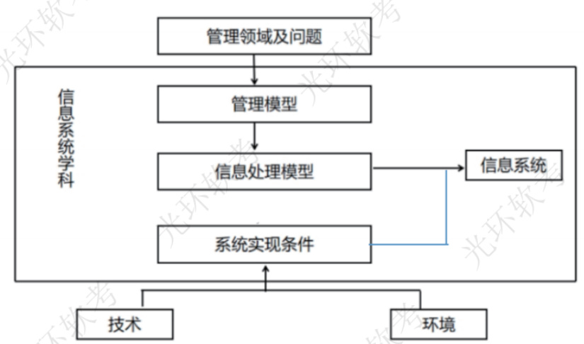  
图 1-1信息系统抽象模型  

# 3.信息系统生命周期  

（1）软件的生命周期通常包括：可行性分析与项目开发计划、需求分析、概要设计、详细设计、编码、测试、维护等阶段。 X小  

(2)信息系统的生命周期可以简化为：系统规划(可行性分析与项目开发计划),系统分析（需求分析），系统设计（概要设计、详细设计），系统实施（编码、测试），系统运行和维护等阶段。具体内容如下。  

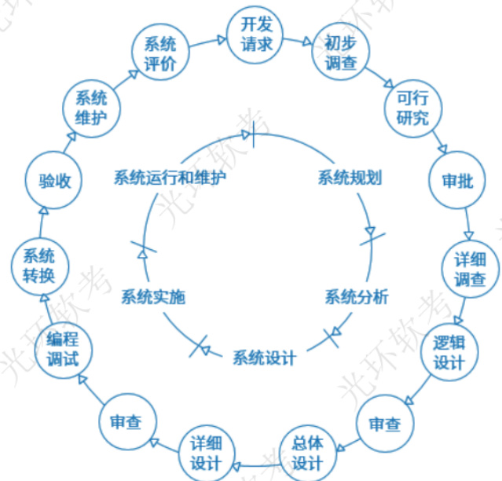  
图1-2信息系统的生命周期示意图  

# 4.【拓展知识点】信息化内涵  

“企业信息化”不仅指在企业中应用信息技术，更重要的是通过深入应用信息技术，促进企业的业务模式、组织架构乃至经营战略发生革新或转变。信息化用作形容词时，常指对象或领域因信息技术的深人应用所达成的新形态或状态。例如，“信息化社会”指信息技术应用到一定程度后达成的社会形态，它只有充分应用信息技术才能达成。综上所述，信息化是推动经济社会发展转型的一个历史性过程。  

信息化内涵主要包括：  

（1)信息网络体系：包括信息资源、各种信息系统、公用通信网络平台等。  

(2)信息产业基础：包括信息科学技术研究与开发、信息装备制造、信息咨询服务等。  

(3)社会运行环境：包括现代工农业、管理体制、政策法律、规章制度、文化教育、道德观念等生产关系与上层建筑。 XV  

(4)效用积累过程：包括劳动者素质、国家现代化水平和人民生活质量的不断提高,精神文明和物质文明建设不断进步等。  

# 5.信息化体系  

国家信息化体系包括信息技术应用（龙头）、信息资源（核心）、信息网络（基础设施）、信息技术和产业（国家信息化建设基础）、信息化人才（关键）、信息化政策法规和标准规范（保障）6个要素，这6个要素的关系构成了一个有机的整体。  

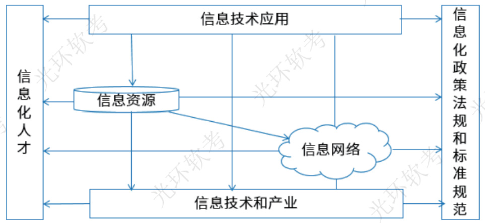  
图 1-3 国家信息化体系  

# 6.信息化趋势  

（1）组织信息化趋势  

组织信息化除驱动和加速组织转型升级和生产力建设外，还呈现出产品信息化、产业信息化、社会生活信息化和国民经济信息化等趋势和方向。&  

（2）国家信息化趋势  

《国家信息化发展战略纲要》强调国家信息化发展战略总目标是建设网络强国，分“三步走”：第一步到 2020 年，核心关键技术部分领域达到国际先进水平，信息产业国际竞争力大幅提升，信息化成为驱动现代化建设的先导力量；第二步到2025年，建成国际领先的移动通信网络，根本改变核心关键技术受制于人的局面，实现技术先进、产业发达、应用领先、网络安全坚不可摧的战略目标，涌现一批具有强大国际竞争力的大型跨国网信企业；第三步到21世纪中叶，信息化全面支撑富强民主文明和谐的社会主义现代化国家建设，网络强国地位日益巩固，在引领全球信息化发展方面有更大作为。  

《“十四五”国家信息化规划》明确了：建设泛在智联的数字基础设施体系，建立高效利用的数据要素资源体系，构建释放数字生产力的创新发展体系，培育先进安全的数字产业体系，构建产业数字化转型发展体系，构筑共建共治共享的数字社会治理体系，打造协同高效的数字政府服务体系，构建普惠便捷的数字民生保障体系，拓展互利共赢的数字领域国际合作体系和建立健全规范有序的数字化发展治理体系等重大任务。光 下软  

# 1.2现代化基础设施建设基本概念  

新型基础设施是以新发展理念为引领，以技术创新为驱动，以信息网络为基础,面向高质量发展需要，提供数字转型、智能升级、融合创新等服务的基础设施体系。  

（1）信息基础设施。信息基础设施主要指基于新一代信息技术演化生成的基础设施。信息基础设施包括： $\textcircled{1}$ 以5G、物联网、工业互联网、卫星互联网为代表的通信网络基础设施； $\textcircled{2}$ 以人工智能、云计算、区块链等为代表的新技术基础设施； $\textcircled{3}$ 以数据中心、智能计算中心为代表的算力基础设施等。信息基础设施凸显“技术新”。议)  

（2）融合基础设施。融合基础设施主要指深度应用互联网、大数据、人工智能等技术，支撑传统基础设施转型升级，进而形成的融合基础设施。融合基础设施包括智能交通基础设施、智慧能源基础设施等。融合基础设施重在“应用新”。※  

（3）创新基础设施。创新基础设施主要指支撑科学研究、技术开发、产品研制的具有公益属性的基础设施。创新基础设施包括重大科技基础设施、科教基础设施、产业技术创新基础设施等。创新基础设施强调“平台新”。  

# 1.【拓展知识点】现代化基础设施建设发展重点  

（1）围绕强化数字转型、智能升级、融合创新支撑，布局建设信息基础设施、融合基础设施、创新基础设施等新型基础设施。（2）建设高速泛在、天地一体、集成互联、安全高效的信息基础设施，增强数据感知、传输、存储和运算能力。(3）加快5G网络规模化部署，持续提高用户普及率,推广升级千兆光纤网络。（4）前瞻布局6G网络技术储备。（5）扩容骨干网互联节点,新设一批国际通信出入口,全面推进互联网协议第六版(IPv6)商用部署。 LK XV  

(6)实施中西部地区中小城市基础网络完善工程。  

（7)推动物联网全面发展，打造支持固移融合、宽窄结合的物联接入能力。  

（8)加快构建全国一体化大数据中心体系，强化算力统筹智能调度,建设若干国家枢纽节点和大数据中心集群，建设E级和10E级超级计算中心。 人  

(9)积极稳妥发展工业互联网和车联网。  

一（10)打造全球覆盖、高效运行的通信、导航、遥感空间基础设施体系，建设商业航天发射场。  

（11)加快交通、能源、市政等传统基础设施数字化改造，加强泛在感知、终端联网、智能调度体系建设。  

（12)发挥市场主导作用，打通多元化投资渠道，构建新型基础设施标准体系。  

# 2.工业互联网平台体系  

工业互联网平台体系具有四大层级：它以网络为基础，平台为中枢,数据为要素，安全为保障。  

# （1）网络是基础  

工业互联网网络体系包括网络互联、数据互通和标识解析三部分。网络互联实现要素之间的数据传输，包括企业外网和企业内网。典型技术包括传统的工业总线、工业以太网以及创新的时间敏感网络(TSN)、确定性网络、5G等技术，企业外网根据工业高性能、高可靠、高灵活、高安全网络需求进行建设，用于连接企业各地机构、上下游企业、用户和产品。企业内网用于连接企业内人员、机器、材料、环境、系统，主要包含信息(IT)网络和控制(OT)网络。当前，内网技术发展呈现三个特征：IT 和OT正走向融合，工业现场总线向工业以太网演进，工业无线技术加速发展。数据互通是通过对数据进行标准化描述和统一建模，实现要素之间传输信息的相互理解，数据互通涉及数据传输、数据语义语法等不同层面。标识解析体系实现要素的标记、管理和定位，由标识编码、标识解析系统和标识数据服务组成，通过为物料，机器、产品等物理资源和工序、软件、模型、数据等虚拟资源分配标识编码，实现物理实体和虚拟对象的逻辑定位和信息查询，支撑跨企业、跨地区、跨行业的数据共享共用。  

# （2）平台是中枢  

工业互联网平台体系包括边缘层、IaaS、PaaS和 SaaS四个层级，相当于工业互联网的“操作系统",它有四个主要作用： $\textcircled{\scriptsize{1}}$ 数据汇聚。网络层面采集的多源、异构、海量数据，传输至工业互联网平台，为深度分析和应用提供基础。 $\textcircled{2}$ 建模分析。提供大数据、人工智能分析的算法模型和物理、化学等各类仿真工具，结合数字孪生、工业智能等技术，对海量数据挖掘分析，实现数据驱动的科学决策和智能应用。 $\textcircled{3}$ 知识复用。将工业经验知识转化为平台上的模型库、知识库，并通过工业微服务组件方式，方便二次开发和重复调用，加速共性能力沉淀和普及。 $\textcircled{4}$ 应用创新。面向研发设计、设备管理、企业运营、资源调度等场景，提供各类工业 App、云化软件，帮助企业提  

质增效。  

（3）数据是要素  

工业互联网数据有三个特性： $\textcircled{\scriptsize{1}}$ 重要性。数据是实现数字化、网络化、智能化的基础，没有数据的采集、流通、汇聚、计算、分析，各类新模式就是无源之水，数字化转型也就成为无本之木。 $\circledcirc$ 专业性。工业互联网数据的价值在于分析利用，分析利用的途径必须依赖行业知识和工业机理。制造业千行百业、千差万别，每个模型、算法背后都需要长期积累和专业队伍，只有深耕细作才能发挥数据价值。 $\textcircled{3}$ 复杂性，工业互联网运用的数据来源于“研产供销服”各环节，“人机料法环”各要素，ERP,MES、PLC 等各系统，维度和复杂度远超消费互联网，面临采集困难、格式各异、分析复杂等挑战。 XV  

# （4）安全是保障  

工业互联网安全体系涉及设备、控制、网络、平台、工业 App、数据等多方面网络安全问题，其核心任务就是要通过监测预警、应急响应、检测评估、功能测试等手段确保工业互联网健康有序发展。与传统互联网安全相比，工业互联网安全具有三大特点： $\textcircled{1}$ 涉及范围广。工业互联网打破了传统工业相对封闭可信的环境，网络攻击可直达生产一线。联网设备的爆发式增长和工业互联网平台的广泛应用，使网络攻击面持续扩大。 $\circledcirc$ 造成影响大。工业互联网涵盖制造业、能源等实体经济领域，一旦发生网络攻击、破坏行为，安全事件影响严重。 $\textcircled{3}$ 企业防护基础弱。目前我国广大工业企业安全意识、防护能力仍然薄弱，整体安全保障能力有待进一步提升。  

# 3.【拓展知识点】融合应用  

工业互联网融合应用推动了一批新模式、新业态孕育兴起，提质、增效、降本、绿色、安全发展成效显著，初步形成了六大类典型应用模式。  

(1)平台化设计。平台化设计是依托工业互联网平台，汇聚人员、算法、模型、任务等设计资源，实现高水平高效率的轻量化设计、并行设计、敏捷设计、交互设计和基于模型的设计，变革传统设计方式，提升研发质量和效率。※  

(2)智能化制造。智能化制造是互联网、大数据、人工智能等新一代信息技术在制造业领域加速创新应用，实现材料、设备、产品等生产要素与用户之间的在线连接和实时交互，逐步实现机器代替人工生产，智能化代表制造业未来发展的趋势。  

(3)网络化协同。网络化协同是通过跨部门、跨层级、跨企业的数据互通和业务互联，推动供应链上的企业和合作伙伴共享客户、订单、设计、生产、经营等各类信息资源，实现网络化的协同设计、协同生产、协同服务，进而促进资源共享、能力交易以及业务优化配置等。 环软  

(4)个性化定制。个性化定制是面向消费者个性化需求,通过客户需求准确获取和分析、敏捷产品开发设计、柔性智能生产、精准交付服务等，实现用户在产品全生命周期中的深度参与,是以低成本、高质量和高效率的大批量生产实现产品个性化设计、  

生产、销售及服务的一种制造服务模式。  

(5)服务化延伸。服务化延伸是制造与服务融合发展的新型产业形态,指的是企业从原有制造业务向价值链两端高附加值环节延伸，从以加工组装为主向“制造 $^+$ 服务”转型，从单纯出售产品向出售“产品 $^+$ 服务”转变，具体包括设备健康管理、产品远程运维、设备融资租赁、分享制造、互联网金融等。  

一（6)数字化管理。数字化管理是企业通过打通核心数据链，贯通制造全场景、全过程，基于数据的广泛汇聚、集成优化和价值挖掘，优化、创新乃至重塑企业战略决策、产品研发、生产制造、经营管理、市场服务等业务活动，构建数据驱动的高效运营管理新模式。  

工业互联网已延伸至众多国民经济大类，涉及原材料、装备、消费品、电子等制造业各大领域，以及采矿、电力、建筑等实体经济重点产业，实现更大范围、更高水平、更深程度发展，形成了千姿百态的融合应用实践。  

# 4.车联网  

车联网是新一代网络通信技术与汽车、电子、道路交通运输等领域深度融合的新兴产业形态。智能网联汽车是搭载先进的车载传感器、控制器、执行器等装置，并融合现代通信与网络技术，实现车与车、路、人、云端等智能信息交换、共享，具备复杂环境感知、智能决策、协同控制等功能，可实现“安全、高效、舒适、节能”行驶的新一代汽车。 淞  

（1）体系框架  

车联网系统是一个“端、管、云"三层体系。  

1）端系统。端系统是汽车的智能传感器负责采集与获取车辆的智能信息，感知行车状态与环境；是具有车内通信、车间通信、车网通信的泛在通信终端；同时还是让汽车具备IoV寻址和网络可信标识等能力的设备。  

X2）管系统。管系统解决车与车、车与路、车与网、车与人等的互联互通，实现车辆自组网及多种异构网络之间的通信与漫游，在功能和性能上保障实时性、可服务性与网络泛在性，同时它是公网与专网的统一体。  

3）云系统。车联网是一个云架构的车辆运行信息平台，它的生态链包含了ITS、物流、客货运、危特车辆、汽修汽配、汽车租赁、企事业车辆管理、汽车制造商、4S店、车管、保险、紧急救援、移动互联网等，是多源海量信息的汇聚，因此需要虚拟化、安全认证、实时交互、海量存储等云计算功能，其应用系统也是围绕车辆的数据汇聚、计算、调度、监控、管理与应用的复合体系。  

# （2）链接方式  

车联网分别是车与云平台、车与车、车与路、车与人、车内设备之间等全方位网络链接。  

1)车与云平台间的通信是指车辆通过卫星无线通信或移动蜂窝等无线通信技术  

实现与车联网服务平台的信息传输，接收平台下达的控制指令，实时共享车辆数据。  

2)车与车间的通信是指车辆与车辆之间实现信息交流与信息共享，包括车辆位置、行驶速度等车辆状态信息，可用于判断道路车流状况。  

3)车与路间的通信是指借助地面道路固定通信设施实现车辆与道路间的信息交流，用于监测道路路面状况，引导车辆选择最佳行驶路径。  

4)车与人间的通信是指用户可以通过Wi-Fi、蓝牙、蜂窝等无线通信手段与车辆进行信息沟通，使用户能通过对应的移动终端设备监测并控制车辆。  

5)车内设备间的通信是指车辆内部各设备间的信息数据传输，用于对设备状态的实时检测与运行控制，建立数字化的车内控制系统。  

# 1.3农业现代化乡村振兴战略  

党的十九届五中全会着眼 2035年基本实现社会主义现代化，提出“关键核心技术实现重大突破，进入创新型国家前列”的远景目标。建设创新型国家，完善科技创新体系是关键。当前，我国经济发展正处于转型升级的关键时期，突破一系列瓶颈，解决深层次矛盾问题的根本出路和动力在于把发展基点放在创新上，发挥科技创新在全面创新中的引领作用，通过建设科技强国，全面塑造发展新优势。  

推进农业农村数字化发展，重点是完善农村信息技术基础设施建设，加快数字技术推广应用，让广大农民共享数字经济发展红利。聚焦数字赋能农业农村现代化建设，重点建设基础设施、发展智慧农业和建设数字乡村等方面。  

（1）建设基础设施。  
（2）发展智慧农业。  
（3）建设数字乡村。  

# 1.两化融合与智能制造  

坚持自主可控、安全高效，推进产业基础高级化、产业链现代化，保持制造业比重基本稳定，增强制造业竞争优势，推动制造业高质量发展”是工业发展的重要战略。“深人实施智能制造和绿色制造工程，发展服务型制造新模式，推动制造业高端化、智能化、绿色化”是我国推动制造业优化升级的重点方向。  

# 2.两化融合  

两化融合是信息化和工业化的高层次的深度结合，是指以信息化带动工业化、以工业化促进信息化，走新型工业化道路；两化融合的核心就是信息化支撑，追求可持续发展模式。信息化和工业化深度融合是信息化和工业化两个历史进程的交汇与创新，是中国特色新型工业化道路的集中体现，是新发展阶段制造业数字化、网络化、智能化发展的必由之路，是数字经济时代建设制造强国、网络强国和数字中国的扣合点。信息化和工业化的融合既加速了工业化进程，也拉动了信息技术的进步。信息世界与物理世界的深度融合是未来世界发展的总趋势，两化深度融合顺应这一趋势，正在全面加速数字化转型，推动制造业企业形态、生产方式、业务模式和就业方式的根本性变革。 x  

信息化与工业化主要在技术、产品、业务、产业四个方面进行融合。  

(1)技术融合。技术融合是指工业技术与信息技术的融合，产生新的技术，推动技术创新。例如，汽车制造技术和电子技术融合产生的汽车电子技术；工业和计算机控制技术融合产生的工业控制技术。%  

（2）产品融合。产品融合是指电子信息技术或产品渗透到产品中,增加产品的技术含量。例如，普通机床加上数控系统之后就变成了数控机床；传统家电采用了智能化技术之后就变成了智能家电；普通飞机模型增加控制芯片之后就成了遥控飞机。信息技术含量的提高使产品的附加值大大提高。 XV  

（3)业务融合。业务融合是指信息技术应用到企业研发设计、生产制造、经营管理、市场营销等各个环节，推动企业业务创新和管理升级。例如，计算机管理方式改变了传统手工台账，极大地提高了管理效率；信息技术应用提高了生产自动化、智能化程度，生产效率大大提高：网络营销成为一种新的市场营销方式，受众大量增加，营销成本大大降低。  

(4)产业衍生。产业衍生是指两化融合可以催生出的新产业,形成一些新兴业态,如工业电子、工业软件、工业信息服务业。工业电子包括机械电子、汽车电子、船舶电子、航空电子等；卫业软件包括工业设计软件、工业控制软件等；工业信息服务业包括工业企业 B2B电子商务、工业原材料或产成品大宗交易、工业企业信息化咨询等。  

# 3.智能制造  

智能制造（Intelligent Manufacturing,IM）是基于新一代信息通信技术与先进深度融合，贯穿于设计、生产、管理、服务等制造活动的各个环节，具有自感知、自学习、自决策、自执行、自适应等功能的新型生产方式。智能制造是一项重要的国家战略，也是各个国家推动新一代工业革命的关注焦点。 光  

智能制造是一种由智能机器和人类专家共同组成的人机一体化智能系统，它在制造过程中能进行智能活动，诸如分析、推理、判断、构思和决策等。通过人与智能机器的合作共事，去扩大、延伸和部分地取代人类专家在制造过程中的脑力劳动。它把制造自动化的概念更新，扩展到柔性化、智能化和高度集成化。  

智能制造的建设是一项持续性的系统工程，涵盖企业的方方面面。GB/T39116《智能制造能力成熟度模型》明确了智能制造能力建设服务覆盖的能力要素、能力域和能力子域。  

能力要素提出了智能制造能力成熟度等级提升的关键方面，包括人员、技术、资源和制造。人员包括组织战略、人员技能2个能力域。技术包括数据、集成和信息安全3个能力域。资源包括装备、网络2个能力域。制造包括设计、生产、物流、销售和服务5个能力域。设计包括产品设计和工艺设计2个能力子域；生产包括采购、计划与调度、生产作业、设备管理、安全环保、仓储配送、能源管理7个能力子域；物流包括物流1个能力子域；销售包括销售1个能力子域：服务包括客户服务和产品服务2个能力子域。 X  

GB/T39116《智能制造能力成熟度模型》还规定了企业智能制造能力在不同阶段应达到的水平。成熟度等级分为五个等级，自低向高分别是一级(规划级)、二级(规范级)、三级(集成级)、四级(优化级)和五级(引领级)。较高的成熟度等级涵盖了低成熟度等级的要求，如图1-4所示。  

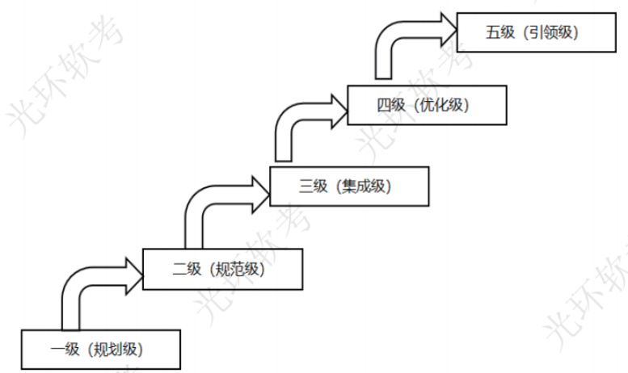  
图1-4智能制造能力成熟度等级  

(1)一级(规划级):企业应开始对实施智能制造的基础和条件进行规划,能够对核心业务活动(设计、生产、物流、销售、服务)进行流程化管理。  

(2)二级(规范级):企业应采用自动化技术、信息技术手段对核心装备和业务活动等进行改造和规范，实现单一业务活动的数据共享。  

(3)三级(集成级):企业应对装备、系统等开展集成,实现跨业务活动间的数据共享。  

(4)四级(优化级):企业应对人员、资源、制造等进行数据挖掘,形成知识、模型等，实现对核心业务活动的精准预测和优化。  

(5)五级(引领级):企业应基于模型持续驱动业务活动的优化和创新,实现产业链协同并衍生新的制造模式和商业模式。 X  

# 4.消费互联网基本属性  

消费互联网具有的属性包括：  

（1）媒体属性：由自媒体、社会媒体以及资讯为主的门户网站。  
（2）产业属性：由在线旅行和为消费者提供生活服务的电子商务等其他组成。  

# 1.4数字中国概览示意图  

习近平总书记在党的十九大报告中指出：加强应用基础研究，拓展实施国家重大科技项目，突出关键共性技术、前沿引领技术、现代工程技术、颠覆性技术创新，为建设“数字中国”等提供有力支撑。数字中国是新时代国家信息化发展的新战略，是满足人民日益增长的美好生活需要的新举措，是驱动引领经济高质量发展的新动力，涵盖经济、政治、文化、社会、生态等各领域信息化建设，主要包括宽带中国、互联网 $^+$ 、大数据、云计算、人工智能、数字经济、电子政务、新型智慧城市、数字乡村等内容。“迎接数字时代，激活数据要素潜能，推进网络强国建设，加快建设数字经济、数字社会、数字政府，以数字化转型整体驱动生产方式、生活方式和治理方式变革"成为了新时代我国信息化发展的主旋律，如图1-5所示。  

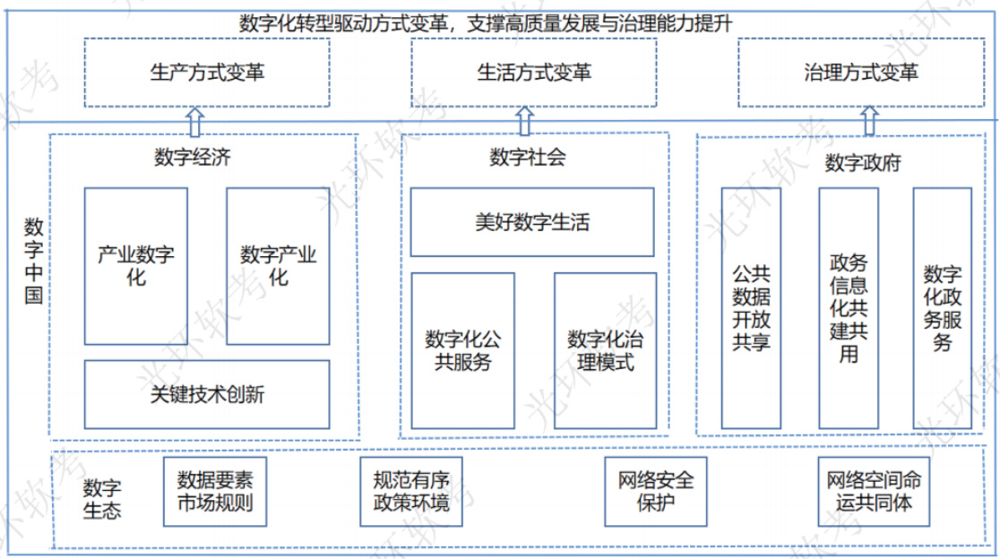  
图1-5数字中国概览示意图  

# 1.数字经济  

数字经济是继农业经济、工业经济之后的更高级经济形态。从本质上看，数字经济是一种新的技术经济范式，它建立在信息与通信技术的重大突破的基础上，以数字技术与实体经济融合驱动的产业梯次转型和经济创新发展的主引擎，在基础设施、生产要素、产业结构和治理结构上表现出与农业经济、工业经济显著不同的新特点。  

（1）新技术经济范式  

1962 年库恩在其代表作《科学革命的结构》中首先对“范式”(Paradigm)进行了定义。库恩认为：“范式是指那些公认的科学成就，在一段时间里为实践共同体提供典型的问题和解答”。1982 年，技术创新经济学家多西将这个概念引人技术创新之中，并提出了技术范式(TechnologyParadigm)的概念，将技术范式定义为解决所选择的技术经济问题的一种模式，而这些解决问题的办法立足于自然科学的原理，从这个定义出发，云计算、人工智能、大数据等技术在与社会经济活动的融合重构中，经过技术与经济的相互促进，形成了一些相对稳定的经济新结构和新形态，如平台经济、分享经济、算法经济、服务经济、协同经济等。进而，先一步形成的经济形态触发社会其他领域的连锁变革，最终实现整个经济领域的技术经济范式转换。数字经济的技术经济范式的结构主要包括驱动力、新结构、价值创造和经济增长。  

# （2）主要内容构成  

从产业构成来看，数字经济包括数字产业化和产业数字化两大部分。《数字经济及其核心产业统计分类(2021)》给出了数字经济具体分类，分别是：数字产品制造业、数字产品服务业、数字技术应用业、数字要素驱动业和数字化效率提升业，其中，前4类为数字产业化部分，第5类为产业数字化部分。从整体构成上看，数字经济包括数字产业化、产业数字化、数字化治理和数据价值化四个部分。 X  

# 1）数字产业化  

数字产业化是指为产业数字化发展提供数字技术、产品、服务、基础设施和解决方案，以及完全依赖于数字技术、数据要素的各类经济活动，包括电子信息制造业、电信业、软件、信息技术、互联网行业等。数字产业化是数字经济的基础部分。《中华人民共和国国民经济和社会发展第十四个五年规划和2035年远景目标纲要》提出了强调加快推动数字产业化，培育壮大人工智能、大数据、区块链、云计算、网络安全等新兴数字产业，提升通信设备、核心电子元器件、关键软件等产业水平。构建基于5G的应用场景和产业生态，在智能交通、智慧物流、智慧能源、智慧医疗等重点领域开展试点示范。鼓励企业开放搜索、电商、社交等数据，发展第三方大数据服务产业。促进共享经济、平台经济健康发展。数字产业化发展重点包括：  

$\textcircled{\scriptsize{1}}$ 云计算：加快云操作系统迭代升级，推动超大规模分布式存储、弹性计算、数据虚拟隔离等技术创新，提高云安全水平。以混合云为重点培育行业解决方案、系统集成、运维管理等云服务产业。  

$\textcircled{2}$ 大数据：推动大数据采集、清洗、存储、挖掘、分析、可视化算法等技术创新，培育数据采集、标注、存储、传输、管理、应用等全生命周期产业体系，完善大数据标准体系。  

$\textcircled{3}$ 物联网：推动传感器、网络切片、高精度定位等技术创新，协同发展云服务与边缘计算服务，培育车联网、医疗物联网、家居物联网产业。  

$\textcircled{4}$ 工业互联网：打造自主可控的标识解析体系、标准体系、安全管理体系，加强工业软件研发应用，培育形成具有国际影响力的工业互联网平台，推进“工业互联网+智能制造”产业生态建设。  

$\textcircled{5}$ 区块链：推动智能合约、共识算法、加密算法、分布式系统等区块链技术创新,以联盟链为重点发展区块链服务平台和金融科技、供应链管理、政务服务等领域应用方案，完善监管机制。  

$\circled{6}$ 人工智能：建设重点行业人工智能数据集，发展算法推理训练场景，推进智能医疗装备、智能运载工具、智能识别系统等智能产品设计与制造，推动通用化和行业性人工智能开放平台建设。  

$\textcircled{7}$ 虚拟现实和增强现实：推动三维图形生成、动态环境建模、实时动作捕捉、快速渲染处理等技术创新，发展虚拟现实整机、感知交互、内容采集制作等设备和开发工具软件行业解决方案。X  

2）【拓展知识点】产业数字化  

产业数字化是指在新一代数字科技支撑和引领下，以数据为关键要素，以价值释放为核心，以数据赋能为主线，对产业链上下游的全要素数字化升级、转型和再造的过程。产业数字化作为实现数字经济和传统经济深度融合发展的重要途径，是新时代背景下使用数字经济发展的必由之路和战略执择。《中华人民共和国国民经济和社会发展第十四个五年规划和2035年远景目标纲要》明确提出了推进产业数字化转型，实施“上云用数赋智”行动，推动数据赋能全产业链协同转型。※  

产业数字化发展对经济和社会各项发展都具有重要意义。从微观看，数字化助力传统企业蝶变，再造企业质量效率新优势。传统企业迫切需要新的增长机会与发展模式；快速选代及进阶的数字科技为传统企业转型升级带来新希望；传统产业成为数字科技应用创新的重要场景。从中观看，数字化促进产业提质增效，重塑产业分工协作新格局。提升产品生产制造过程的自动化和智能化水平；降低产品研发和制造成本，实现精准化营销、个性化服务；重塑产业流程和决策机制。从宏观看，孕育新业态新模式，加速新旧动能转换新引擎。  

数字科技广泛应用和消费需求变革催生出共享经济、平台经济等新业态新模式;促进形成新一代信息技术、高端装备、机器人等新兴产业，加速数字产业化形成。产业数字化具有的典型特征包括：  

$\textcircled{\scriptsize{1}}$ 以数字科技变革生产工具;  
$\textcircled{2}$ 以数据资源为关键生产要素；  
$\textcircled{3}$ 以数字内容重构产品结构;  
$\textcircled{4}$ 以信息网络为市场配置纽带；  
$\textcircled{5}$ 以服务平台为产业生态载体；  
$\circled{6}$ 以数字善治为发展机制条件。  

通过产业数字化全面推动数字时代产业体系的质量变革，效率变革、动力变革,推动新旧动能转换和高质量发展。产业数字化的理解需要兼顾社会与市场两个维度,以更加全面的视角理解其内涵本质。从社会维度看，产业数字化是建立在生产工具与生产要素变革基础上的一种社会行为；从市场维度看，产业数字化是以信息网络为市场配置纽带，以服务平台为产业生态载体的资源优化过程。数字善治是社会及市场两个维度有机融合的具体体现，其既是产业数字化发展的机制条件，也是驱动产业数字化发展的重要动力机制。  

在数字经济背景下，企业逐步进人数据驱动时代。随着企业对数字技术的不断利用，各类主体在组织生产、业务重构、经营管理等方面的数字化程度日益完善，数据将成为企业各类信息汇集的载体。未来以数据驱动的业务形式将成为主流，全渠道的数据盘活将成为企业的核心竞争力。因此，数据资产有效盘活与运营，将成为数字经济时代下企业的核心竞争力。企业应加深对数据的利用水平和治理水平，通过数据积累与运营，打通企业内部不同层级、不同系统之间的数据壁垒，盘活数据资产价值,实现对内支撑业务应用和管理决策；对外加强数据服务能力输出，从而提升数据潜在价值向实际业务价值的转化率，使得企业在提升市场竞争力同时也强化了运营能力，以此获得业务的高速增长。  

# 3）【拓展知识点】数字化治理  

数字化治理通常指依托互联网、大数据、人工智能等技术和应用，创新社会治理方法与手段，优化社会治理模式，推进社会治理的科学化、精细化、高效化，助力社会治理现代化。数字化治理是数字经济的组成部分之一，包括但不限于多元治理，以“信息技术 $+$ 治理”为典型特征的技管结合，以及数字化公共服务等。  

数字化治理的核心特征是全社会的数据互通、数字化全面协同与跨部门的流程再造，形成“用数据说话、用数据决策、用数据管理、用数据创新”的治理机制。作为数字时代的全新治理范式，数字化治理的内涵至少包含：  

$\textcircled{1}$ 对数据的治理：即治理对象扩大到涵盖数据要素。作为新兴生产要素和关键的治理资源，数据要素成为大国竞争的主要领域，对数据的治理成为制定数字经济规则的重要内容，数据要素的所有权、使用权、监管权，以及信息保护和数据安全等都需要全新治理体系。  

$\circledcirc$ 运用数据进行治理：即运用数字与智能技术优化治理技术体系，进而提升治理能力。大数据、人工智能等新一代数字技术，可以为各领域治理进行全方位的“数字赋能”,改进治理技术、治理手段和治理模式，实现复杂治理问题的超大范围协同、精准“滴灌”、双向触达和超时空预判。  

$\textcircled{3}$ 对数字融合空间进行治理：随着越来越多的经济社会活动搬到线上，治理场域也拓展到数字空间。未来会有越来越多的经济社会活动发生在线上，数字融合空间会以全新的方式创造经济价值、塑造社会关系，这需要适应数字融合世界的治理体系，对数字融合空间的新生事物进行有效治理。  

# 4）【拓展知识点】数据价值化  

价值化的数据是数字经济发展的关键生产要素，加快推进数据价值化进程是发展数字经济的本质要求。近年来，数据可存储、可重用、呈现爆发增长、海量集聚的特点，是实体经济数字化、网络化、智能化发展的基础性战略资源。数据价值化包括但不限于数据采集、数据标准、数据确权、数据标注、数据定价、数据交易、数据流转、数据保护等。数据价值化是指以数据资源化为起点，经历数据资产化、数据资本化阶段，实现数据价值化的经济过程。上述三个要素构成数据价值化的“三化”框架，即数据资源化、数据资产化、数据资本化，细化描述为：  

$\textcircled{\scriptsize{1}}$ 数据资源化：是使无序、混乱的原始数据成为有序、有使用价值的数据资源。数据资源化阶段包括通过数据采集、整理、聚合、分析等，形成可采、可见、标准、互通、可信的高质量数据资源。数据资源化是激发数据价值的基础，其本质是提升数据质量，形成数据使用价值的过程。  

$\textcircled{2}$ 数据资产化：是数据通过流通交易给使用者或者所有者带来的经济利益的过程。数据资产化是实现数据价值的核心，其本质是形成数据交换价值，初步实现数据价值的过程。 下软  

$\textcircled{3}$ 数据资本化：主要包括两种方式，数据信贷融资与数据证券化。数据资本化是拓展数据价值的途径，其本质是实现数据要素社会化配置。  

# 2.【拓展知识点】数字政府新特征  

数字政府被赋予的新的特征：  

（1）协同化：主要强调组织的互联互通。（2）云端化：云平台是政府数字化最基本的技术要求，政务上云促成各地各部门由分散建设向集群集约式演化。（3）智能化：智能化治理是政府应对社会治理多元参与、治理环境越发复杂、治理内容多样化趋势的关键手段。（4）数据化：数据化也是现阶段数字政府建设的重点，是建立在政务数据整合共享基础上的数字化的转型。  

（5）动态化：指数字政府是在数据驱动下动态发展不断演进的过程。  

数字政府建设关键词主要包括：  

$\textcircled{\scriptsize{1}}$ 共享：推动政务数据共享，推进政务服务事项集成化办理。数字政府，数据先行。数据共享是提升政务服务效能的重要抓手。  

$\circledcirc$ 互通：国家政务服务平台持续推动与各地区、各部门政务服务业务办理系统的全面对接融合，打破地域阻隔与部门壁垒，实现更大范围内的系统互联互通，有力推动了政务服务线上线下融合互通和跨地区、跨部门、跨层级协同办理。  

$\textcircled{3}$ 便利：数字政府，利企便民。加强数字政府建设的根本目标是更好地服务企业和群众，满足人民日益增长的美好生活需要。  

# 3.数字政府主要内容  

《“十四五”国家信息化规划》中提出打造协同高效的数字政府服务体系，深人推进“放管服”改革、加快政府职能转变，打造市场化、法治化、国际化营商环境，坚持整体集约建设数字政府，推动条块政务业务协同，加快政务数据开放共享和开发利用，深化推进“一网通办”“跨省通办”“一网统管"，畅通参与政策制定的渠道，推动国家行政体系更加完善、政府作用更好发挥、行政效率和公信力显著提升，推动有效市场和有为政府更好结合，打造服务型政府。  

（1）一网通办：“一网通办”和一窗式服务在本质上是一致的。  

（2）跨省通办：“跨省通办”是一种政务服务模式。  

（3）一网统管：是新型智慧城市推进城市治理体系和治理能力现代化的重要创新模式，“一网统管”建设通常强调：  

·一网：主要包括政务云、政务网和政务大数据中心等。  

一屏：通过对多个部门的数据进行整合，将城市运行情况充分反映出来。  

·联动：畅通各级指挥体系，为跨部门、跨区域、跨层级联勤联动、高效处置提供快速响应能力。  

·预警：基于多维、海量、全息数据汇集，实现城市运行体征的全量、实时掌握和智能预警。 K  

·创新：以管理需求带动智能化建设，以信息流、数据流推动业务流程全面优化和管理。 小  

# 4.【拓展知识点】数字民生  

数字民生建设重点通常强调：  

1）普惠：充分开发利用信息技术体系，扩大民生保障覆盖范围，助力普惠型民生建设，解决民生资源配置不均衡等问题。  

2）赋能：信息技术体系与民生的深度融合赋予了民生建设新动能，促进民生保障实效指数式增长，如“互联网 $^+$ 教育”“互联网 $^+$ 医疗”“互联网 $^+$ 养老”“互联网$^+$ 交通”等。  

3）利民：信息技术体系创新拓展了公共服务场景，推动数字技术全面融人社会交往和日常生活新趋势，使民生服务日趋智慧化、便利化和人性化。  

# 5.智慧城市  

新型智慧城市建设持续推动着城市的高质量发展，主要体现在：  

·智慧城市建设更加注重以人民为中心;  
光环软·新技术持续赋能智慧城市的建设与发展；  
·城市治理现代化是智慧城市建设的必然要求；  
·智慧城市群区域一体化协同发展新格局逐步形成;  
·共建、共治、共享生态模式助力智慧城市高质量发展。  

# （1）基本原理  

$\textcircled{\scriptsize{1}}$ 强调“人民城市为人民”，以面向政府、企业、市民等主体提供智慧化的服务为主要模式； 小考  

$\textcircled{2}$ 重点强化数据治理、数字李生、边际决策、多元融合和态势感知五个核心能力要素建设；，  

$\textcircled{3}$ 更加注重规划设计、部署实施、运营管理、评估改进和创新发展在内的智慧城市全生命周期管理；  

$\textcircled{4}$ 目标旨在推动城市治理、民生服务、生态宜居、产业经济、精神文明五位一体的高质量发展；  

$\textcircled{5}$ 持续推动城市治理体系与治理能力现代化水平提升。  

# （2）智慧城市核心能力要素  

1)数据治理：围绕数据这一新的生产要素进行能力构建，包括数据责权利管控、全生命周期管理及其开发利用等。 XV  

2）数字李生：围绕现实世界与信息世界的互动融合进行能力构建，包括社会李生、城市李生和设备孪生等，将推动城市空间摆脱物理约束，进人数字空间。  

3）边际决策：基于决策算法和信息应用等进行能力构建，强化执行端的决策能力，从而达到快速反应、高效决策的效果，满足对社会发展的敏捷需求。  

～4）多元融合：强调社会关系和社会活动的动态性及其融合的高效性等，实现服务可编排和快速集成，从而满足各项社会发展的创新需求。  

5）态势感知：围绕对社会状态的本质反映及模拟预测等进行能力构建，洞察可变因素与不可见因素对社会发展的影响，从而提升生活质量。  

# （3）智慧城市发展成熟度  

1）一级（规划级）：应围绕智慧城市的发展进行策划，明确相关职责分工和工作机制等，初步开展数据采集和应用，确保相关活动有序开展。  

2)二级（管理级）：应明确智慧城市发展战略、原则、目标和实施计划等，推进城市基础设施智能化改造，多领域实现信息系统单项应用，对智慧城市全生命周期实施管理。  

3）三级（协同级）：应管控智慧城市各项发展目标，实施多业务、多层级、跨领域应用系统的集成，持续推进信息资源的共享与交换，推动惠民服务、城市治理、生态宜居、产业发展等的融合创新，实现跨领域的协同改进。  

4）四级（优化级）：应聚焦智慧城市与城市经济社会发展深度融合，基于数据与知识模型实施城市经济、社会精准化治理，推动数据要素的价值挖掘和开发利用，推进城市竞争力持续提升。  

5）五级（引领级）：应构建智慧城市敏捷发展能力，实现城市物理空间、社会空间、信息空间的融合演进和共生共治，引领城市集群治理联动，形成高质量发展共同体。  

# 6.【拓展知识点】数字生活  

数字生活是依托互联网和一系列数字科技技术应用为基础的一种生活方式，可以  

方便快捷地带给人们更好的生活体验和工作便利。数字生活主要体现在如下方面。  

1）生活工具数字化  
2）生活方式数字化  
3）生活内容数字化  

# 7.【拓展知识点】数字生态-数字营商环境  

《中华人民共和国国民经济和社会发展第十四个五年规划和2035年远景目标纲要》指出“坚持放管并重，促进发展与规范管理相统一，构建数字规则体系，营造开放、健康、安全的数字生态”  

# （1）数字营商环境  

国家工业信息安全发展研究中心2021年12月提出的全球数字营商环境评价指标体系。该评价体系包含5个一级指标：  

1）数字支撑体系，包含普遍接人、智慧物流设施、电子支付设施；  

2）数据开发利用与安全，包含公共数据开放、数据安全；  

3）数字市场准入，包含数字经济业态市场准入、政务服务便利度  

4）数字市场规则，包含平台企业责任、商户权利与责任、数字消费者保护；  

5）数字创新环境，包含数字创新生态、数字素养与技能、知识产权保护。  

# 1.5数字化转型与元宇宙  

随着众多信息通信新技术的迅速发展与普及应用，信息空间成长为第三空间，并与物理空间和社会空间共同构成人类社会的三元空间。新一轮科技革命与产业革命交互演进，面向组织的战略发展、业务模式、生产管理、运行管理等全方位的数字化转型，已成为数字经济时代广大组织的必选题。以云计算、大数据、人工智能等为代表的新一代信息技术发展迅猛，成为驱动组织数字化转型的关键要素。组织需要通过深化应用数字技术，打造敏捷、韧性、创新的数字化能力，重构传统业务流程和价值链，推动实现全要素、全链条、全层级的数字化转型。随着各领域数字化转型的发展和持续深化，元宇宙这一新概念也随之流行。元宇宙本质上是对现实世界的虚拟化、数字化过程，需要对内容生产、经济系统、用户体验以及实体世界内容等进行大量改造。  

# 1.数字化转型  

数字化转型(DigitalTransformation)是建立在数字化转换(Digitization)、数字化升级(Digitalization)基础上，进一步触及组织核心业务，以新建一种业务模式为目标的高层次转型。数字化转型是开发数字化技术及支持能力以新建一个富有活力的数字化商业模式，只有组织对其业务进行系统性、彻底的(或重大和完全的)重新定义，而不仅仅是 IT,而是对组织活动、流程、业务模式和员工能力的方方面面进行重新定义的时候,成功才会得以实现。  

# 2.【拓展知识点】驱动因素  

从全球视角来看，当前国际社会主要矛盾聚焦在发达国家企图垄断市场、资源和技术与发展中国家的发展愿望之间的矛盾。发达国家生产力没有飞跃式发展(第四次科技革命姗姗来迟),世界范围内市场、资源开发程度越来越充分，众多发展中国家想进一步改善人民生活，进一步参与到世界市场和资源的竞争中。纵观历史，无论是国际竞争关系、产业转型升级和新经济发展，还是当前我国社会主要矛盾变化带来的新特征、新要求，都有其发展规律和演进范式，即“生产力飞跃、生产要素变化、信息传播效率突破和社会‘智慧主体”规模扩容的叠加，将会促使人类社会生产关系的创新变革，最终引发经济与民生的深层发展”。这个范式驱动完成了原始经济到农业经济，再到工业经济的转型过程，同样会驱动工业经济向数字经济的转型。  

（1）生产力飞升：第四次科技革命  

科学技术是第一生产力。近代人类发展过程中，已经完成了三次科技革命，正在经历第四次科技革命，每次科技革命都对应一个科学范式，其深刻影响着世界格局的变化，是人类社会发展的根本动力，也是国际社会主要矛盾的发源地。  

第一科学范式为经验范式。它偏重于经验事实的描述和明确具体的实用性的科学研究范式。在研究方法上以归纳为主，带有较多盲目性的观测和实验。第二科学范式为理论范式。它主要指偏重理论总结和理性概括，强调较高普遍的理论认识而非直接实用意义的科学研究范式。第三科学范式为模拟范式。它是一个与数据模型构建、定量分析方法以及利用计算机来分析和解决科学问题的研究范式。第四科学范式为数据密集型研究范式。它针对数据密集型科学，是由传统的假设驱动向基于科学数据进行探索的科学方法转变而生成的科学研究范式。其研究方法是基于计算机生产实践产生的数据，按照驱动理论获得猜想与假设，完成数据自动化的计算和原理探索，即由计算机实施第一、第二、第三科学范式。第四范式通过新型信息技术的数据洞察，从大数据中自动化挖掘实践经验、理论原理并自行开展模拟仿真，完成基于数据的自决策和自优化，极大地繁荣应用科学技术。 X  

（2）生产要素变化：数据要素的诞生  

数据是与土地、劳动力、资本和技术并列的主要生产要素，表明数据将会是未来社会数字化、智能化发展的重要基础。数据是一项重要的经济资源，其对经济社会的全面持续发展、经济组织转型和参与个体生活质量非常重要且不可或缺。数据记载信息，信息融合知识，知识孕育智慧，过去人们已经持续了几十年的信息化建设，人们把智慧解构成知识，把知识分解为信息，把信息拆解为数据。随着人工智能、区块链和大数据等技术的出现，过去分散在各个环节的数据，重新归集为显性信息、知识和智慧，数据的经济价值越发凸显，因此数据对我国高质量发展的作用，与土地、设备、原材料、资本、劳动、技术同等重要，具备了单列为生产要素的现实条件。  

（3）信息传播效率突破：社会互联网新格局  

随着科学技术的发展，各种网络服务随之而来，互联网社交网络就是其中之一。人们的日常生活逐渐从现实社交网络转移到互联网虚拟社交网络中。互联网社交网络下，人们可以跟不在身边的朋友进行面对面的交流,还可以寻找有共同爱好的陌生人。从而形成在线社区，构成了庞大的社交网络平台，为用户提供便捷交流的渠道。  

社交网络信息传输具有永生性、无限性、即时性以及方向性的特征。永生性指尽管在传播过程中可以控制信息，但它并不会被破坏或者消灭。比如：到一条信息且尚未传播该消息，但该消息实实在在地存在，信息的载体还可以继续传播。无限性是指信息可以像病毒一样无限地传播下去。即时性是社交网络信息传播的速度从通信器向接收者传播信息的时间大大缩短,甚至可以忽略。方向性意味着信息传播具有目的性，某些信息的传播仅是为了传递给特定的人。 XV  

随着互联网的发展，在互联网上传播信息已成为信息扩散的主要渠道。互联网的特性是信息可以跨越时间和地理障碍在网络上迅速传播。 .下  

（4）社会“智慧主体”规模：快速复制与“智能 $^+$  

过去，我们认为的“智慧主体”都是自然人，复制一个“智慧主体”的难度很大，需要教育、培育、培养等众多的手段方法。同时，其周期也较为漫长，培育一个自然人的“智慧主体",往往需要超过 20年的时间。漫长的复杂交互环境，以及自然环境因素等限制，都制约了社会“智慧主体”规模的扩大与繁荣，从而使互联网的节点容量出现瓶颈，随着社会的进一步演进，这种瓶颈会阻碍人类社会的高质量建设，会影响人类社会的进一步发展和演进。  

现在，社会的“智慧主体”已经不单纯是自然人，他可以是一个互联网账号、台自动驾驶的汽车、一部智能手机，或者是工厂中的一套智能机器人。这些新兴“智慧主体”，具有不同于自然人的全量社会化活动模式，如消费选择等，但其在数据生产、数据开发利用、劳动力贡献和决策能力等方面，具备了自然人很多关键特征，在不知不觉中已经让这些新主体参与到了人们社会活动的方方面面，乃至与自然人享有同等的社会空间,如未来某一时刻无人驾驶的汽车主体与自然人道路参与主体享有同等的道路权。  

新兴的“智慧主体”具备较强的可复制性、自我学习能力、更加广泛的连接能力和更加标准的交互手段等。新兴“智慧主体”规模和种类的快速扩张，会引发人类社会的深层次变革，改变自然人主体的劳动方式，劳动密集型的社会劳动逐步消退，智力密集型的社会劳动持续强化，自然人"智慧主体"甚至会全面退出生产制造过程领域，让自然人的竞争力聚焦在新兴"智慧主体"不会具备的领域。这个领域是以“服务”为典型代表，因为该领域会面对更加复杂的交互过程、更多的风险融合应对和情感因素管控等。 X L  

# 3.基本原理  

随着经济与社会的持续发展，同领域相关参与者因为数量的持续增多和发展水平趋于一致等，再加上我国处在中高速发展阶段，这些因素共同导致了经济与社会的竞争越来越充分、越来越激烈。随着我国社会主要矛盾从人民日益增长的物质文化同落后的社会生产之间的矛盾，转变为人民日益增长的美好生活需要和不平衡、不充分的发展之间的矛盾，以及信息时代带来的信息高效、充分且大规模传播，信息对象过程加速，乃至出现信息淹没等情况，这进一步加剧了经济与社会参与者的竞争，这表现在产品和服务的生命周期选代越来越快，组织运行决策越来越高效，组织的转型升级周期越来越短，组织的业务发展越来越敏捷等。  

传统发展视角下，组织为提升自身的竞争力，往往通过优化组织结构体系(如组织结构扁平化),提升工艺技术与装备(如应用新技术或自动化装备),降低业务成本(如人员容量、材料成本加工成本等)等方式展开，这种优化与提升从某种程度上实现了对组织竞争力和竞争优势的保持和增强。这种发展模式下，组织通过治理和管理体系强化组织的协同性和创新力，并降低组织风险；通过减少客户个性选择驱动业务规模化发展，优化产品生产和服务交付成本。 X  

数字经济时代，经济与社会竞争的进一步加剧，传统发展视角下的竞争力与竞争优势的保持和增强等方法，越来越难以支撑组织的发展需求，主要体现在：  

$\textcircled{\scriptsize{1}}$ 决策瓶颈：以组织架构构建的治理与管理体系决策效率容易遇到瓶颈，并且组织规模越大、行政层级越多、决策效率效能越容易达到瓶颈。  

$\circledcirc$ 变革制约：组织变革是一项系统工程，这不仅仅包括新组织、新工艺、新产品、新营销等的策划、规划和设计等，其部署落实也是一组复杂的工作，变革的效能常常受组织文化、人员技能、技术现状等方面的制约，太多的变革一致性无法解决&  

$\textcircled{3}$ 知识资产流失：组织研发或沉淀的各类经验，如使用传统的知识体系(如用文档资料管理),容易随着人员流动而流失，这是因为传统知识方法需要相关人员全部掌握。W)  

X $\ensuremath{\mathcal{Q}})$ 需求响应延迟：组织为了有效地控制成本，最常用的方法是固化管理、工艺等,通过“简单可复制”的模式，达到一致性和成本最优化，这会导致组织对客户或服务对象的个性化需求延迟满足乃至放弃满足。  

组织的数字化转型就是基于组织既有的治理与管理体系、工艺路径和产品技术、服务活动定义等，打造更加高效的决策效率、更灵活的工艺调度、更多元的产品与服务技术应用和更丰富的业务模式等。数字化转型需要组织结合信息技术的开发利用,对组织完成深层次变革。  

（1）能力因子定义和数字化“封装”  

实施数字化转型，组织需要把各项能力和活动进行清晰的结构化并定义，形成细化的可灵活调度和编排的能力因子，这些能力因子是有层次或可组合的，如能力域、能力子域、能力项、能力分项、能力子项等，对于数字化转型不同成熟度的组织来说，主要体现在能力因子定义颗粒度、科学性和有效性等方面。  

能力因子的定义可驱动组织的管理精细化,更重要的是能够实现对这些能力因子的数字化“封装”这种封装不只是对业务流程、工艺过程和技术内容的“包装”,而是需要向具体活动的人员、技术(含内部控制等)资源、数据、流程(过程、动作)的模块化“封装”,打造基于数据的标准化输入与输出，形成类似信息化系统中的对象、类、模块等的组件。在工业类组织中体现为数字装备、数字化管理单元、数字产品等，目的是实现“智能 $^+$  

（2）基于“互联网 $^+$ ”的调度和决策  

实施数字化转型，组织需要在已有治理与管理体系、工艺体系、服务体系、产品体系的基础上，通过使用“互联网 $^+$ ”的模式，将组织沉淀的各类知识经验进行数字化提炼，形成数字算法、模型和框架等，满足信息系统能够理解和使用的方式，让调度和决策脱离“自然人”,从而提高调度和决策效率及其科学性。这部分工作是数字化转型中一项持续性工作，其科技含量比较高，也是组织数字化转型中的难点，主要体现在：， X  

$\textcircled{1}$ 业务融合：将知识经验形成数字化调用模式,需要业务和信息技术的充分融合，需要实施这些工作的业务人员具备一定的数字技能,或者信息技术人员能够深人理解业务。 小 代  

$\circledcirc$ 持续坚持：通过数字模式开展决策与调度活动，开始时的效果、效率、效能并不一定理想，这就需要组织能够持续坚持，通过持续改进活动，提升数据模式的价值。  

$\textcircled{3}$ 文化冲突：调度与决策的科学化、敏捷化，依赖组织的知识沉淀，这就需要组织解决文化冲突，引导成员适应数字化带来的各种变化，积极贡献知识经验，消除自我成长顾虑以及驾驭数字的“恐惧”等。  

$\textcircled{4}$ 效果判别：通常情况下，治理和管理关注判断与决策的正确性，执行操作关注过程的精确性，而使用数字模式实施决策和调度时，其精确性被凸显出来，对决策和调度的数据及应用过程提出了更高的要求，需要组织投人更多的智力资源。  

# （3）转型控制  

数字化转型往往不是指一个结果的表达，而是一个持续的过程，组织需要能够有效管控转型过程，无论是服务组织还是工业组织，都不能一而就地完成转型升级。组织需要充分借鉴信息化与工业化、信息化与领域现代化等深度融合的最佳实践，结合自身的实际情况，持续建设、优化和改进数字化转型过程。  

# 4.智慧转移  

数字化转型基本原理揭示了个体智慧（知识、技能和经验等）由“自然人”个体转移到组织智慧(计算机、信息系统等掌握的)的必要性和重要性。这种“智慧转移”也称“智慧移植”，需要经历一系列的过程才能完成，每个组织开展此类活动的模式与方法存在差异，也可以参考图1-6所示的“智慧转移”模型。  

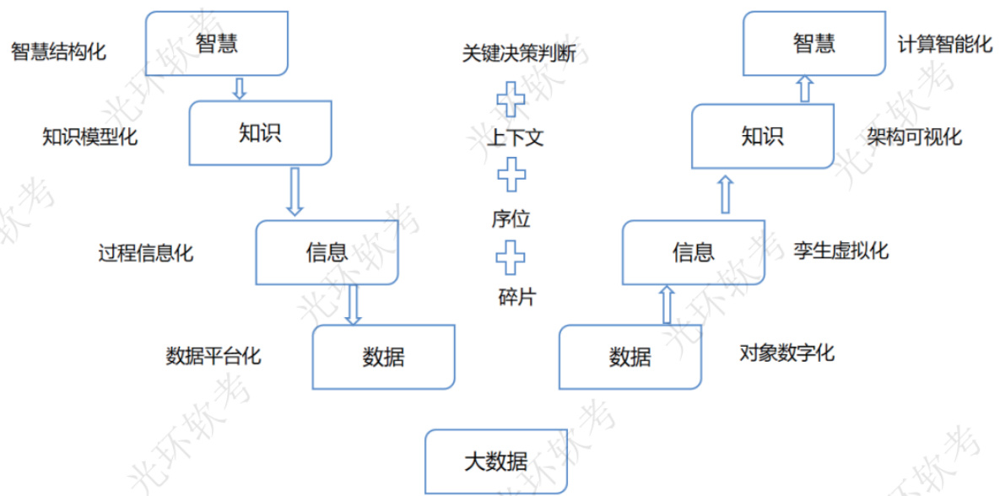  
图 1-6 智慧转移的 S8D 模型  

DIKW模型很好地诠释了数据(Data) $>$ 信息(Information) $>$ 知识(Knowledge)和智慧(wisdom)之间的关系，并揭示了他们的转化过程与方法。S8D 模型就是基于 DIKW 模型，构筑了“智慧一数据”“数据一智慧”两大过程的8个转化活动。  

（1）“智慧一数据”过程  

该过程通常指信息系统规划、建设、运行过程，也就是传统讲的“信息化过程”。该过程： $\textcircled{\scriptsize{1}}$ 通过智慧结构化明确了业务体系层面的内容； $\textcircled{2}$ 通过知识模型化定义业务活动的逻辑关系； $\textcircled{3}$ 通过过程信息化(管理和工艺流程化)明确各执行操作系列要求：$\ensuremath{\mathcal{Q}})$ 通过数据平台化实现了数据的采集、存储和共享等。  

（2）“数据一智慧”过程  

X 该过程通常指数据的开发利用和资源管理的过程，即人们常说的“智慧化过程”，重点解决基于各类组织组成对象(人员、流程、业务、工艺、装备等）“数字关系”的“脑力替代”。该过程在大数据“筑底”后，多元化数据能够被开发利用： $\textcircled{\scriptsize{1}}$ 通过对象数字化实现对各类对象的数字化表达； $\textcircled{2}$ 通过李生虚拟化完成物理对象到信息空间的映射； $\textcircled{3}$ 通过架构可视化实现业务知识模型与经验沉淀的复用和创新； $\textcircled{4}$ 通过计算智能化实现多元条件下的调度和决策。 七人  

数据是筑底构建可计算智慧的关键，通过“智慧一数据”过程将人类智慧形成了数据表达，并通过数据流动，提高了组织业务与工作效能，实现“体力劳动替代”。接下来通过“数据一智慧”工程，在大数据的基础上，逆变数据为计算智能，完成了智慧载体由自然人到计算机和信息系统的转移，其价值不仅仅可实现智慧的在线时效$(7\times24$ 无休),更可以实现“智慧挤压” (多方法多维度综合判断)和更高级别的“智慧萃取”(新智慧的生成),进一步实现智慧的可复制。这一过程也是第四科学范式的基本框  

架，是第四次科技革命的触发逻辑。  

# 5.【拓展知识点】持续迭代  

组织数字化转型需要在能力因子不断细化的基础上,针对能力因子的数字化转型实施迭代，可类比为整体数字化转型与局部数字转型的关系。组织每个能力因子数字化“封装”的持续迭代主要包含四项活动，即：信息物理世界(也称数字李生，CPS)建设、决策能力边际化(PtoE)部署、科学社会物理赛博机制构筑(CPSS)、数字框架与信息调制(DFIM)针对能力因子的持续迭代可以从任何一项活动开始实施四项活动，形成持续选代闭环。 X  

针对能力因子中的各类对象，实施数字李生建设，并在此基础上加人该因子与其他因子之间的配置关系。组织可以通过该项活动实现能力因子相关数据挖掘与数据开发利用，从而发现新的技术和逻辑，提升各项工作效率。 下软  

（2）决策能力边际化部署  

决策能力边际化是指处置执行层面的装置和人员能够基于决策算法模型等，敏捷取得更高的决策能力(权),达到敏捷响应的效果。组织可以通过该项活动实现决策权融合与调制，达到装备智能化和提高决策效能的价值效果。  

（3）科学物理赛博机制构筑  

科学物理赛博机制构筑是在CPS 的基础上，汇聚组织内能力因子的环境因素力量(或组织维度的外部社会力量),建设高密度数据框架，参照社会运行原理，封装、解构和重构各能力因子协同关系。组织可以通过该项活动实现对各能力因子的灵活组合机制，形成能够面对各类需求的动态调度能力。  

（4）数据框架与信息调制设计  

组织能力因子的数字密度越高，对其可控性就越高，对应的安全可靠性也越高。组织通过优化能力因子的数字框架模型，并提升数据采集获取的精准度和及时性，能够有效地提升组织对能力因子的应急与动员能力，从而具备更加可靠的已知风险管控能力和未知风险的应对能力。  

6.元宇宙  

元宇宙(Metaverse)是一个新兴概念，是一大批技术的集成。北京大学陈刚教授对元宇宙的定义是：元宇宙是利用科技手段进行链接与创造的，与现实世界映射与交互的虚拟世界，具备新型社会体系的数字生活空间。清华大学沈阳教授对元宇宙的定义是：元宇宙是整合多种新技术而产生的新型虚实相融的互联网应用和社会形态，它基于扩展现实技术提供沉浸式体验，以及数字李生技术生成现实世界的镜像，通过区块链技术搭建经济体系，将虚拟世界与现实世界在经济系统、社交系统、身份系统上密切融合，并且允许每个用户进行内容生产和编辑。中国社会科学院学者左鹏飞从时空性、真实性、独立性、连接性四个方面去交叉定义元宇宙。他指出：从时空性来看，元宇宙是一个空间维度上虚拟而时间维度上真实的数字世界；从真实性来看，元宇宙中既有现实世界的数字化复制物，也有虚拟世界的创造物；从独立性来看，元宇宙是一个与外部真实世界既紧密相连，又高度独立的平行空间；从连接性来看，元宇宙是一个把网络、硬件终端和用户囊括进来的一个永续的、广覆盖的虚拟现实系统。  

# （1）主要特征  

随着虚拟现实、人工智能、数字李生、云计算等关键技术逐步迭代发展，用户对更沉浸的虚拟世界有了更深人、更丰富的需求。元宇宙的流行是互联网发展到了一定的高度，也可以认为是互联网发展的另一阶段。元宇宙的主要特征包括：  

$\textcircled{\scriptsize{1}}$ 沉浸式体验：元宇宙的发展主要基于人们对互联网体验的需求，这种体验就是即时信息基础上的沉浸式体验。 XV  

$\circledcirc$ 虚拟身份：人们已经拥有大量的互联网账号，未来人们在元宇宙中，随着账号内涵和外延的进一步丰富，将会发展成为一个或若干个数字身份，这种身份就是数字世界的一个或一组角色。 X  

$\textcircled{3}$ 虚拟经济：虚拟身份的存在就促使元宇宙具备了开展虚拟社会活动的能力，而这些活动需要一定的经济模式展开，即虚拟经济。  

$\circledast$ 虚拟社会治理：元宇宙中的经济与社会活动也需要一定的法律法规和规则的约束，就像现实世界一样，元宇宙也需要社区化的社会治理。  

总之，元宇宙作为现实世界的李生空间和虚拟世界，其物理属性淡化，但社会属性将会被强化,我们在现实社会中的大量特征和活动,都逐渐会在元宇宙中体现出来。  

# （2）发展演进  

元宇宙作为多技术的集成融合和现实世界虚拟化，其发展一方面受到各类技术创新、发展和演进的影响，另一方面受经济与社会发展进程的约束。从互联网发展的基本规律和数字化转型进程来看，元宇宙首先会在社交、娱乐和文化领域发展，形成虚拟“数字人”，逐步再向虚拟身份方向演进，形成“数字人生”，此时的元宇宙偏向个体用户需求。但随着元宇宙中虚拟经济的发展和现实中组织数字化转型的深人，元宇宙向“数字组织”领域延伸，从而影响现实世界的经济与社会发展整体数字化转型升级，形成“数字生态”。之后伴随相关法律法规、标准规范的生成，网信事业的发展以及网络文明的进一步完善，元宇宙的虚拟世界形态持续迭代，形成“数字社会治理”，实现物理空间、社会空间和信息空间三元空间的协同发展新格局。  

# 第2章信息技术发展  

# 2.1信息技术及其发展  

信息技术是以微电子学为基础的计算机技术和电信技术的结合而形成的，对声音的、图像的、文字的、数字的和各种传感信号的信息进行获取、加工、处理、存储、传播和使用的技术。按表现形态的不同，信息技术可分为硬技术(物化技术)与软技术(非物化技术)。前者指各种信息设备及其功能，如传感器、服务器、智能手机、通信卫星、笔记本电脑。后者指有关信息获取与处理的各种知识、方法与技能，如语言文字技术、数据统计分析技术、规划决策技术、计算机软件技术等。 X八  

# 1.【拓展知识点】计算机软硬件  

计算机硬件(Computer Hardware)是指计算机系统中由电子、机械和光电元件等组成的各种物理装置的总称。这些物理装置按系统结构的要求构成一个有机整体，为计算机软件运行提供物质基础。计算机软件(Computer Software)是指计算机系统中的程序及其文档，程序是计算任务的处理对象和处理规则的描述;  

文档是为了便于了解程序所需的阐明性资料。程序必须安装入机器内部才能工作，文档一般是给人看的，不一定安装入机器。)  

硬件和软件互相依存。硬件是软件赖以工作的物质基础，软件的正常工作是硬件发挥作用的重要途径。计算机系统必须要配备完善的软件系统才能正常工作，从而充分发挥其硬件的各种功能。硬件和软件协同发展，计算机软件随硬件技术的迅速发展而发展，而软件的不断发展与完善又促进硬件的更新，两者密切交织发展，缺一不可。随着计算机技术的发展，在许多情况下，计算机的某些功能既可以由硬件实现，也可以由软件来实现。因此硬件与软件在一定意义上来说没有绝对严格的界线  

# 2.计算机网络  

在计算机领域中，网络就是用物理链路将各个孤立的工作站或主机相连在一起，组成数据链路，从而达到资源共享和通信的目的。凡将地理位置不同，并具有独立功能的多个计算机系统通过通信设备和线路连接起来，且以功能完善的网络软件(网络协议、信息交换方式及网络操作系统等)实现网络资源共享的系统，均可称为计算机网络。从网络的作用范围可将网络类别划分为个人局域网(PersonalAreaNetwork,PAN)>局 域 网 (Local AreaNetwork,LAN)> 城 域 网(MetropolitanAreaNetwork,MAN)、广域网(Wide Area Network,WAN)、公用网(PublicNetwork)、专用网(Private Network)o  

（1）网络标准协议  

网络协议是为计算机网络中进行数据交换而建立的规则、标准或约定的集合。网络协议由三个要素组成，分别是语义、语法和时序。语义是解释控制信息每个部分的含义，它规定了需要发出何种控制信息，完成的动作以及做出什么样的响应；语法是用户数据与控制信息的结构与格式，以及数据出现的顺序；时序是对事件发生顺序的详细说明。人们形象地将这三个要素描述为：语义表示要做什么，语法表示要怎么做,时序表示做的顺序。 下软  

1) OSI   

<html><body><table><tr><td colspan="3">OSI七层模型</td></tr><tr><td>(1)应用层</td><td>处理网应用</td><td>直接为端用户服务。负责对软件提供接口以使程序能使用 网络服务，如事务处理程序、文件传送协议和网络管理等。 在TCP/IP协议中，常见的协议有HTTP、Telnet.FTP、SMTP</td></tr><tr><td>(2)表示层</td><td>数据表示</td><td>如同应用程序和网络之间的翻译官，数据将按照网络能理 解的方案进行格式化；这种格式化也因所使用网络的类型 不同而不同。表示层管理数据的解密加密、数据转换、格 式化和文本压缩常见的协议有JPEGASCII、GIF、DES、 MPEG.</td></tr><tr><td></td><td>(3)会话层互联主机通信</td><td>负责在网络中的两节点之间建立和维持通信，以及提供交互 会话的管理功能，如三种数据流方向的控制，即一路交互、 两路交替和两路同时会话模式。常见的协议有RPC、SQL、 NFS。</td></tr><tr><td>(4)传输层</td><td>端到端连接</td><td>主要负责确保数据可靠、顺序、无错地从A点传输到B点。 如提供建立、维护和拆除传送连接的功能；选择网络层提 供最合适的服务；在系统之间提供可靠的透明的数据传 送，提供端到端的错误恢复和流量控制。常见的协议有 TCP、UDP。</td></tr><tr><td>(5)网络层</td><td>分组传输和路 由选择</td><td>其主要功能是将网络地址(例如，IP地址)翻译成对应的物 理地址(例如，MAC地址)，并决定如何将数据从发送方路 由到接收方。常见的协议有IP、ICMP.IGMP、ARP等。</td></tr><tr><td>(6)数据链 路层</td><td>传输以帧为单 位</td><td>它控制网络层与物理层之间的通信。它的主要功能是将从 网络层接收到的数据分割成特定的可被物理层传输的帧。 常见的协议有IEEE802.3/.2、HDLC、PPP。</td></tr><tr><td>(7)物理层</td><td>二进制位传输 (bit)</td><td>该层包括物理联网媒介，如电缆连线连接器。该层的协议 产生并检测电压以便发送和接收携带数据的信号。具体标 准有RS232、RJ-45、FDDI。</td></tr></table></body></html>  

2）IEEE802协议族  

<html><body><table><tr><td colspan="2">IEEE802规范</td></tr><tr><td>802.1</td><td>802协议概论</td></tr><tr><td>802.2</td><td>逻辑链路控制层LLC协议 X</td></tr><tr><td>802.3</td><td>以太网介质访问控制协议(CSMA/CD)及物理层技术规范</td></tr><tr><td>802.4</td><td>令牌总线TokenBus协议</td></tr><tr><td>802.5</td><td>令牌环Token Ring 协议</td></tr><tr><td>802.6</td><td>城域网MAN协议</td></tr><tr><td>802.7</td><td>FDDI宽带技术协议</td></tr><tr><td>802.8</td><td>光纤技术协议</td></tr><tr><td>802.9</td><td>局域网上的语音/数据集成规范</td></tr><tr><td>802.10</td><td>局域网安全互操作标准</td></tr><tr><td>802.11</td><td>无线局域网WLAN标准协议</td></tr></table></body></html>  

3)TCP/IP  

TCP/P在一定程度上参考了OSI,它将 OSI的七层简化为四层 $\lbrace{\mathrm{{D}}}\rbrace$ 应用层、表示层、会话层三个层次提供的服务相差不是很大，所以在 TCP/IP 中，它们被合并为应用层一个层次。 $\textcircled{2}$ 由于传输层和网络层在网络协议中的地位十分重要，所以在 TCP/IP 中它们被作为独立的两个层次。 $\textcircled{3}$ 因为数据链路层和物理层的内容相差不多，所以在TCP/P 中它们被归并在网络接口层一个层次里。.  

<html><body><table><tr><td>OSI体系结构</td><td colspan="2">TCP/IP协议集</td></tr><tr><td>应用层</td><td rowspan="3">应用层</td><td>FTP、TFFTP（FileTransferProtocol,文件传输协议）、 TFTP（TrivialFileTransferProtocol,简单文件传输协议）HTTP</td></tr><tr><td>表示层</td><td>（Hypertext TransferProtocol,超文本传输协议）、SMT（Simple MailTransferProtocol,简单邮件传输协议）DHCP（Dynamic</td></tr><tr><td>会话层</td><td>HostConfigurationProtocol,动态主机配置协议）>Telnet（远程 登录协议）>DNS（Domain Name System,域名系统）、SNMP （SimpleNetworkManagementProtocol,简单网络管理协议）等</td></tr><tr><td>传输层</td><td>传输层</td><td>分别是TCP和UDP（UserDatagramProtocol,用户数据报协 议），这些协议负责提供流量控制、错误校验和排序服务。 IP、ICMP（ Internet Control Message Protocol,网际控制报文协</td></tr><tr><td>网络层</td><td>网络层</td><td>议）、IGMP（Internet Group Management Protocol,网际组管理协 议）、ARP（AddressResolutionProtocol,地址解析协议）和RARP （ReverseAddressResolutionProtoco1,反向地址解析协议）</td></tr><tr><td>数据链路层</td><td>网络接口层各种物理通信网络接口</td><td></td></tr><tr><td>物理层</td><td></td><td></td></tr></table></body></html>  

4）应用层协议  

应用层协议主要有FTP、TFTP、HTTP、SMTP、DHCP、Telnet、DNS 和 SNMP等。  

$\textcircled{\mathrm{1}}\,\mathrm{FTP}$ （文件传输协议）：指客户端向服务器传送文件的协议，例如通过命令字来告诉服务器相关的信息。运行在 TCP之上，即通过Internet将文件从一台计算机传输到另一台计算机的一种途径。  

$\textcircled{2}$ TFTP（简单文件传输协议）：是用来在客户机与服务器之间进行简单文件传输的协议，提供不复杂、开销不大的文件传输服务。TFTP 建立在UDP（用户数据报协议）之上，提供不可靠的数据流传输服务，不提供存取授权与认证机制，使用超时重传方式来保证数据的到达。  

$\textcircled{3}$ HTTP（超文本传输协议）：是用于从WWW服务器传输超文本到本地浏览器的传送协议。它可以使浏览器更加高效，使网络传输减少。HTTP建立在 TCP 之上，它不仅保证计算机正确快速地传输超文本文档，还确定传输文档中的哪一部分，以及哪部分内容首先显示等。 X  

$\textcircled{4}$ SMTP(简单邮件传输协议）：建立在 TCP 之上，是一种提供可靠且有效的电子邮件传输的协议。  

$\textcircled{5}$ DHCP（动态主机配置协议）：建立在UDP之上，基于客户机/服务器模型设计的。所有的IP网络设定数据都由DHCP服务器集中管理，并负责处理客户端的DHCP要求；而客户端则会使用从服务器分配下来的IP环境数据。  

$\circled{6}$ Telnet（远程登录协议）：是登录和仿真程序，建立在TCP之上，它的基本功能是允许用户登录进人远程计算机系统。 X  

$\textcircled{7}$ DNS（域名系统）：在Internet上域名与IP地址之间是一一对应的，它们之间的转换工作称为域名解析，DNS 就是进行域名解析的服务器。  

$\circled{8}$ SNMP（简单网络管理协议）：是为了解决Internet上的路由器管理问题而提出的。  

5）传输层协议主要包括：TCP（传输控制协议）和UDP(用户数据报协议)，这些协议负责提供流量控制、错误校验和排序服务。  

$\textcircled{\scriptsize{1}}$ 传输控制协议TCP：提供一种面向连接的、可靠的数据传输服务，保证了端到端数据传输的可靠性。  

$\textcircled{2}$ 用户数据报协议UDP：是一种不可靠的《无连接的协议，可以保证应用程序进程间的通信，但在数据传输过程中没有流量控制和确认机制，数据报可能会丢失、延迟、乱序到达信宿。与TCP 相比，UDP是一种无连接的协议，它的错误检测功能要弱得多。TCP有助于提供可靠性，而UDP则有助于提高传输速率。UDP协议用于传输数据量大，对可靠性要求不是很高，但要求速度快的场合。  

# 6）网络层协议  

网络层协议主要包括：IP、ICMP（网际控制报文协议）、IGMP（网际组管理协  

议）、ARP(地址解析协议)和RARP（反向地址解析协议）等，这些协议处理信息的路由和主机地址解析。  

IP：网络层的功能主要由 IP 来提供。  

ARP用于动态地完成IP地址向物理地址的转换。物理地址即网卡地址，也称为MAC（媒体访问控制）地址，每块网卡都有唯一的地址。  

RARP用于动态完成物理地址向IP地址的转换。  

ICMP专门用于发送差错报文的协议。如IP协议是一种尽力传送的通信协议，即传送的数据可能丢失、重复、延迟或乱序传递，所以需要一种尽量避免差错并能在发生差错时报告的机制，这就是ICMP的功能。  

7）以太网规范IEEE802.3是重要的局域网协议，内容包括：  

<html><body><table><tr><td>标准</td><td>类型</td><td>速率</td><td>介质</td></tr><tr><td>802.3</td><td>标准以太网</td><td>10Mb/s</td><td>传输介质为细同轴电缆</td></tr><tr><td>802.3u</td><td>快速以太网</td><td>100Mb/s</td><td>双绞线 X</td></tr><tr><td>802.3z</td><td>千兆以太网</td><td>1000Mb/s</td><td>光纤或双绞线</td></tr></table></body></html>  

8）网络与信息安全专业技术知识-网络技术概述  

无线技术使用的传输介质是无线电波。  

无线局域网标准IEEE802.11  

无线局域网标准，定义了无线的媒体访问控制（MAC）子层和物理层规范。IEEE802.11系列标准主要有 4个子标准：IEEE802.1a、IE802.11b、IEEE $802.11\mathrm{g}$ 、IEEE$802.11\mathrm{n}$ X  

<html><body><table><tr><td>标准名称</td><td>标准描述</td></tr><tr><td>IEEE802.11b</td><td>带宽为11Mbps，工作频率为2.4GHz</td></tr><tr><td>IEEE802.11a</td><td>工作频率为5GHz，宽带为54Mbps</td></tr><tr><td>IEEE802.11g</td><td>兼容IEEE802.11a/b，同IEEE 802.11b一样，也工作在2.4GHz 频段</td></tr><tr><td>IEEE802.11n</td><td>传输速率由目前 IEEE802.11a及 IEEE802.11g 提供的54Mbps, 提高到300Mbps甚至高达600Mbps</td></tr></table></body></html>  

# 3.软件定义网络  

软件定义网络(Software Defined Network,SDN)是一种新型网络创新架构，是网络虚拟化的一种实现方式，它可通过软件编程的形式定义和控制网络，其通过将网络设备的控制面与数据面分离开来，从而实现了网络流量的灵活控制，使网络变得更加智能，为核心网络及应用的创新提供了良好的平台。  

利用分层的思想，SDN将数据与控制相分离。在控制层，包括具有逻辑中心化和可编程的控制器，可掌握全局网络信息，方便运营商和科研人员管理配置网络和部署新协议等。在数据层，包括哑交换机(与传统的二层交换机不同，专指用于转发数据的设备),仅提供简单的数据转发功能，可以快速处理匹配的数据包，适应流量日益增长的需求。两层之间采用开放的统一接口(如Open Flow等)进行交互。控制器通过标准接口向交换机下发统一标准规则，交换机仅需按照这些规则执行相应的动作即可。SDN打破了传统网络设备的封闭性。此外，南北向和东西向的开放接口及可编程性，也使得网络管理变得更加简单、动态和灵活。  

SDN 的整体架构由下到上(由南到北)分为数据平面、控制平面和应用平面，具体如图2-1所示。其中，数据平面由交换机等网络通用硬件组成，各个网络设备之间通过不同规则形成的SDN数据通路连接；控制平面包含了逻辑上为中心的SDN控制器，它掌握着全局网络信息，负责各种转发规则的控制；应用平面包含着各种基于 SDN的网络应用，用户无须关心底层细节就可以编程、部署新应用。  

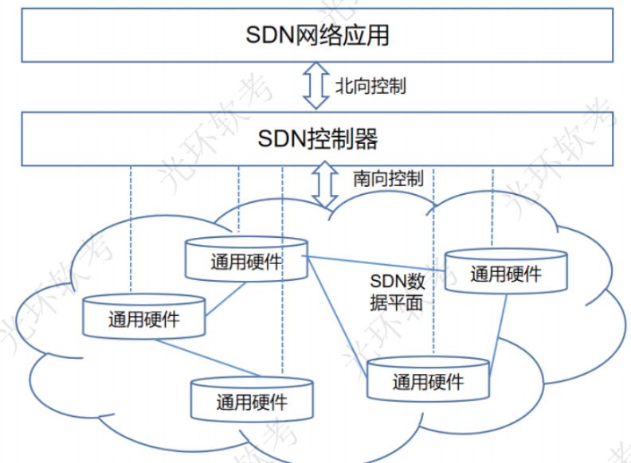  
图 2-1 SDN体系架构图  

控制平面与数据平面之间通过 SDN 控制数据平面接口(Control-Data-PlaneInterface,CDPI)进行通信，它具有统一的通信标准，主要负责将控制器中的转发规则下发至转发设备，最主要应用的是OpenFlow协议。控制平面与应用平面之间通过SDN北向接口(North Bound Interface,NBI)进行通信，而 NBI 并非统一标准，它允许用户根据自身需求定制开发各种网络管理应用。  

SDN中的接口具有开放性，以控制器为逻辑中心，南向接口负责与数据平面进行通信，北向接口负责与应用平面进行通信，东西向接口负责多控制器之间的通信。最主流的南向接口 CDPI 采用的是 Open Flow 协议。Open Flow 最基本的特点是基于流(Flow)的概念来匹配转发规则，每一个交换机都维护一个流表(Flow Table),依据流表中的转发规则进行转发，而流表的建立、维护和下发都是由控制器完成的。针对北向接口，应用程序通过北向接口编程来调用所需的各种网络资源，实现对网络的快速配置和部署。东西向接口使控制器具有可扩展性，为负载均衡和性能提升提供了技术保障。  

# 4.【拓展知识点】第五代移动通信技术  

（1）第五代移动通信技术（5G）是具有高速率、低时延和大连接特点的新一代移动通信技术。（2）在正交频分多址（OFDMA）和多入多出（MIM0）基础技术上，5G为支持三大应用场景，采用了灵活的全新系统设计。（3）5G的三大类应用场景，即增强移动宽带（eMBB）超高可靠低时延通信（uRLLC）和海量机器类通信（mMTC）。1）增强移动宽带主要面向移动互联网流量爆炸式增长，为移动互联网用户提供更加极致的应用体验；2）超高可靠低时延通信主要面向工业控制、远程医疗、自动驾驶等对时延和可靠性具有极高要求的垂直行业应用需求； X3）海量机器类通信主要面向智慧城市、智能家居、环境监测等以传感和数据采集为目标的应用需求。（4）在频段方面，5G 同时支持中低频和高频频段，4G 仅支持中低频，其中中低频满足覆盖和容量需求，高频满足在热点区域提升容量的需求，5G针对中低频和高频设计了统一的技术方案，并支持百 MHz的基础带宽。为了支持高速率传输和更优覆盖，5G采用LDPC、Polar新型信道编码方案、性能更强的大规模天线技术等。5G采用短帧、快速反馈、多层/多站数据重传等技术。  

# 5.存储技术  

存储分类根据服务器类型分为：封闭系统的存储和开放系统的存储。封闭系统主要指大型机等服务器。开放系统指基于包括麒麟、欧拉、UNIX、Linux等操作系统的服务器。开放系统的存储分为：内置存储和外挂存储。外挂存储根据连接的方式分为直连式存储(Direct-Attached Storage,DAS)和网络化存储(Fabric-Attached Storage,FAS)。网络化存储根据传输协议又分为网络接入存储(Network-Attached Storage,NAS)和存储区域网络(Storage Area Network,SAN)。DAS、NAS、SAN 等存储模式之间的技术与应用对比如表2-2所示。V X八 下软  

常用存储模式的技术与应用对比：  

<html><body><table><tr><td>存储系统架构</td><td>DAS</td><td>NAS</td><td>SAN</td></tr><tr><td>安装难易度</td><td>不一定</td><td>不 简单</td><td>困难</td></tr><tr><td>数据传输协议</td><td>SCSI/FC/ATA</td><td>X TCP/IP</td><td>LFC</td></tr><tr><td>传输对象</td><td>数据块</td><td>文件</td><td>数据块</td></tr><tr><td>使用标准文件共 享协议</td><td>否</td><td>是(NFS/CIFS.·)</td><td>否</td></tr><tr><td>异种操作系统文 件共享</td><td>否</td><td>是</td><td>需要转换设备</td></tr><tr><td>集中式管理</td><td>不一定</td><td>是</td><td>需要管理工具</td></tr><tr><td>管理难易度</td><td>不一定</td><td>以网络为基础，容易</td><td>不一定，但通常很难</td></tr><tr><td>提高服务器效率</td><td>否</td><td>是</td><td>是找</td></tr><tr><td>灾难忍受度</td><td>低</td><td>高</td><td>高，专有方案</td></tr><tr><td>适合对象</td><td>中小组织服务器 捆绑磁盘(JBOD)</td><td>中小组织 SOHO族 组织部门</td><td>大型组织 数据中心 光纤通道储域网</td></tr><tr><td>应用环境</td><td>局域网 文档共享程度低 独立操作平台 服务器数量少</td><td>局域网 文档共享程度高 异质格式存储需求高 光</td><td>网络环境复杂 文档共享程度高 异质操作系统平台 服务器数量多</td></tr><tr><td>业务模式</td><td>一般服务器</td><td>Web服务器多媒体资 料存储文件资料共享</td><td>大型资料库数据库等</td></tr><tr><td>档案格式复杂度</td><td>低</td><td>中</td><td>高</td></tr><tr><td>容量扩充能力</td><td>低</td><td>中</td><td>高</td></tr></table></body></html>  

# 6、存储虚拟化  

存储虚拟化(Storage Virtualization)是“云存储”的核心技术之一，它把来自一个或多个网络的存储资源整合起来，向用户提供一个抽象的逻辑视图，用户可以通过这个视图中的统一逻辑接口来访问被整合的存储资源。用户在访问数据时并不知道真实的物理位置。它带给人们直接的好处是提高了存储利用率，降低了存储成本，简化了大型、复杂、异构的存储环境的管理工作。  

存储虚拟化使存储设备能够转换为逻辑数据存储。虚拟机作为一组文件存储在数据存储的目录中。数据存储是类似于文件系统的逻辑容器。它隐藏了每个存储设备的特性，形成一个统一的模型，为虚拟机提供磁盘。存储虚拟化技术帮助系统管理虚拟基础架构存储资源，提高资源利用率和灵活性，提高应用正常运行时间。  

# 7.绿色存储(Green Storage)  

绿色存储(Green Storage)技术是指从节能环保的角度出发，用来设计生产能效更佳的存储产品，降低数据存储设备的功耗，提高存储设备每瓦性能的技术。绿色存储是一个系统设计方案，贯穿于整个存储设计过程，包含存储系统的外部环境、存储架构、存储产品、存储技术、文件系统和软件配置等多方面因素。  

绿色存储技术的核心是设计运行温度更低的处理器和更有效率的系统，生产更低能耗的存储系统或组件，降低产品所产生的电子碳化合物，其最终目的是提高所有网络存储设备的能源效率，用最少的存储容量来满足业务需求，从而消耗最低的能源。以绿色理念为指导的存储系统最终是存储容量、性能、能耗三者的平衡。  

绿色存储技术涉及所有存储分享技术，包括磁盘和磁带系统、服务器连接、存储设备、网络架构及其他存储网络架构、文件服务和存储应用软件、重复数据删除、自动精简配置和基于磁带的备份技术等可以提高存储利用率、降低建设成本和运行成本的存储技术，其目的是提高所有网络存储技术的能源效率。  

# 8.数据结构模型  

数据结构模型是数据库系统的核心。数据结构模型描述了在数据库中结构化和操纵数据的方法，模型的结构部分规定了数据如何被描述(例如树、表等)。模型的操纵部分规定了数据的添加、删除、显示、维护、打印、查找、选择、排序和更新等操作。  

常见的数据结构模型有三种：层次模型、网状模型和关系模型，层次模型和网状模型又统称为格式化数据模型。  

# （1）层次模型  

层次模型是数据库系统最早使用的一种模型，它用“树”结构表示实体集之间的关联，其中实体集(用矩形框表示)为结点，而树中各结点之间的连线表示它们之间的关联。在层次模型中，每个结点表示一个记录类型，记录类型之间的联系用结点之间的连线(有向边)表示，这种联系是父子之间的一对多的联系。这就使得层次数据库系统只能处理一对多的实体联系。每个记录类型可包含若干个字段，这里记录类型描述的是实体，字段描述实体的属性。每个记录类型及其字段都必须命名。各个记录类型、同一记录类型中各个字段不能同名。每个记录类型可以定义一个排序字段，也称码字段，如果定义该排序字段的值是唯一的，则它能唯一地标识一个记录值。  

一个层次模型在理论上可以包含任意有限个记录类型和字段,但任何实际的系统都会因为存储容量或实现复杂度而限制层次模型中包含的记录类型个数和字段个数。在层次模型中，同一双亲的子女结点称为兄弟结点，没有子女结点的结点称为叶结点。层次模型的一个基本的特点是任何一个给定的记录值只能按其层次路径查看，没有一个子女记录值能够脱离双亲记录值而独立存在。  

（2）网状模型  

网状数据库系统采用网状模型作为数据的组织方式。网状模型用网状结构表示实体类型及其实体之间的联系。网状模型是一种可以灵活地描述事物及其之间关系的数据库模型。八 下  

现实世界中事物之间的联系更多的是非层次关系的，一个事物和另外的几个都有联系，用层次模型表示这种关系很不直观，网状模型克服了这一弊病，可以清晰地表示这种非层次关系。用有向图结构表示实体类型及实体间联系的数据结构模型称为网状模型。网状模型取消了层次模型的不能表示非树状结构的限制，两个或两个以上的结点都可以有多个双亲结点，则此有向树变成了有向图，该有向图描述了网状模型。  

网状模型中以记录为数据的存储单位。记录包含若干数据项。网状数据库的数据项可以是多值的和复合的数据。每个记录有一个唯一标识它的内部标识符，称为码（Database Key，DBK）,它在一个记录存人数据库时由数据库管理系统(DatabaseManagement System,DBMS)自动赋予。DBK可以看作记录的逻辑地址，可作记录的替身或用于寻找记录。网状数据库是导航式(Navigation)数据库，用户在操作数据库时不但说明要做什么，还要说明怎么做。例如在查找语句中不但要说明查找的对象，而且要规定存取路径。  

# （3）关系模型  

关系模型是在关系结构的数据库中用二维表格的形式表示实体以及实体之间的联系的模型。关系模型是以集合论中的关系概念为基础发展起来的。关系模型中无论是实体还是实体间的联系均由单一的结构类型关系来表示。  

关系模型的基本假定是所有数据都表示为数学上的关系，就是说n个集合的笛卡儿积的一个子集，有关这种数据的推理通过二值的谓词逻辑来进行，这意味着对每个命题都只有两种可能的值；要么是真，要么是假。数据通过关系演算和关系代数的一种方式来操作。关系模型是采用二维表格结构表达实体类型及实体间联系的数据模型。  

关系模型允许设计者通过数据库规范化的提炼，去建立一个信息的一致性的模型。访问计划和其他实现与操作细节由 DBMS引擎来处理，而不应该反映在逻辑模型中,这与 SQL DBMS普遍的实践是对立的，在它们那里性能调整经常需要改变逻辑模型。  

基本的关系建造块是域或者叫数据类型。元组是属性的有序多重集(Multiset),属性是域和值的有序对。关系变量(Relvar)是域和名字的有序对(序偶)的集合，它充当关系的表头（Header）。关系是元组的集合。尽管这些关系概念是在数学上定义的，它们可以宽松地映射到传统数据库概念上。表是关系公认的可视表示：元组类似于行的概念。 X  

关系模型的基本原理是信息原理，即所有信息都表示为关系中的数据值。所以，关系变量在设计时是相互无关联的；反而，设计者在多个关系变量中使用相同的域，如果一个属性依赖于另一个属性，则通过参照完整性来强制这种依赖性。  

# 9.常用数据库类型  

数据库根据存储方式可以分为关系型数据库(SQL)和非关系型数据库(NotOnlySQL,NOSQL)。  

（1）关系型数据库  

《网状数据库(以网状数据模型为基础建立的数据库)和层次数据库(采用层次模型作为数据组织方式的数据库)已经很好地解决了数据的集中和共享问题，但是在数据独立性和抽象级别上仍有很大欠缺。用户在对这两种数据库进行存取时，仍然需要明确数据的存储结构，指出存取路径。而后来出现的关系数据库较好地解决了这些问题。关系数据库系统采用关系模型作为数据的组织方式。关系数据库是在一个给定的应用领域中，所有实体及实体之间联系的集合。关系型数据库支持事务的ACID原则，即原子性(Atomicity)、一致性(Consistency)、隔离性(Isolation)、持久性(Durability),这四种原则保证在事务过程当中数据的正确性。 X  

# （2）非关系型数据库  

非关系型数据库是分布式的、非关系型的、不保证遵循ACID 原则的数据存储系统。NOSQL 数据存储不需要固定的表结构，通常也不存在连接操作。在大数据存取上具备关系型数据库无法比拟的性能优势。  

常见的非关系数据库分为：  

$\textcircled{\scriptsize{1}}$ 键值数据库：类似传统语言中使用的哈希表。可以通过key来添加、查询或者删除数据库，因为使用key 主键访问，会获得很高的性能及扩展性。Key/Value 模型对于信息系统来说，其优势在于简单、易部署、高并发。  

$\textcircled{2}$ 列存储(Column-oriented)数据库：将数据存储在列族中，一个列族存储经常被一起查询，比如人们经常会查询某个人的姓名和年龄，而不是薪资。这种情况下姓名和年龄会被放到一个列族中，薪资会被放到另一个列族中。这种数据库通常用来应对分布式存储海量数据。 X  

$\textcircled{3}$ 面向文档(Document-Oriented)数据库：文档型数据库可以看作是键值数据库的升级版，允许之间嵌套键值，而且文档型数据库比键值数据库的查询效率更高。面向文档数据库会将数据以文档形式存储。  

$\textcircled{4}$ 图形数据库：允许人们将数据以图的方式存储。实体会作为顶点，而实体之间的关系则会作为边。比如有三个实体：Steve Jobs、Apple 和 Next,则会有两个 Foundedby 的边将Apple 和 Next 连接到 Steve Jobs。%  

（3）不同存储方式数据库的优缺点  

关系型数据库和非关系型数据库的优缺点，如表2-3所示。  

<html><body><table><tr><td>数据库 类型</td><td>特点类型</td><td>描述</td></tr><tr><td rowspan="2">下软考 关系型数 据库</td><td>优点</td><td>1.容易理解：二维表结构是非常贴近逻辑世界的一个概念，关 系模型相对网状、层次等其他模型来说更容易理解 2.使用方便：通用的SQL语言使得操作关系型数据库非常方 便 3.易于维护：丰富的完整性(实体完整性、参照完整性和用户 定义的完整性)大大降低了数据冗余和数据不一致的概率</td></tr><tr><td>缺点</td><td>1.数据读写必须经过SQL解析，大量数据、高并发下读写性 能不足(对于传统关系型数据库来说，硬盘I/O是一个很大的 瓶颈) 2.具有固定的表结构，因此扩展困难 光环软 3.多表的关联查询导致性能欠佳</td></tr><tr><td rowspan="2">非关系型 数据库</td><td>优点 环软</td><td>1.高并发：大数据下读写能力较强(基于键值对的，可以想象 成表中的主键和值的对应关系，且不需要经过SQL层的解析， 所以性能非常高) 2.基本支持分布式：易于扩展，可伸缩(因为基于键值对，数 据之间没有耦合性，所以非常容易水平扩展) 3.简单：弱结构化存储</td></tr><tr><td>缺点</td><td>1.事务支持较弱 2.通用性差 光环软考 3.无完整约束，复杂业务场景支持较差</td></tr></table></body></html>  

# 10.数据仓库  

传统的数据库系统中缺乏决策分析所需的大量历史数据信息，因为传统的数据库一般只保留当前或近期的数据信息。为了满足中高层管理人员预测、决策分析的需要，在传统数据库的基础上产生了能够满足预测、决策分析需要的数据环境一一数据仓库。数据仓库相关的基础概念包括：  

$\textcircled{\scriptsize{1}}$ 清洗/转换/加载(Extract/Transformation/Load,ETL):用户从数据源抽取出所需的数据，经过数据清洗、转换，最终按照预先定义好的数据仓库模型，将数据加载到数据仓库中去。  

$\textcircled{2}$ 元数据：关于数据的数据,指在数据仓库建设过程中所产生的有关数据源定义、目标定义、转换规则等相关的关键数据。同时元数据还包含关于数据含义的商业信息。典型的元数据包括：数据仓库表的结构、数据仓库表的属性、数据仓库的源数据(记录系统)、从记录系统到数据仓库的映射、数据模型的规格说明、抽取日志和访问数据的公用例行程序等。  

$\textcircled{3}$ 粒度：数据仓库的数据单位中保存数据的细化或综合程度的级别。细化程度越高，粒度级就越小；相反，细化程度越低，粒度级就越大。  

$\textcircled{4}$ 分割：结构相同的数据被分成多个数据物理单元。任何给定的数据单元属于且仅属于一个分割。  

$\textcircled{5}$ 数据集市：小型的，面向部门或工作组级的数据仓库。  

$\circled{6}$ 操作数据存储(OperationDataStore,ODS):能支持组织日常的全局应用的数据集合，是不同于DB的一种新的数据环境，是DW扩展后得到的一个混合形式。它具有四个基本特点：面向主题的、集成的、可变的、当前或接近当前的。  

$\textcircled{7}$ 数据模型：逻辑数据结构，包括由数据库管理系统为有效进行数据库处理提供的操作和约束：用于表示数据的系统。 V 下  

$\circled{8}$ 人工关系：在决策支持系统环境中用于表示参照完整性的一种设计技术。  

数据仓库是一个面向主题的、集成的、非易失的且随时间变化的数据集合，用于支持管理决策。常见的数据仓库的体系结构如图2-2所示。  

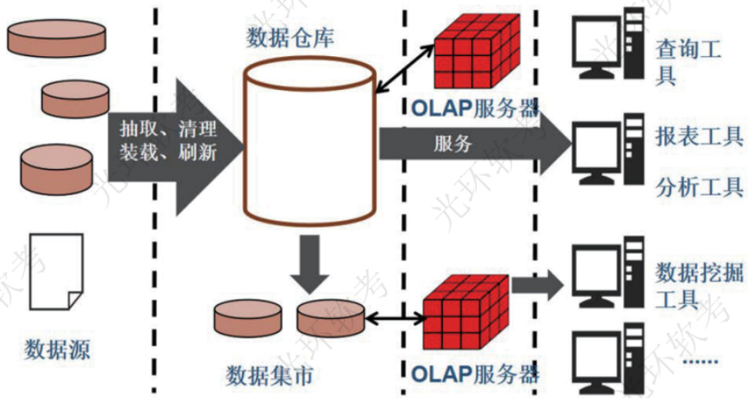  
图 2-2数据仓库体系结构  

(1)数据源。它是数据仓库系统的基础,是整个系统的数据源泉。通常包括组织内部信息和外部信息。内部信息包括存放于关系型数据库管理系统中的各种业务处理数据和各类文档数据。外部信息包括各类法律法规、市场信息和竞争对手的信息等。  

(2)数据的存储与管理。它是整个数据仓库系统的核心。数据仓库的真正关键是数据的存储和管理。数据仓库的组织管理方式决定了它有别于传统数据库，同时也决定了其对外部数据的表现形式。要决定采用什么产品和技术来建立数据仓库的核心，则需要从数据仓库的技术特点着手分析。针对现有各业务系统的数据，进行抽取、清理并有效集成，按照主题进行组织。数据仓库按照数据的覆盖范围可以分为组织级数据仓库和部门级数据仓库(通常称为数据集市)。  

（3）联机分析处理( $\mathrm{On}{}^{\cdot}$ -LineAnalyticProcessing,OLAP)服务器。OLAP对分析需要的数据进行有效集成，按多维模型予以组织，以便进行多角度、多层次的分析，并发现趋势。其具体实现可以分为：基于关系数据库的 OLAP(Relational OLAP,ROLAP)、基于多维数据组织的OLAP(Multidimensional OLAP,MOLAP)和基于混合数据组织的OLAP(HybridOLAP,HOLAP)。ROLAP 基本数据和聚合数据均存放在 RDBMS 之中；MOLAP基本数据和聚合数据均存放于多维数据库中：HOLAP基本数据存放于关系数据库管理系统(Relational Database Management System,RDBMS)之中,聚合数据存放于多维数据库中。  

(4)前端工具。前端工具主要包括各种查询工具、报表工具、分析工具、数据挖掘工具以及各种基于数据仓库或数据集市的应用开发工具。其中数据分析工具主要针对OLAP服务器，报表工具、数据挖掘工具主要针对数据仓库。  

# 11.信息安全  

常见的信息安全问题主要表现为：计算机病毒泛滥、恶意软件的入侵、黑客攻击、利用计算机犯罪、网络有害信息泛滥、个人隐私泄露等。随着物联网、云计算、人工智能、大数据等新一代信息技术的广泛应用，信息安全也面临着新的问题和挑战。  

（1）信息安全基础  

信息安全强调信息(数据)本身的安全属性，主要包括以下内容。  

$\textcircled{\scriptsize{1}}$ 保密性(Confidentiality):信息不被未授权者知晓的属性。  

$\textcircled{2}$ 完整性(Integrity):信息是正确的、真实的、未被篡改的、完整无缺的属性。  

$\textcircled{3}$ 可用性(Availability):信息可以随时正常使用的属性。  

信息必须依赖其存储、传输、处理及应用的载体(媒介)而存在，因此针对信息系统，安全可以划分为四个层次：设备安全、数据安全、内容安全、行为安全。  

信息系统一般由计算机系统、网络系统、操作系统、数据库系统和应用系统组成,与此对应，信息系统安全主要包括计算机设备安全、网络安全、操作系统安全、数据库系统安全和应用系统安全等。  

网络安全技术主要包括：防火墙、入侵检测与防护、VPN、安全扫描、网络蜜罐技术、用户和实体行为分析技术等。  

# （2）加密解密  

为了保证信息的安全性，就需要采用信息加密技术对信息进行伪装，使得信息非法窃取者无法理解信息的真实含义；需要采用加密算法提取信息的特征码(校验码)或特征矢量，并与有关信息封装在一起，信息的合法拥有者可以利用特征码对信息的完整性进行校验；需要采用加密算法对信息使用者的身份进行认证、识别和确认，以对信息的使用进行控制。  

发信者将明文数据加密成密文，然后将密文数据送人网络传输或存人计算机文件，而且只给合法收信者分配密钥。合法收信者接收到密文后，实行与加密变换相逆的变换，去掉密文的伪装并恢复出明文，这一过程称为解密(Decryption),解密在解密密钥的控制下进行。用于解密的一组数学变换称为解密算法。  

加密技术包括两个元素：算法和密钥。密钥加密技术的密码体制分为对称密钥体制和非对称密钥体制两种。相应地，对数据加密的技术分为两类，即对称加密(私人密钥加密)和非对称加密(公开密钥加密)。对称加密以数据加密标准(Data EncryptionStandard,DES)算法为典型代表，非对称加密通常以RSA(RivestShamir Adleman)算法为代表，对称加密的加密密钥和解密密钥相同，而非对称加密的加密密钥和解密密钥不同，加密密钥可以公开而解密密钥需要保密。  

# （3）【拓展知识点】安全行为分析技术  

传统安全产品、技术、方案基本上都是基于已知特征进行规则匹配来进行分析和检测。基于特征、规则和人工分析，以“特征”为核心的检测分析存在安全可见性盲区，有滞后效应、无力检测未知攻击、容易被绕过，以及难以适应攻防对抗的网络现实和快速变化的组织环境、外部威胁等问题。另一方面，虽然大多数的攻击可能来自组织以外，但最严重的损害往往是由内部人员造成的，只有管理好内部威胁，才能保证信息和网络安全。 X  

用户和实体行为分析(User andEntity Behavior Analytics,UEBA)提供了用户画像及基于各种分析方法的异常检测，结合基本分析方法（利用签名的规则、模式匹配、简单统计、阈值等)和高级分析方法(监督和无监督的机器学习等),用打包分析来评估用户和其他实体(主机、应用程序、网络、数据库等)发现与用户或实体标准画像或行为异常的活动所相关的潜在事件。UEBA以用户和实体为对象，利用大数据，结合规则以及机器学习模型，并通过定义此类基线，对用户和实体行为进行分析和异常检测，尽可能快速地感知内部用户和实体的可疑或非法行为。  

UEBA是一个完整的系统，涉及算法、工程等检测部分，以及用户与实体风险评分排序、调查等用户交换和反馈。从架构上来看，UEBA系统通常包括数据获取层、算法分析层和场景应用层。  

网络安全态势感知(NetworkSecurity SituationAwareness)是在大规模网络环境中,对能够引起网络态势发生变化的安全要素进行获取、理解、显示，并据此预测未来的网络安全发展趋势。安全态势感知不仅是一种安全技术，也是一种新兴的安全概念。它是一种基于环境的、动态的、整体的洞悉安全风险的能力。安全态势感知的前提是安全大数据，其在安全大数据的基础上进行数据整合、特征提取等，然后应用一系列态势评估算法生成网络的整体态势状况，应用态势预测算法预测态势的发展状况，并使用数据可视化技术，将态势状况和预测情况展示给安全人员，方便安全人员直观便徒地了解网络当前状态及预期的风险。 XV  

网络安全态势感知的关键技术主要包括：海量多元异构数据的汇聚融合技术、面向多类型的网络安全威胁评估技术、网络安全态势评估与决策支撑技术、网络安全态势可视化等。八  

# 12.【拓展知识点】信息技术的发展  

(1)在计算机软硬件方面，计算机硬件技术将向超高速、超小型、平行处理、智能化的方向发展，计算机硬件设备的体积越来越小、速度越来越高、容量越来越大、功耗越来越低、可靠性越来越高。  

（2)计算机软件越来越丰富，功能越来越强大，“软件定义一切”概念成为当前发展的主流。  

(3)5G成为当前的主流，面向物联网、低时延场景的窄带物联网(NB-IoT)和增强型机器类型通信(eMTC)、工业物联网(IIoT)和低延时高可靠通信(URLLC)等技术，将进一步得到充分发展。 不软  

(4)在信息安全方面,传统计算机安全理念将过渡到以可信计算理念为核心的计算机安全，由网络普及应用引发的技术与应用模式的变革，正在进一步推动信息安全网络化关键技术的创新；同时信息安全标准的研究与制定，信息安全产品和服务的集成和融合，正引领着当前信息安全技术朝着标准化和集成化的方向发展。  

# 2.2新一代信息技术及应用  

信息技术在智能化、系统化、微型化、云端化的基础上不断融合创新，促进了物联网、云计算、大数据、区块链、人工智能、虚拟现实等新一代信息技术的诞生。新一代信息技术与信息资源充分开发利用形成的新模式、新业态等，是信息化发展的主要趋势，也是信息系统集成领域未来的重要业务范畴。  

# 1.物联网  

物联网(The Internet of Things)是指通过信息传感设备，按约定的协议将任何物品与互联网相连接，进行信息交换和通信，以实现智能化识别、定位、跟踪、监控和管理的网络。物联网主要解决物品与物品(Thing to Thing,T2T)、人与物品(Human toThing,H2T)、人与人(Human to Human,H2H)之间的互连。另外，许多学者在讨论物联网时经常会引入 M2M 的概念：可以解释为人与人(Man to Man)、人与机器(Man toMachine)或机器与机器(Machine to Machine)。 X  

# （1）技术基础  

物联网架构可分为三层：感知层、网络层和应用层。感知层由各种传感器构成，包括温度传感器，二维码标签、RFID 标签和读写器，摄像头，GPS等感知终端。感知层是物联网识别物体、采集信息的来源。网络层由各种网络，包括互联网、广电网、网络管理系统和云计算平台等组成，是整个物联网的中枢，负责传递和处理感知层获取的信息。应用层是物联网和用户的接口，它与行业需求结合以实现物联网的智能应  

用。  

物联网的产业链包括传感器和芯片、设备、网络运营及服务、软件与应用开发和系统集成。物联网技术在智能电网、智慧物流、智能家居、智能交通、智慧农业、环境保护、医疗健康、城市管理(智慧城市)、金融服务与保险业、公共安全等方面有非常关键和重要的应用。  

（2）【拓展知识点】关键技术  

物联网关键技术主要涉及传感器技术、传感网和应用系统框架等。  

1)传感器技术  

传感器是一种检测装置，它能“感受”到被测量的信息，并能将检测到的信息按一定规律变换成为电信号或其他所需形式的信息输出，以满足信息的传输、处理、存储、显示、记录和控制等要求。它是实现自动检测和自动控制的首要环节，也是物联网获取物理世界信息的基本手段。  

射频识别技术(RadioFrequencyIdentification,RFID)是物联网中使用的一种传感器技术，在物联网发展中备受关注。RIFD可通过无线电信号识别特定目标并读写相关数据，而无须识别系统与特定目标之间建立机械或光学接触，RFID 是一种简单的无线系统，由一个询问器(或阅读器)和很多应答器(或标签)组成。标签由耦合元件及芯片组成，每个标签具有扩展词条唯一的电子编码，附着在物体上标识目标对象，它通过天线将射频信息传递给阅读器，阅读器就是读取信息的设备。RFID技术让物品能够“开口说话”。这就赋予了物联网一个特性一—可跟踪性，即可以随时掌握物品的准确位置及其周边环境。  

2)传感网  

微机电系统(Micro-Electro-Mechanical Systems,MEMS)是由微传感器、微执行器、信号处理和控制电路、通信接口和电源等部件组成的一体化的微型器件系统。其目标是把信息的获取、处理和执行集成在一起，组成具有多功能的微型系统，集成于大尺寸系统中，从而大幅地提高系统的自动化、智能化和可靠性水平。MEMS 赋予了普通物体新的“生命”，它们有了属于自己的数据传输通路、存储功能、操作系统和专门的应用程序，从而形成一个庞大的传感网，使物联网能够通过物品来实现对人的监控与保护。未来，衣服可以通过传感网“告诉”洗衣机放多少水和洗衣粉最经济；文件夹会“检查”人们忘带了什么重要文件；食品蔬菜的标签会向顾客的手机介绍“自己”是否真正“绿色安全”。  

3)应用系统框架  

物联网应用系统框架是一种以机器终端智能交互为核心的，网络化的应用与服务。它将使对象实现智能化的控制，涉及5个重要的技术部分：机器、传感器硬件、通信网络、中间件和应用。该框架基于云计算平台和智能网络，可以依据传感器网络获取的数据进行决策，改变对象的行为控制和反馈，以智能停车场为例，当车辆驶入或离开天线通信区时，天线以微波通信的方式与电子识别卡进行双向数据交换，从电子车卡上读取车辆的相关信息，从司机卡上读取司机的相关信息，自动识别电子车卡和司机卡，并判断该车卡是否有效和司机卡的合法性，核对车道控制电脑并显示与该电子车卡和司机卡一一对应的车牌号码及驾驶员等资料信息。车道控制电脑自动将通过时间、车辆和驾驶员的有关信息存人数据库中，车道控制电脑根据读到的数据判断是正常卡、未授权卡、无卡还是非法卡，据此做出相应的回应和提示。另外，家中的老人通过佩戴嵌人智能传感器的手表，在外地的子女可以随时通过手机查询父母的血压、心跳是否稳定。智能化的住宅在主人上班时，传感器自动关闭水电气和门窗，定时向主人的手机发送消息，汇报安全情况。  

# （3）【拓展知识点】应用和发展  

物联网的应用领域涉及人们工作与生活的方方面面。在工业、农业、环境、交通、物流、安保等基础设施领域的应用，有效地推动了这些方面的智能化发展，使得有限的资源能更加合理地使用分配，从而提高了行业效率、效益；在家居、医疗健康、教育、金融与服务业、旅游业等与生活息息相关领域的应用，通过与社会科学和社会治理的充分融合创新，实现了服务范围服务方式和服务质量等方面的巨大变革和进步。  

# 2.云计算  

云计算(CloudComputing)是分布式计算的一种，指的是通过网络“云”将巨大的数据计算处理程序分解成无数个小程序，然后通过由多部服务器组成的系统进行处理和分析这些小程序得到结果并返回给用户。在云计算早期，就是简单的分布式计算，进行任务分发并对计算结果进行合并。当前的云计算已经不单单是一种分布式计算，而是分布式计算、效用计算、负载均衡、并行计算、网络存储、热备份冗余和虚拟化等计算机技术混合演进并跃升的结果。  

# （1）技术基础  

云计算是一种基于互联网的计算方式,通过这种方式将网络上配置为共享的软件资源、计算资源、存储资源和信息资源，按需求提供给网上的终端设备和终端用户。云计算也可以理解为向用户屏蔽底层差异的分布式处理架构。在云计算环境中，用户与实际服务提供的计算资源相分离，云端集合了大量计算设备和资源。  

当使用云计算服务时，用户不需要安排专门的维护人员，云计算服务的提供商会为数据和服务器的安全做出相对较高水平的保护。由于云计算将数据存储在云端(分布式的云计算设备中承担计算和存储功能的部分),业务逻辑和相关计算都在云端完成，因此，终端只需要一个能够满足基础应用的普通设备即可。  

云计算实现了“快速、按需、弹性”的服务，用户可以随时通过宽带网络接人“云”并获得服务，按照实际需求获取或释放资源，根据需求对资源进行动态扩展。  

按照云计算服务提供的资源层次，可以分为基础设施即服务(Infrastructure as aService,IaaS)、平台即服务(Platform as a Service,PaaS)和软件即服务(Software as a  

Service,SaaS)三种服务类型。  

IaaS向用户提供计算机能力、存储空间等基础设施方面的服务。这种服务模式需要较大的基础设施投入和长期运营管理经验，其单纯出租资源的盈利能力有限。  

PaaS向用户提供虚拟的操作系统、数据库管理系统、Web应用等平台化的服务。PaaS服务的重点不在于直接的经济效益，而更注重构建和形成紧密的产业生态。  

SaaS向用户提供应用软件(如CRM、办公软件等)、组件、工作流等虚拟化软件的服务，SaaS一般采用Web技术和SOA架构，通过Internet向用户提供多租户、可定制的应用能力，大大缩短了软件产业的渠道链条，减少了软件升级、定制和运行维护的复杂程度，并使软件提供商从软件产品的生产者转变为应用服务的运营者。  

# （2）关键技术  

云计算的关键技术主要涉及虚拟化技术、云存储技术、多租户和访问控制管理、云安全技术等。 下人  

# 1)虚拟化技术  

虚拟化是一个广义术语,在计算机领域通常是指计算元件在虚拟的基础上而不是真实的基础上运行。虚拟化技术可以扩大硬件的容量，简化软件的重新配置过程。CPU的虚拟化技术可以单CPU模拟多CPU并行，允许一个平台同时运行多个操作系统，并且应用程序都可以在相互独立的空间内运行而互不影响，从而显著提高计算机的工作效率。  

虚拟化技术与多任务以及超线程技术是完全不同的。多任务是指在一个操作系统中多个程序同时并行运行，而在虚拟化技术中，则可以同时运行多个操作系统，而且每一个操作系统中都有多个程序运行，每一个操作系统都运行在一个虚拟的CPU 或者虚拟主机上。超线程技术只是单CPU模拟双CPU来平衡程序运行性能，这两个模拟出来的CPU是不能分离的，只能协同工作。  

容器(Container)技术是一种全新意义上的虚拟化技术，属于操作系统虚拟化的范畴，也就是由操作系统提供虚拟化的支持。目前最受欢迎的容器环境是Docker。容器技术将单个操作系统的资源划分到孤立的组中，以便更好地在孤立的组之间平衡有冲突的资源使用需求。例如：用户创建一个应用，传统方式需要虚拟机，但虚拟机本身就占用了更多的系统资源。又如，应用需要在开发和运维之间转移、协作，当开发和运维的操作环境不同时，也会影响结果。使用容器技术可将应用隔离在一个独立的运行环境中，该独立环境称之为容器，可以减少运行程序带来的额外消耗，并可以在几乎任何地方以相同的方式运行。  

2）【拓展知识点】云存储技术  

云存储技术是基于传统媒体系统发展而来的一种全新信息存储管理方式，该方式整合应用了计算机系统的软硬件优势,可较为快速、高效地对海量数据进行在线处理，通过多种云技术平台的应用，实现了数据的深度挖掘和安全管理。  

分布式文件系统作为云存储技术中的重要组成部分，在维持兼容性的基础上，对系统复制和容错功能进行提升。同时，通过云集群管理实现云存储的可拓展性，借助模块之间的合理搭配，完成解决方案拟定解决的网络存储问题、联合存储问题、多节点存储问题，备份处理、负载均衡等。云储存的实现过程中，结合分布式的文件结构，在硬件支撑的基础上，对硬件运行环境进行优化，确保数据传输的完整性和容错性：结合成本低廉的硬件的扩展，大大降低了存储的成本。  

在分布式文件系统的支撑下，实现了通过云存储资源的拓展，辅助高吞吐量数据的分析，使得用户可以更加充分、全面地进行数据管理，实现用户上传信息的优化管理，满足了不同平台信息获取需要。另一方面，通过加强对云存储技术中相关数据的安全防护,实现信息存储过程中的病毒防护和安全监控,确保信息存储应用的安全性。  

3)【拓展知识点】多租户和访问控制管理  

云计算环境下访问控制的研究是伴随着云计算的发展而开始的,访问控制管理是云计算应用的核心问题之一。云计算访问控制的研究主要集中在云计算访问控制模型、基于ABE密码体制的云计算访问控制、云中多租户及虚拟化访问控制研究。  

云计算访问控制模型就是按照特定的访问策略来描述安全系统，建立安全模型的一种方法。用户(租户)可以通过访问控制模型得到一定的权限，进而对云中的数据进行访问，所以访问控制模型多用于静态分配用户的权限，云计算中的访问控制模型都是以传统的访问控制模型为基础，在传统的访问控制模型上进行改进，使其更适用于云计算的环境。根据访问控制模型功能的不同，研究的内容和方法也不同，常见的有基于任务的访问控制模型、基于属性模型的云计算访问控制、基于 UCON 模型的云计算访问控制、基于BLP模型的云计算访问控制等。  

基于ABE密码机制的云计算访问控制包括4个参与方：数据提供者、可信第三方授权中心、云存储服务器和用户，首先，可信授权中心生成主密钥和公开参数，将系统公钥传给数据提供者，数据提供者收到系统公钥之后，用策略树和系统公钥对文件加密，将密文和策略树上传到云服务器；然后，当一个新用户加入系统后，将自己的属性集上传给可信授权中心并提交私钥申请请求,可信授权中心针对用户提交的属性集和主密钥计算生成私钥，传给用户；最后，用户下载感兴趣的数据。如果其属性集合满足密文数据的策略树结构，则可以解密密文：否则，访问数据失败。  

云中多租户及虚拟化访问控制是云计算的典型特征。由于租户间共享物理资源,并且其可信度不容易得到，所以租户之间就可以通过侧通道攻击来从底层的物理资源中获得有用的信息。此外，由于在虚拟机上要部署访问控制策略可能会带来多个租户访问资源的冲突，导致物理主机上出现没有认证的或者权限分配错误的信息流。这就要求在云环境下，租户之间的通信应该由访问控制来保证，并且每个租户都有自己的访问控制策略，使得整个云平台的访问控制变得复杂，目前，对多租户访问控制的研究主要集中在对多租户的隔离和虚拟机的访问控制方面al.  

4）【拓展知识点】云安全技术  

云安全研究主要包含两个方面的内容，一是云计算技术本身的安全保护工作，涉及相应的数据完整性及可用性、隐私保护性以及服务可用性等方面的内容；二是借助于云服务的方式来保障客户端用户的安全防护需求,通过云计算技术来实现互联网安全，涉及基于云计算的病毒防治、木马检测技术等。  

在云安全技术的研究方面，主要包含：  

$\textcircled{\scriptsize{1}}$ 云计算安全性：主要是对于云自身以及所涉及的应用服务内容进行分析，重点探讨其相应的安全性问题，这里主要涉及如何有效实现安全隔离，保障互联网用户数据的安全性，如何有效防护恶意网络攻击，提升云计算平台的系统安全性，以及用户接人认证以及相应的信息传输审计、安全等方面的工作。  

$\circledcirc$ 保障云基础设施的安全性：主要就是如何利用相应的互联网安全基础设备的相应资源，有效实现云服务的优化，从而保障满足预期的安全防护的要求。  

$\textcircled{3}$ 云安全技术服务：重点集中于如何保障实现互联网终端用户的安全服务要求，能有效实现客户端的计算机病毒防治等相关服务工作。从云安全架构的发展情况来看，如果云计算服务商的安全等级不高，会造成服务用户需要具备更强的安全能力、承担更多管理职责。 小  

为了提升云安全体系的能力，保障其具有较强的可靠性,云安全技术要从开放性、安全保障、体系结构的角度考虑。 $\textcircled{\scriptsize{1}}$ 云安全系统具有一定的开放性，要保障开放环境下可信认证； $\textcircled{2}$ 在云安全系统方面，要积极采用先进的网络技术和病毒防护技术； $\textcircled{3}$ 在云安全体系构建过程中，要保证其稳定性，以满足海量数据动态变化的需求。  

综上所述，云安全技术是新一代互联网中安全技术构架的核心内容，体现了当前快速发展的云计算的先进性，是未来的信息安全技术发展的必然趋势。随着云计算应用领域的拓展，云安全技术也必然会越来越成熟，能有效全方位保障广大互联网用户的数据应用安全性，对于云计算的进一步推广与应用具有至关重要的作用。  

（3）【拓展知识点】应用和发展  

云计算经历十余年的发展，已逐步进入成熟期，在众多领域正发挥着越来越大的作用，“上云”将成为各类组织加快数字化转型、鼓励技术创新和促进业务增长的第一选择，甚至是必备的前提条件。  

云计算将进一步成为创新技术和最佳工程实践的重要载体和试验场。从AI与机器学习、IoT与边缘计算、区块链到工程实践领域的DevOps、云原生和 Service Mesh,都有云计算厂商积极参与、投入和推广的身影。以人工智能为例，从前面提到的IaaS中 GPU计算资源的提供，到面向特定领域成熟模型能力开放(如各类自然语言处理、图像识别、语言合成的 API,再到帮助打造定制化 AI模型的机器学习平台，云计算实际上已成为Al相关技术的基础。  

云计算将顺应产业互联网大潮，下沉行业场景，向垂直化、产业化纵深发展。随着通用类架构与功能的不断完善和对行业客户的不断深耕，云计算自然渗透进人更多垂直领域，成为提供更贴近行业业务与典型场景的基础能力。以金融云为例，云计算可针对金融保险机构特殊的合规和安全需要，提供物理隔离的基础设施，还可提供支付、结算、风控、审计等业务组件。X  

多云和混合云将成为大中型组织的刚需，得到更多重视与发展。当组织大量的工作负载部署在云端，新的问题则会显现： $\textcircled{\scriptsize{1}}$ 虽然云端已经能提供相当高的可用性，但为了避免单一供应商出现故障时的风险，关键应用仍须架设必要的技术冗余； $\textcircled{2}$ 当业务规模较大时，从商业策略角度看，也需要避免过于紧密的厂商绑定，以寻求某种层面的商业制衡和主动权。  

云的生态建设重要性不断凸显，成为影响云间竞争的关键因素。当某个云发展到一定规模和阶段，就不能仅仅考虑技术和产品，需要站在长远发展的角度，建立和培养具有生命力的繁荣生态和社区。另外，云生态需要关注面向广大开发者、架构师和运维工程师的持续输出、培养和影响。只有赢得广大技术人员的关注和喜爱，才能赢得未来的云计算市场。  

综上所述，“创新、垂直、混合，生态”这四大趋势伴随云计算快速发展。云计算对 IT 硬件资源与软件组件进行了标准化、抽象化和规模化，某种意义上颠覆和重构了IT业界的供应链，是当前新一代信息技术发展的巨大的革新与进步。  

# 3.大数据  

大数据(Big Data)指无法在一定时间范围内用常规软件工具进行捕捉、管理和处理的数据集合，是具有更强的决策力、洞察发现力和流程优化能力的海量、高增长率和多样化的信息资产。  

（1）技术基础  

大数据是具有体量大、结构多样、时效性强等特征的数据，处理大数据需要采用新型计算架构和智能算法等新技术。大数据从数据源到最终价值实现一般需要经过数据准备、数据存储与管理、数据分析和计算、数据治理和知识展现等过程，涉及数据模型、处理模型、计算理论以及与其相关的分布计算、分布存储平台技术、数据清洗和挖掘技术、流式计算和增量处理技术、数据质量控制等方面的研究。一般来说，大数据主要特征包括： 下软  

1)数据海量：大数据的数据体量巨大，从TB 级别跃升到PB 级别(1PB $\lvert=$ 1024TB)EB 级别(1EB=1024PB),甚至达到 ZB 级别(1ZB=1024EB)。  

2)数据类型多样：大数据的数据类型繁多，一般分为结构化数据和非结构化数据。相对于以往便于存储的以文本为主的结构化数据，非结构化数据越来越多，包括网络日志、音频、视频、图片、地理位置信息等，这些多类型的数据对数据的处理能力提出了更高要求。  

3)数据价值密度低：数据价值密度的高低与数据总量的大小成反比。以视频为例，一部1小时的视频，在连续不间断的监控中，有用数据可能仅有一二秒。如何通过强大的机器算法更迅速地完成数据的价值“提纯”，成为目前大数据背景下亟待解决的难题。  

4)数据处理速度快：为了从海量的数据中快速挖掘数据价值，一般要求要对不同类型的数据进行快速的处理，这是大数据区分于传统数据挖掘的最显著特征。  

# （2）关键技术  

大数据技术作为信息化时代的一项新兴技术，技术体系处在快速发展阶段，涉及数据的处理、管理、应用等多个方面。具体来说，技术架构是从技术视角研究和分析大数据的获取、管理、分布式处理和应用等。大数据的技术架构与具体实现的技术平台和框架息息相关，不同的技术平台决定了不同的技术架构和实现。从总体上说，大数据技术架构主要包含大数据获取技术、分布式数据处理技术和大数据管理技术，以及大数据应用和服务技术。 下软  

1）大数据获取技术  

目前，大数据获取的研究主要集中在数据采集、整合和清洗三个方面。数据采集技术实现数据源的获取，然后通过整合和清理技术保证数据质量。%  

数据采集技术主要是通过分布式爬取、分布式高速高可靠性数据采集、高速全网数据映像技术，从网站上获取数据信息。除了网络中包含的内容之外，对于网络流量的采集可以使用 DPI或 DFI等带宽管理技术进行处理。  

数据整合技术是在数据采集和实体识别的基础上，实现数据到信息的高质量整合。数据整合技术包括多源多模态信息集成模型、异构数据智能转换模型、异构数据集成的智能模式抽取和模式匹配算法、自动容错映射和转换模型及算法、整合信息的正确性验证方法、整合信息的可用性评估方法等。  

数据清洗技术一般根据正确性条件和数据约束规则，清除不合理和错误的数据，对重要的信息进行修复，保证数据的完整性。包括数据正确性语义模型、关联模型和数据约束规则、数据错误模型和错误识别学习框架、针对不同错误类型的自动检测和修复算法、错误检测与修复结果的评估模型和评估方法等。  

2)分布式数据处理技术  

分布式计算是随着分布式系统的发展而兴起的，其核心是将任务分解成许多小的部分，分配给多台计算机进行处理，通过并行工作的机制，达到节约整体计算时间，提高计算效率的目的。目前,主流的分布式计算系统有 Hadoop、Spark 和 Storm。Hadoop常用于离线的复杂的大数据处理，Spark 常用于离线的快速的大数据处理，而 Storm常用于在线的实时的大数据处理。 环软  

大数据分析与挖掘技术主要指改进已有数据挖掘和机器学习技术；开发数据网络挖掘、特异群组挖掘、图挖掘等新型数据挖掘技术；创新基于对象的数据连接、相似性连接等大数据融合技术：突破用户兴趣分析、网络行为分析、情感语义分析等面向  

领域的大数据挖掘技术。  

3)大数据管理技术  

大数据管理技术主要集中在大数据存储、大数据协同和安全隐私等方面。  

大数据存储技术主要有三个方面。 $\textcircled{\scriptsize{1}}$ 采用MPP架构的新型数据库集群，通过列存储、粗粒度索引等多项大数据处理技术和高效的分布式计算模式,实现大数据存储；$\textcircled{2}$ 围绕Hadoop 衍生出相关的大数据技术，应对传统关系型数据库较难处理的数据和场景，通过扩展和封装 Hadoop 来实现对大数据存储、分析的支撑； $\textcircled{3}$ 基于集成的服务器、存储设备、操作系统、数据库管理系统，实现具有良好的稳定性、扩展性的大数据一体机。  

多数据中心的协同管理技术是大数据研究的另一个重要方向。通过分布式工作流引擎实现工作流调度、负载均衡，整合多个数据中心的存储和计算资源，从而为构建大数据服务平台提供支撑。  

大数据隐私性技术的研究，主要集中于新型数据发布技术，尝试在尽可能少损失数据信息的同时最大化地隐藏用户隐私。在数据信息量和隐私之间是有矛盾的，目前没有非常好的解决办法。  

4)大数据应用和服务技术  

大数据应用和服务技术主要包含分析应用技术和可视化技术。  

大数据分析应用主要是面向业务的分析应用。在分布式海量数据分析和挖掘的基础上，大数据分析应用技术以业务需求为驱动，面向不同类型的业务需求开展专题数据分析，为用户提供高可用、高易用的数据分析服务。  

可视化通过交互式视觉表现的方式来帮助人们探索和理解复杂的数据。大数据的可视化技术主要集中在文本可视化技术、网络(图)可视化技术、时空数据可视化技术、多维数据可视化和交互可视化等。在技术方面，主要关注原位交互分析(In SituInteractive Analysis)、数据表示、不确定性量化和面向领域的可视化工具库。  

（3）【拓展知识点】应用和发展  

大数据像水、矿石、石油一样，正在成为新的资源和社会生产要素，从数据资源中挖掘潜在的价值，成为当前大数据时代研究的热点。如何快速对数量巨大、来源分散、格式多样的数据进行采集、存储和关联分析，从中发现新知识、创造新价值、提升新能力的新一代信息技术和服务业态，是其应用价值的重要体现。  

1)在互联网行业,网络的广泛应用和社交网络已深人到社会工作、生活的方方面面，海量数据的产生、应用和服务一体化。每个人都是数据的生产者、使用者和受益者。从大量的数据中挖掘用户行为，反向传输到业务领域，支持更准确的社会营销和广告，可增加业务收入，促进业务发展。同时，随着数据的大量生成、分析和应用，数据本身已成为可以交易的资产，大数据交易和数据资产化成为当前具有价值的领域和方向。 XV  

2)在政府的公共数据领域，结合大数据的采集、治理和集成，将各个部门搜集的信息进行剖析和共享，能够发现管理上的纰漏，提高执法水平，增进财税增收和加大市场监管程度，大大改变政府管理模式、节省政府投资、增强市场管理，提高社会治理水平、城市管理能力和人民群众的服务能力。  

3)在金融领域，大数据征信是重要的应用领域。通过大数据的分析和画像，能够实现个人信用和金融服务的结合，从而服务于金融领域的信任管理、风控管理、借贷服务等，为金融业务提供有效支撑。  

4)在工业领域，结合海量的数据分析，能够为工业生产过程提供准确的指导，如在航运大数据领域，能够使用大数据对将来航路的国际贸易货量进行预测分析，预知各个口岸的热度；能够利用天气数据对航路的影响进行分析，提供相关业务的预警、航线的调整和资源的优化调配方案，避免不必要的亏损。  

5)在社会民生领域,大数据的分析应用能够更好地为民生服务。以疾病预测为例，基于大数据的积累和智能分析，能够透视人们搜索“流感、肝炎、肺结核和未病”的发病时间和地点分布，结合气温变化、环境指数、人口流动等因素建立预测模型，能够为公共卫生治理人员提供多种传染病的趋势预测，帮助其提早进行预防部署。  

# 4.区块链  

“区块链”概念于2008年在《比特币：一种点对点电子现金系统》中被首次提出，并在比特币系统的数据加密货币体系中成功应用，已成为政府、组织和学者等重点关注和研究的热点。区块链技术具有多中心化存储、隐私保护、防篡改等特点，提供了开放、分散和容错的事务机制，成为新一代匿名在线支付、汇款和数字资产交易的核心，被广泛应用于各大交易平台，为金融、监管机构、科技创新、农业以及政治等领域带来了深刻的变革。  

# （1）技术基础  

区块链概念可以理解为以非对称加密算法为基础,以改进的默克尔树(Merkle Tree)为数据结构，使用共识机制、点对点网络、智能合约等技术结合而成的一种分布式存储数据库技术。区块链分为公有链(Public Blockchain)、联盟链(Consortium Blockchain)、私有链(PrivateBlockchain)和混合链(HybridBlcokchain)四大类。  

一般来说，区块链的典型特征包括：  

1)多中心化：链上数据的验证、核算、存储、维护和传输等过程均依赖分布式系统结构，运用纯数学方法代替中心化组织机构在多个分布式节点之间构建信任关系，从而建立可信的分布式系统。  

2)多方维护：激励机制可确保分布式系统中的所有节点均可参与数据区块的验证过程，并通过共识机制选择特定节点将新产生的区块加人到区块链中。  

3)时序数据：区块链运用带有时间戳信息的链式结构来存储数据信息，为数据信息添加时间维度的属性，从而可实现数据信息的可追溯性。x.  

4)智能合约：区块链技术能够为用户提供灵活可变的脚本代码，以支持其创建新型的智能合约。  

5)不可篡改:在区块链系统中,因为相邻区块间后序区块可对前序区块进行验证,若篡改某一区块的数据信息，则需递归修改该区块及其所有后序区块的数据信息，然而每一次哈希的重新计算代价是巨大的，且须在有限时间内完成，因此可保障链上数据的不可篡改性。  

6)开放共识：在区块链网络中，每台物理设备均可作为该网络中的一个节点，任意节点可自由加入且拥有一份完整的数据库拷贝。  

7)安全可信：数据安全可通过基于非对称加密技术对链上数据进行加密来实现,分布式系统中各节点通过区块链共识算法所形成的算力来抵御外部攻击、保证链上数据不被篡改和伪造，从而具有较高的保密性、可信性和安全性。  

# （2）【拓展知识点】关键技术  

从区块链的技术体系视角看,区块链基于底层的数据基础处理、管理和存储技术，以区块数据的管理、链式结构的数据、数字签名、哈希函数、默克尔树、非对称加密等，通过基于 P2P网络的对称式网络，组织节点参与数据的传播和验证，每个节点均会承担网络路由、验证区块数据、传播区块数据、记录交易数据、发现新节点等功能，包含传播机制和验证机制，为保障区块链应用层的安全，通过激励层的发行机制和分配机制，在整个分布式网络的节点以最高效率的方式达成共识。  

1）分布式账本  

分布式账本是区块链技术的核心之一。分布式账本的核心思想是：交易记账由分布在不同地方的多个节点共同完成,而且每一个节点保存一个唯一、真实账本的副本，它们可以参与监督交易合法性，同时也可以共同为其作证；账本里的任何改动都会在所有的副本中被反映出来，反应时间会在几分钟甚至是几秒内，记账节点足够多，理论上除非所有的节点被破坏，所有整个分布式账本系统是非常稳健的，从而保证了账目数据的安全性。 X  

分布式账本中存储的资产是指法律认可的合法资产，如金融、实体、电子的资产等任何形式的有价资产。为了确保资产的安全性和准确性，分布式账本一方面通过公私钥以及签名控制账本的访问权：另一方面根据共识的规则，账本中的信息更新可以由一个、一部分人或者是所有参与者共同完成。  

分布式账本技术能够保障资产的安全性和准确性，具有广泛的应用场景，特别在公共服务领域，能够重新定义政府与公民在数据分享、透明度和信任意义上的关系，目前已经广泛应用到金融交易、政府征税、土地所有权登记、护照管理、社会福利等领域。 L人  

# 2)加密算法  

区块数据的加密是区块链研究和关注的重点，其主要作用是保证区块数据在网络传输、存储和修改过程中的安全。区块链系统中的加密算法一般分为散列(哈希)算法和非对称加密算法。  

散列算法也叫数据摘要或者哈希算法，其原理是将一段信息转换成一个固定长度并具备以下特点的字符串：如果某两段信息是相同的，那么字符也是相同的；即使两段信息十分相似，但只要是不同的，那么字符串将会十分杂乱、随机并且两个字符串之间完全没有关联。  

本质上，散列算法的目的不是为了“加密”而是为了抽取数据特征”,也可以把给定数据的散列值理解为该数据的“指纹信息”。典型的散列算法有MD5、SHA-1/SHA-2和SM3,目前区块链主要使用SHA-2中的SHA256算法。  

非对称加密算法由对应的一对唯一性密钥(即公开密钥和私有密钥)组成的加密方法。任何获悉用户公钥的人都可用用户的公钥对信息进行加密与用户实现安全信息交互。由于公钥与私钥之间存在的依存关系，只有用户本身才能解密该信息，任何未受授权用户甚至信息的发送者都无法将此信息解密。常用的非对称加密算法包括 RSA、Elgamal、D-H、ECC(椭圆曲线加密算法)等。  

3)共识机制  

在区块链的典型应用一数字货币中，面临着一系列安全和管理问题，例如：如何防止诈骗?区块数据传输到各个分布式节点的先后次序如何控制?如何应对传输过程中数据的丢失问题?节点如何处理错误或伪造的信息?如何保障节点之间信息更新和同步的一致性?这些问题就是所谓的区块链共识问题。个  

区块链共识问题需要通过区块链的共识机制来解决。在互联网世界，共识主要是计算机和软件程序协作一致的基本保障，是分布式系统节点或程序运行的基本依据。共识算法能保证分布式的计算机或软件程序协作一致，对系统的输入输出做出正确的响应。厂  

区块链的共识机制的思想是：在没有中心点总体协调的情况下，当某个记账节点提议区块数据增加或减少，并把该提议广播给所有的参与节点，所有节点要根据一定的规则和机制，对这一提议是否能够达成一致进行计算和处理。  

目前，常用的共识机制主要有 PoW、PoS、DPoS、Paxos、PBFT等。根据区块链不同应用场景中各种共识机制的特性，共识机制分析可基于:  

$\textcircled{1}$ 合规监管：是否支持超级权限节点对全网节点、数据进行监管。  

$\textcircled{2}$ 性能效率；交易达成共识被确认的效率。  

$\textcircled{3}$ 资源消耗：共识过程中耗费的CPU网络输入输出、存储等资源。  

$\textcircled{4}$ 容错性；防攻击、防欺诈的能力。  

（3）【拓展知识点】应用和发展  

当前，TCP/IP协议是全球互联网的“牵手协议”。将“多中心化、分布式”理念变成了一种可执行的程序，并在此基础上派生出了更多的类似协议。然而，回顾互联网技术的发展，当前的互联网技术成功实现了信息的多中心化，但却无法实现价值的多中心化。换句话说，互联网上能多中心化的活动是无需信用背书的活动，需要信用做保证的都是中心化的、有第三方中介机构参与的活动。因此，无法建立全球信用的互联网技术就在发展中遇到了障碍一兴人们无法在互联网上通过多中心化方式参与价值交换活动。  

从区块链技术研究角度看： $\textcircled{1}$ 在共识机制方面，如何解决公有链、私有链、联盟链的权限控制、共识效率、约束、容错率等方面的问题，寻求针对典型场景的、具有普适性的、更优的共识算法及决策将是研究的重点； $\textcircled{2}$ 在安全算法方面，目前采用的算法大多数是传统的安全类算法，存在潜在的“后门”风险，算法的强度也需要不断升级；另外，管理安全、隐私保护、监管缺乏以及新技术(如量子计算)所带来的安全问题需要认真对待； $\textcircled{3}$ 在区块链治理领域，如何结合现有信息技术治理体系的研究，从区块链的战略、组织、架构以及区块链应用体系的各个方面，研究区块链实施过程中的环境与文化、技术与工具、流程与活动等问题，进而实现区块链的价值，开展相关区块链的审计，是区块链治理领域需要核心关注的问题； $\textcircled{4}$ 在技术日益成熟的情况下，研究区块链的标准化，也是需要重要考虑的内容。  

1)区块链将成为互联网的基础协议之一、本质上，互联网同区块链一样，也是个多中心化的网络，并没有一个“互联网的中心”存在。不同的是，互联网是一个高效的信息传输网络，并不关心信息的所有权，没有内生的、对有价值信息的保护机制;区块链作为一种可以传输所有权的协议，将会基于现有的互联网协议架构，构建出新的基础协议层。从这个角度看，区块链(协议)会和传输控制协议/因特网互联协议(TCP/IP)一样，成为未来互联网的基础协议，构建出一个高效的、多中心化的价值存储和转移网络。  

2)区块链架构的不同分层将承载不同的功能。类似 TCP/IP 协议栈的分层结构,人们在统一的传输层协议之上，发展出了各种各样的应用层协议，最终构建出了今天丰富多彩的互联网。未来区块链结构也将在一个统一的、多中心化的底层协议基础上,发展出各种各样应用层协议。  

3)区块链的应用和发展呈螺旋式上升趋势。如同互联网的发展一样，在发展过程中会经历过热甚至泡沫阶段，并以颠覆式的技术改变融合传统产业。区块链作为数字化浪湖中下一个阶段的核心技术，其发展周期将比预想得要长，影响的范围和深度也会远远超出人们的想象，将会构建出多样化生态的价值互联网，从而深刻改变未来商业社会的结构和每个人的生活。  

# 5.人工智能  

人工智能是指研究和开发用于模拟、延伸和扩展人类智能的理论、方法、技术及应用系统的一门技术科学。这一概念自1956年被提出后，已历经半个多世纪的发展和演变。21世纪初，随着大数据、高性能计算和深度学习技术的快速迭代和进步,  

人工智能进人新一轮的发展热潮，其强大的赋能性对经济发展、社会进步、国际政治经济格局等产生了重大且深远的影响，已成为新一轮科技革命和产业变革的重要驱动力量。 L人  

# （1）技术基础  

人工智能从产生到现在，其发展历程经历了6个主要阶段：起步发展期(1956年至20世纪60年代初)、反思发展期(20世纪60年代至20世纪70年代初)、应用发展期(20世纪70年代初至20世纪80年代中)、低迷发展期(20世纪80年代中至20世纪90 年代中)、稳步发展期(20 世纪 90 年代中至 2010 年)、蓬勃发展期(2011年至今)。  

从当前的人工智能技术进行分析可知，其在技术研究方面主要聚焦在热点技术、共性技术和新兴技术三个方面。其中以机器学习为代表的基础算法的优化改进和实践，以及迁移学习、强化学习、多核学习和多视图学习等新型学习方法是研究探索的热点；自然语言处理相关的特征提取、语义分类、词嵌入等基础技术和模型研究，以及智能自动问答、机器翻译等应用研究也取得诸多的成果；以知识图谱、专家系统为逻辑的系统化分析也在不断地取得突破，大大拓展了人工智能的应用场景，对人工智能未来的发展具有重要的潜在影响。)  

# （2）关键技术  

人工智能的关键技术主要涉及机器学习、自然语言处理、专家系统等技术，随着人工智能应用的深人，越来越多新兴的技术也在快速发展中。  

1）机器学习  

机器学习是一种自动将模型与数据匹配，并通过训练模型对数据进行“学习”的技术，机器学习的研究主要聚焦在机器学习算法及应用、强化学习算法、近似及优化算法和规划问题等方面，其中常见的学习算法主要包含回归、聚类、分类、近似、估计和优化等基础算法的改进研究，迁移学习、多核学习和多视图学习等强化学习方法是当前的研究热点。  

神经网络是机器学习的一种形式，该技术出现在20世纪60年代，并用于分类型应用程序。它根据输入、输出、变量权重或将输入与输出关联的“特征”来分析问题。它类似于神经元处理信号的方式。深度学习是通过多等级的特征和变量来预测结果的神经网络模型，得益于当前计算机架构更快的处理速度，这类模型有能力应对成千上万个特征。与早期的统计分析形式不同，深度学习模型中的每个特征通常对于人类观察者而言意义不大，使得该模型的使用难度很大且难以解释。深度学习模型使用一种称为反向传播的技术，通过模型进行预测或对输出进行分类。强化学习是机器学习的另外一种方式,指机器学习系统制订了目标而且迈向目标的每一步都会得到某种形式的奖励。 X  

机器学习模型是以统计为基础的，而且应该将其与常规分析进行对比以明确其价值增量。它们往往比基于人类假设和回归分析的传统“手工”分析模型更准确，但也更复杂和难以解释，相比于传统的统计分析，自动化机器学习模型更容易创建，而且能够揭示更多的数据细节。  

2）自然语言处理  

自然语言处理(Natural Language Processing,NLP)是计算机科学领域与人工智能领域中的一个重要方向。它研究能实现人与计算机之间用自然语言进行有效通信的各种理论和方法。自然语言处理是一门融语言学、计算机科学、数学于一体的科学。因此，这一领域的研究将涉及自然语言，即人们日常使用的语言，所以它与语言学的研究有着密切的联系，但又有重要的区别。自然语言处理并不是一般地研究自然语言，而在于研制能有效地使用自然语言通信的计算机系统，特别是其中的软件系统。因而它是计算机科学的一部分。 XV  

自然语言处理主要应用于机器翻译、舆情监测、自动摘要、观点提取、文本分类、问题回答、文本语义对比、语音识别、中文OCR 等方面。 下软  

自然语言处理(即实现人机间自然语言通信，或实现自然语言理解和自然语言生成)是千分困难的，困难的根本原因是自然语言文本和对话的各个层次上广泛存在着各种各样的歧义性或多义性。自然语言处理解决的核心问题是信息抽取、自动文摘/分词、识别转化等，用于解决内容的有效界定、消歧和模糊性、有瑕疵的或不规范的输人、语言行为理解和交互。当前，深度学习技术是自然语言处理的重要技术支撑，在自然语言处理中需应用深度学习模型，如卷积神经网络、循环神经网络等，通过对生成的词向量进行学习，以完成自然语言分类、理解的过程。  

3)专家系统  

专家系统是一个智能计算机程序系统，通常由人机交互界面、知识库、推理机、解释器义综合数据库、知识获取等6个部分构成，其内部含有大量的某个领域专家水平的知识与经验，它能够应用人工智能技术和计算机技术,根据系统中的知识与经验，进行推理和判断，模拟人类专家的决策过程，以便解决那些需要人类专家处理的复杂问题。简而言之，专家系统是一种模拟人类专家解决领域问题的计算机程序系统。  

在人工智能的发展过程中，专家系统的发展已经历了三个阶段，正向第四代过渡和发展。第一代专家系统以高度专业化、求解专门问题的能力强为特点。但在体系结构的完整性、可移植性、系统的透明性和灵活性等方面存在缺陷，求解问题的能力弱。第二代专家系统属于单学科专业型、应用型系统，其体系结构较完整，移植性方面也有所改善，而且在系统的人机接口、解释机制、知识获取技术，不确定推理技术、增强专家系统的知识表示和推理方法的启发性、通用性等方面都有所改进。第三代专家系统属多学科综合型系统，采用多种人工智能语言，综合采用各种知识表示方法和多种推理机制及控制策略，并运用各种知识工程语言、骨架系统及专家系统开发工具和环境来研制大型综合专家系统。  

当前人工智能的专家系统研究已经进人到第四个阶段，主要研究大型多专家协作系统、多种知识表示、综合知识库、自组织解题机制、多学科协同解题与并行推理，专家系统工具与环境、人工神经网络知识获取及学习机制等。  

（3）【拓展知识点】应用和发展  

经过 60多年的发展，人工智能在算法、算力(计算能力)和算料(数据)等方面取得了重要突破，正处于从“不能用”到“可以用”的技术拐点，但是距离“很好用”还存在诸多瓶颈。实现从专用人工智能向通用人工智能的跨越式发展，既是下一代人工智能发展的必然趋势，也是研究与应用领域的重大挑战，是未来应用和发展的趋势。  

1）从人工智能向人机混合智能发展。借鉴脑科学和认知科学的研究成果是人工智能的一个重要研究方向。人机混合智能旨在将人的作用或认知模型引人到人工智能系统中，提升人工智能系统的性能，使人工智能成为人类智能的自然延伸和拓展，通过人机协同更加高效地解决复杂问题。 北  

2)从“人工 $^+$ 智能”向自主智能系统发展。当前人工智能领域的大量研究集中在深度学习，但是深度学习的局限是需要大量人工干预，比如人工设计深度神经网络模型、人工设定应用场景、人工采集和标注大量训练数据、用户需要人工适配智能系统等，非常费时费力。因此，科研人员开始关注减少人工干预的自主智能方法，提高机器智能对环境的自主学习能力。火  

3）人工智能将加速与其他学科领域交叉渗透。人工智能本身是一门综合性的前沿学科和高度交叉的复合型学科，研究范畴广泛而又异常复杂，其发展需要与计算机科学、数学、认知科学、神经科学和社会科学等学科深度融合。借助于生物学、脑科学、生命科学和心理学等学科的突破，将机理变为可计算的模型，人工智能将与更多学科深人地交叉渗透。  

4）人工智能产业将蓬勃发展。随着人工智能技术的进一步成熟以及政府和产业界投入的日益增长，人工智能应用的云端化将不断加速，全球人工智能产业规模在未来10年将进人高速增长期。“人工智能 $\boldsymbol{\mathbf{\rho}}+\boldsymbol{\mathbf{X}}$ ”的创新模式将随着技术和产业的发展日趋成熟，对生产力和产业结构产生革命性影响，并推动人类进人普惠型智能社会。  

5）人工智能的社会学将提上议程。为了确保人工智能的健康可持续发展，使其发展成果造福于民，需要从社会学的角度系统全面地研究人工智能对人类社会的影响，制定完善人工智能法律法规，规避可能的风险，旨在“以有利于整个人类的方式促进和发展友好的人工智能。”  

# 6.虚拟现实  

自从计算机创造以来，计算机一直是传统信息处理环境的主体，这与人类认识空间及计算机处理问题的信息空间存在不一致的矛盾，如何把人类的感知能力和认知经历及计算机信息处理环境直接联系起来，是虚拟现实产生的重大背景。如何建立一个能包容图像、声音、化学气味等多种信息源的信息空间，将其与视觉、听觉、嗅觉、口令、手势等人类的生活空间交叉融合，虚拟现实的技术应运而生。  

（1）技术基础  

虚拟现实(VirtualReality,VR)是一种可以创立和体验虚拟世界的计算机系统(其中虚拟世界是全体虚拟环境的总称)。通过虚拟现实系统所建立的信息空间，已不再是单纯的数字信息空间，而是一个包容多种信息的多维化的信息空间(Cyberspace),人类的感性认识和理性认识能力都能在这个多维化的信息空间中得到充分的发挥。要创立个能让参与者具有身临其境感，具有完善交互作用能力的虚拟现实系统，在硬件方面，需要高性能的计算机软硬件和各类先进的传感器；在软件方面，主要是需要提供一个能产生虚拟环境的工具集。 V  

虚拟现实技术的主要特征包括沉浸性、交互性、多感知性、构想性(也称想象性)和自主性。随着虚拟现实技术的快速发展，按照其“沉浸性”程度的高低和交互程度的不同，虚拟现实技术已经从桌面虚拟现实系统、沉浸式虚拟现实系统、分布式虚拟现实系统等，向着增强式虚拟现实系统(Augmented Reality,AR)和元宇宙的方向发展。  

# （2）关键技术  

虚拟现实的关键技术主要涉及人机交互技术、传感器技术、动态环境建模技术和系统集成技术等。  

# 1)人机交互技术  

虚拟现实中的人机交互技术与传统的只有键盘和鼠标的交互模式不同，是一种新型的利用VR眼镜、控制手柄等传感器设备，能让用户真实感受到周围事物存在的一种三维交互技术，将三维交互技术与语音识别、语音输人技术及其他用于监测用户行为动作的设备相结合，形成了目前主流的人机交互手段。  

2)传感器技术  

VR技术的进步受制于传感器技术的发展，现有的VR设备存在的缺点与传感器的灵敏程度有很大的关系。例如 VR<头显(即VR 眼镜)设备过重、分辨率低、刷新频率慢等，容易造成视觉疲劳；数据手套等设备也都有延迟长、使用灵敏度不够的缺陷，所以传感器技术是VR技术更好地实现人机交互的关键。※  

3)动态环境建模技术  

虚拟环境的设计是VR技术的重要内容，该技术是利用三维数据建立虚拟环境模型。目前常用的虚拟环境建模工具为计算机辅助设计(Computer AidedDesign,CAD),操作者可以通过CAD技术获取所需数据，并通过得到的数据建立满足实际需要的虚拟环境模型。除了通过CAD技术获取三维数据，多数情况下还可以利用视觉建模技术，两者相结合可以更有效地获取数据。%  

4)系统集成技术  

VR系统中的集成技术包括信息同步、数据转换、模型标定、识别和合成等技术,由于VR系统中储存着许多的语音输入信息、感知信息以及数据模型，因此VR系统中的集成技术显得越发重要。 XV  

（3）【拓展知识点】应用和发展  

1)硬件性能优化迭代加快。轻薄化、超清化加速了虚拟现实终端市场的迅速扩大,开启了虚拟现实产业爆发增长的新空间，虚拟现实设备的显示分辨率、帧率、自由度、延时、交互性能、重量、眩晕感等性能指标日趋优化，用户体验感不断提升。  

2)网络技术的发展有效助力其应用化的程度。泛在网络通信和高速的网络速度，有效提升了虚拟现实技术在应用端的体验。借助于终端轻型化和移动化5G技术，高峰值速率、毫秒级的传输时延和千亿级的连接能力,降低了对虚拟现实终端侧的要求。  

3）虚拟现实产业要素加速融通。技术、人才多维并举，虚拟现实产业核心技术不断取得突破，已形成较为完整的虚拟现实产业链条。虚拟现实产业呈现出从创新应用到常态应用的产业趋势，在舞台艺术、体育智慧观赛、新文化弘扬、教育、医疗等领域普遍应用。“虚拟现实 $+$ 商贸会展”成为后疫情时代的未来新常态，“虚拟现实+工业生产”是组织数字化转型的新动能，“虚拟现实 $^+$ 智慧生活”大大提升了未来智能化的生活体验，“虚拟现实 $^+$ 文娱休闲”成为新型信息消费模式的新载体等。  

4)元宇宙等新兴概念为虚拟现实技术带来了“沉浸和叠加”“激进和渐进”“开放和封闭”等新的商业理念，大大提升了其应用价值和社会价值，将逐渐改变人们所习惯的现实世界物理规则，以全新方式激发产业技术创新，以新模式、新业态等方式带动相关产业跃迁升级。  

# 第3章信息系统治理  

# 3.1信息系统治理概述  

信息系统治理（IT治理）是组织开展信息技术及其应用活动的重要管控手段，也是组织治理的重要组成部分，尤其在以数字化发展为重要关注点的新时代，组织的数字化转型和组织建设过程中，IT 治理起到重要的统筹、评估、指导和监督作用。信息技术审计（IT审计）作为与IT治理配套的组织管控手段，是IT治理不可或缺的评估和监督工具,重点承担着组织信息系统发展的合规性检测以及信息技术风险的管控等职能。  

# 1.【拓展知识点】IT治理的驱动因素  

《IT 治理是描述组织采用有效的机制对信息技术和数据资源开发利用，平衡信息化发展和数字化转型过程中的风险，确保实现组织的战略目标的过程。  

驱动组织开展高质量IT治理因素包括：  

1）良好的IT治理能够确保组织IT投资有效性；2）IT属于知识高度密集型领域，其价值发挥的弹性较大;3）IT已经融入组织管理、运行、生产和交付等各领域中，成为各领域高质量发展的重要基础； X 小4）信息技术的发展演进以及新兴信息技术的引入，可为组织提供大量新的发展空间和业务机会等；5）IT治理能够推动组织充分理解IT 价值，从而促进IT价值挖掘和融合利用;6)IT价值不仅仅取决于好的技术,也需要良好的价值管理，场景化的业务融合应用；7)高级管理层的管理幅度有限,无法深人到IT 每项管理当中，需要采用明确责权利和清晰管理去确保IT价值；8)成熟度较高的组织以不同的方式治理IT,获得了领域或行业领先的业务发展效果。 X  

# 2.【拓展知识点】IT治理的内涵  

(1)IT治理作为组织上层管理的一个有机组成部分，由组织治理层或高级管理层负责，从组织全局的高度上对组织信息化与数字化转型做出制度安排，体现了治理层和最高管理层对信息相关活动的关注； X  

（2)IT治理强调数字目标与组织战略目标保持一致，通过对IT的综合开发利用，  

为组织战略规划提供技术或控制方面的支持，以保证相关建设能够真正落实并贯彻组织业务战略和目标；  

（3）IT治理保护利益相关者的权益，对风险进行有效管理，合理利用IT资源，平衡成本和收益，确保信息系统应用有效、及时地满足需求，并获得期望的收益,增强组织的核心竞争力；  

（4）IT治理是一种制度和机制，主要涉及管理和制衡信息系统与业务战略匹配、信息系统建设投资、信息系统安全和信息系统绩效评价等方面的内容；  

（5）IT治理的组成部分包括管理层、组织结构、制度、流程、人员、技术等多个方面，共同构建完善的IT治理架构，达到数字战略和支持组织的目标。  

# 3.IT治理的目标价值  

IT治理主要目标包括：与业务目标一致、有效利用信息与数据资源、风险管理。  

（1）与业务目标一致。IT治理要从组织目标和数字战略中抽取信息与数据需求和功能需求，形成总体的IT治理框架和系统整体模型，为进一步系统设计和实施奠定基础，保证信息技术开发利用跟上持续变化的业务目标。  

（2）有效利用信息与数据资源。目前信息系统工程超期、IT客户的需求没有满足、IT 平台不支持业务应用、数据开发利用效能与价值不高、信息技术与业务发展融合深度不够等问题突出，通过IT治理对信息与数据资源的管理职责进行有效管理，保证投资的回收，并支持决策。  

（3）风险管理。由于组织越来越依赖于信息网络、信息系统和数据资源等，新的风险不断涌现。IT 治理重视风险管理，通过制定信息与数据资源的保护级别，强调对关键的信息与数据资源，实施有效监控和事件处理。  

# 4.IT 治理的管理层次  

IT 治理要保证总体战略目标能够从上而下贯彻执行，IT 治理的管理层次大致可分为三层：最高管理层、执行管理层、业务与服务执行层。  

（1）最高管理层的主要职责包括：证实IT战略与业务战略是否一致；证实通过明确的期望和衡量手段交付IT价值；指导IT战略、平衡支持组织当前和未来发展的投资；指导信息和数据资源的分配。  

（2）执行管理层的主要职责包括：制定IT的目标；分析新技术的机遇和风险；建设关键过程与核心竞争力；分配责任、定义规程、衡量业绩；管理风险和获得可靠保证等。  

（3）业务及服务执行层的主要职责包括：信息和数据服务的提供和支持；IT基础设施的建设和维护；IT需求的提出和响应。 X心  

# 5.【拓展知识点】IT治理体系概述  

IT治理体系的具体构成包括：  

（1）IT定位：IT应用的期望行为与业务目标一致；  

（2)IT 治理架构：业务和 IT 在治理委员会中的构成、组织 IT 与各分支机构的 IT权责边界等；x  

（3)IT治理内容：投资、风险、绩效、标准和规范等；  

（4)IT治理流程：统筹、评估、指导、监督；  

(5)IT治理效果(内外评价)等。  

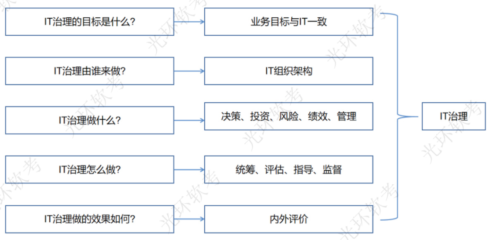  
图 3-1IT治理体系的构成  
图 3-2关键的IT 治理决策  

# 6.【拓展知识点】IT治理关键决策  

IT治理关键决策必须关注五项关键决策  

<html><body><table><tr><td colspan="3"></td></tr><tr><td>IT原则的决策</td><td colspan="2">组织高层关于如何使用IT的陈述</td></tr><tr><td>IT架构的决策</td><td>业务应用需求决策 为购买或内部开发IT应</td><td>IT投资和优先顺序 决策</td></tr><tr><td rowspan="2">组织从一系列政策、关 系以及技术选择中捕获 的数据、应用和基础设 施的逻辑，以达到预期 和商业、技术的标准化 和一体化</td><td>用确定业务需求 IT基础设施决策</td><td>关于应该在IT的哪 些方面投资以及投</td></tr><tr><td>集中协调、共享IT服务 可以给组织的IT能力提 供基础</td><td>资多少的决策，包 括项目的审批和论 证技术</td></tr></table></body></html>  

<html><body><table><tr><td>关键决策</td><td>关键问题</td></tr><tr><td>IT原则</td><td>组织的运行模型是什么?IT 在业务中的角色是什么?IT 期望行为是什么? 如何投资IT</td></tr><tr><td>IT架构</td><td>组织的核心业务流程是什么？它们之间有什么样的关系？哪些信息在驱动 着这些核心流程?数据必须如何整合?哪些技术性能应当在组织范围内得 到标准化，以支持IT效率，方便流程标准化和整合?哪些行为应当在组 织范围内标准化以支持数据整合?哪些技术选择能够指引组织IT新计划 的方法</td></tr><tr><td>IT基础 设施</td><td>哪些基础设施对实现组织的战略目标来说是最关键的?对于每个能力集， 哪些基础设施服务应该在组织级实现，这些服务的水平需求是什么?应当 如何定价基础设施服务?如何保持基础技术的不断更新?哪些基础设施服 务应当外包</td></tr><tr><td>业务应用 需求</td><td>新业务应用的市场和业务流程机会是什么?如何设计实验以评估业务应 用成功与否?如何在架构标准上满足业务需求?应当在什么时候将一个业 务需求从例外转换为标准?谁拥有每个项目的成果并且发起组织变革以 确保其价值</td></tr><tr><td>IT投资和 优先顺序</td><td>哪些流程变革或者强化对组织来说在战略上是最为重要的?当前的以及 在提议中的IT投资组合是如何分配的?这些投资组合同组织的战略目标 一致吗?组织级的投资相对于业务单位的投资哪个更重要?实际投资情况 会影响它们的相对重要性吗</td></tr></table></body></html>  

# 7.IT 治理体系框架  

IT 治理体系框架以组织的战略目标为导向，架起了组织战略与IT的桥梁，实现了IT风险的全面管理以及IT资源的合理利用。  

IT治理体系框架包括：IT战略目标、IT治理组织、IT治理机制、IT治理域、IT治理标准和IT绩效目标等部分，形成一整套IT治理运行闭环。  

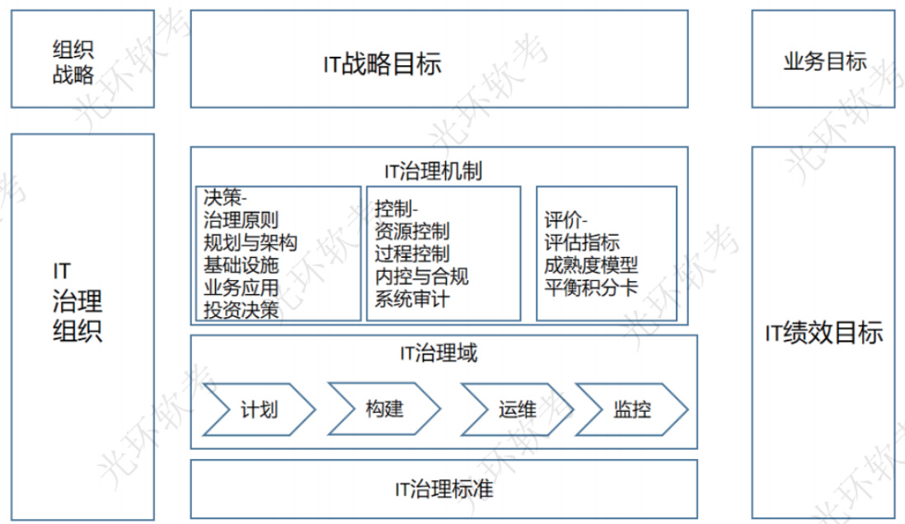  
图 3-3 IT治理体系框架  

# 8.IT治理核心内容  

IT治理本质上关心： $\textcircled{\scriptsize{1}}$ 实现IT的业务价值； $\scriptstyle{\mathcal{D}}\Pi$ 风险的规避。  

IT治理的核心内容包括六个方面：组织职责、战略匹配、资源管理、价值交付、风险管理和绩效管理。%  

（1）组织职责。明确组织信息部门和业务部门之间的关系和责任,正确划分信息系统的所有者、建设者、管理者和监控者。  

（2）战略匹配。是使组织的IT建设与组织战略相匹配。  

（3）资源管理。主要功能是确保用户对组织的应用系统和基础设施都有良好的理解和应用。  

X（4）价值交付。通过对IT项目全生命周期的管理,确保IT 能够按照组织战略实现预期的业务价值。价值交付即是创造业务价值。  

（5）风险管理。是确保IT资产的安全和灾难的恢复、组织信息资源的安全以及人员的隐私安全。风险管理即是保护业务价值。  

（6）绩效管理。绩效管理主要是追踪和监视IT战略、IT项目的实施、信息资源的使用、IT服务的提供以及业务流程的绩效。  

# 9.【拓展知识点】IT治理机制的原则  

建立IT治理机制的原则包括：  

。机制应该明确地定义特定个人和团体所承担的责任利  

（2）透明。有效的机制依赖于正式的程序。对于那些被治理决策所影响或是想要挑战治理决策的人来说，机制如何工作是需要非常清晰的。  

（3）适合。机制鼓励那些处于最佳位置的个人去制定特定的决策。  

# 10.【拓展知识点】IT治理活动的主要任务  

（1)全局统筹：统筹规划IT治理的目标范围、技术环境、发展趋势和人员责权利。  

(2)价值导向。包括基于实现有效收益，确保预期收益清晰理解，明确实现收益的问责机制。  

(3)机制保障。机制保障是指组织应对自身IT发展进行有效管控，保证IT需求与实现的协调发展，并使IT安全和风险得到有效的识别、管理、防范和处置。  

（4)创新发展。创新发展是指利用 IT 创新开拓业务领域，提升管理水平，改进质量、绩效和降低成本，确保实现战略目标的灵活性和对环境变化的适应性。  

(5)文化助推。文化助推是指组织与利益相关者沟通IT治理的目标、策略和职责,营造积极向上、沟通包容的组织文化。 XV  

# 11.【拓展知识点】ITSS中IT服务治理  

在IT治理目标和边界确定的情况下，IT治理围绕决策体系、责任归属、管理流程、内外评价四个方面，通过相关框架体系的研究，规范和引导组织的 IT 治理完成“做什么”“如何做”“怎么样”“如何评价”等问题。  

(1)ITSS 中 IT 服务治理-IT 治理实施指南  

IT治理实施框架包括治理的实施环境、实施过程和治理域。  

1)实施环境包括组织的内外部环境和促成因素。  

2)实施过程规定了IT治理实施的方法论，包括统筹和规划、构建和运行、监督和评估、改进和优化。)  

3)治理域定义了IT治理对象，包括顶层设计管理体系和资源。  

# 12.【拓展知识点】信息和技术治理框架  

COBIT是面向整个组织的信息和技术治理及管理框架，由成立于1969年的美国信息系统审计与控制协会(ISACA)组织设计并编制的。  

X（1）治理和管理目标：COBIT框架介绍了40项核心治理和管理目标。COBIT中治理目标被列人评估、指导和监控(EDM)领域，在这个领域。管理目标分为四个领域：$\textcircled{\scriptsize{1}}$ 调整、规划和组织(APO)针对 IT 的整体组织、战略和支持活动； $\textcircled{2}$ 内部构建、外部采购和实施(BAI针对IT解决方案的定义、采购和实施以及它们到业务流程的整合；$\textcircled{3}$ 交付、服务和支持(DSS)针对IT服务的运营交付和支持，包括安全； $\textcircled{4}$ 监控、评价和评估(MEA)针对 IT的性能监控及其与内部性能目标、内部控制目标和外部要求的一致程度。治理目标与治理流程有关，而管理目标与管理流程有关。治理流程通常由董事会和执行管理层负责，而管理流程则在高级和中级管理层的职责范围内。  

为满足治理和管理目标，每个组织都需要建立、定制和维护由多个组件构成的治理系统。治理系统的组件包括： $\textcircled{\scriptsize{1}}$ 流程。 $\textcircled{2}$ 组织结构。 $\textcircled{3}$ 原则、政策和程序。 $\textcircled{4}$ 信息。$\textcircled{5}$ 文化、道德和行为。 $\circled{6}$ 人员、技能和胜任能力。 $\textcircled{7}$ 服务、基础设施和应用程序。  

（2）信息和技术治理解决方案的设计：组织开展治理系统设计通过流程化的方式进行。 $\textcircled{\scriptsize{1}}$ 了解组织环境和战略； $\textcircled{2}$ 确定治理系统的初步范围； $\textcircled{3}$ 优化治理系统的范围； $\ensuremath{\mathcal{Q}})$ 最终确定治理系统的设计。  

# 13.【拓展知识点】IT治理国际标准  

2008年4月,ISO/IEC正式发布IT治理标准ISO/IEC38500,它的出台不仅标志着IT治理从概念模糊的探讨阶段进人了一个正确认识的发展阶段，而且也标志着信息化正式进人IT治理时代。该标准包括： $\textcircled{\scriptsize{1}}$ 责任； $\textcircled{2}$ 战略； $\textcircled{3}$ 收购； $\circledast$ 性能； $\textcircled{5}$ 一致性;$\textcircled{6}$ 人的行为；该标准规定治理机构应通过评估、指导和监督三个主要任务来治理 $\mathrm{IT}$  

# $3.2\;\mathrm{IT}$ 审计概述  

【拓展知识点】为了有效控制IT风险，有必要对组织的信息系统治理及IT内控与管理等开展IT审计,充分发挥IT 审计监督的作用,提高组织的信息系统治理水平,促进组织信息系统治理目标的实现。  

IT 审计重要性是指IT审计风险（固有风险、控制风险、检查风险）对组织影响的严重程度，如：财务损失、业务中断、失去客户信任、经济制裁等。  

<html><body><table><tr><td>机构/标准名称</td><td>定义</td></tr><tr><td>国际信息系统审计协会 (InformationSystemsAuditand ControlAssociation,ISACA)</td><td>IT审计是一个获取并评价证据，以判断计算机系统 是否能够保证资产的安全、数据的完整以及有效利 用组织的资源并有效实现组织目标的过程</td></tr><tr><td>国际货币基金组织 (International Monetary Fund,IMF)</td><td>IT审计是对计算机化的系统进行审计，不仅是对现 有信息系统的控制，还包括对系统建立过程、计算 机设备和网络管理等方面的控制</td></tr><tr><td>最高审计机关国际组织 (International Organization of Supreme Audit Institutions,INTOSAI</td><td>IT审计是一个通过获取并评估证据，以判断IT系 统是否保护组织的资产，有效地利用组织的资源， 保障数据的安全性和一致性，以及有效地达到组织 业务目标的过程</td></tr><tr><td>GB/T34690.4《信息技术服务治 理第4部分：审计导则》</td><td>IT审计是根据IT审计标准的要求，对信息系统及 相关的IT内部控制和流程进行检查、评价，并发 表审计意见</td></tr></table></body></html>  

# 1.审计目的  

（1）IT审计的目的是指通过开展IT审计工作，了解组织IT系统与IT活动的总体状况，对组织是否实现IT目标进行审查和评价，充分识别与评估相关IT风险,提出评价意见及改进建议，促进组织实现IT目标。  

（2）组织的IT目标主要包括：  

1）组织的IT战略应与业务战略保持一致;  

2）保护信息资产的安全及数据的完整、可靠、有效；  

3）提高信息系统的安全性、可靠性及有效性;※  

4）合理保证信息系统及其运用符合有关法律、法规及标准等的要求。  

# 2.【拓展知识点】IT审计范围和IT审计人员  

（1）IT审计范围的确定，如下表所示。  

<html><body><table><tr><td>IT审计范围</td><td>说明</td></tr><tr><td>总体范围</td><td>需要根据审计目的和投人的审计成本来确定</td></tr><tr><td>组织范围</td><td>明确审计涉及的组织机构、主要流程、活动及人员等</td></tr><tr><td>物理范围</td><td>具体的物理地点与边界</td></tr><tr><td>逻辑范围</td><td>涉及的信息系统和逻辑边界</td></tr><tr><td>其他相关内容</td><td></td></tr></table></body></html>  

（2）审计人员在实施IT审计项目前，应先对组织与信息系统相关的总体情况进行了解和风险评估，确定主要IT风险，如与环境控制相关的风险、与系统相关的风险、与数据相关的风险等，然后根据确定的风险来判断哪些控制、流程对组织的影响比较大，并结合审计项目预计的时间、配备的审计力量等来确定重点审计范围。  

（3）根据GB/T34690.4《信息技术服务治理第4部分：审计导则》，对IT审计人员的要求包括职业道德、知识、技能、资格与经验、专业胜任能力及利用外部专家服务等方面。  

<html><body><table><tr><td>分类 X</td><td>具体要求</td></tr><tr><td>职业道德</td><td>在执业过程中保持独立、客观、公正 在执业过程中保持正直、诚实和守信 正确履行审计职责(其中包括遵守相应的职业审计标准) 对在实施IT审计业务中所获取的信息负有保密责任</td></tr><tr><td>知识、技能、 资格与经验</td><td>掌握与IT相关的专业知识和技能 掌握审计、财务及管理等通用知识和技能 拥有与IT审计工作相关的基本技能、专业技能和软技能 拥有与所处管理或业务岗位相适应的IT审计职业资格及经验</td></tr><tr><td>专业胜任能力 张</td><td>具备相应的IT审计专业胜任能力 拥有与所处管理或业务岗位相适应的IT审计职业资格 光环 定期参加持续的职业教育和培训</td></tr><tr><td>利用外部专家服务</td><td>对外部专家的专业资格及专业经验进行评价 对外部专家的独立性、客观性进行评价 对外部专家的专业胜任能力进行评价 光环软考 与外部专家签订书面协议 对外部专家的服务结果进行评价和利用</td></tr></table></body></html>  

# 3.IT 审计风险  

IT审计风险主要包括固有风险、控制风险、检查风险和总体审计风险。  

<html><body><table><tr><td>类别</td><td>描述</td></tr><tr><td>固有风险</td><td>含义：是指IT活动不存在相关控制的情况下，易于导致重大错误的风险 分类：可从IT组织层面控制、一般控制及应用控制三个方面分析固有风险 持点：固有风险是T活动本身所具有的，审计人员只能评估，却无法控制或 影响它；固有风险的衡量是主观的、复杂的，不同的IT活动其固有风险水平不同</td></tr><tr><td></td><td>含义：是指与IT活动相关的内部控制体系不能及时预防或检查出存在的重大 错误的风险 分类：可从IT组织层面控制、一般控制及应用控制三个方面分析控制风险 控制风险特点：与内部控制制度执行的有效性有关，与审计无关，属于内部控制的范 畴，审计人员只能评估其风险水平而不能对其实施控制和影响。其风险水平 的衡量由于需要兼顾传统内部控制的思想和计算机系统管理的知识，因而较 为复杂且难以准确计量</td></tr><tr><td>检查风险</td><td>含义：检查风险是指通过预定的审计程序未能发现重大、单个或与其他错 误相结合的风险 影响检查风险的因素：由于IT审计规范不完善、审计人员自身或者技术原 因等造成影响审计测试正确性的各种因素</td></tr></table></body></html>  

总体审计风险是指针对单个控制目标所产生的各类审计风险总和。良好的审计计划应尽可能评估和控制审计风险，减少或控制所检查领域的审计风险，比如采取合适的审计工具，在完成审计时把总体审计风险控制在足够低的水平之内，以达到预期保证水平。  

审计风险也用于描述审计人员在执行审计任务时可接受的风险水平。审计人员可通过设定目标风险水平并调整审计工作量,以合适的审计成本满足最小化总体审计风险要求。  

# 4.【拓展知识点】IT审计依据与准则  

IT 审计活动的开展需要结合相关法律法规、准则与标准。我国的IT审计相关法律法规、准则与标准如下表所示。  

<html><body><table><tr><td>类别</td><td>名称</td></tr><tr><td>法律法规</td><td>《中华人民共和国审计法》《中华人民共和国网络安全法》《中华 人民共和国数据安全法》《中华人民共和国个人信息保护法》等</td></tr><tr><td>审计准则</td><td>《信息系统审计指南一计算机审计实务公告第34号》《第2203号 内部审计具体准则 信息系统审计》等</td></tr><tr><td>IT审计国际标准</td><td>GB/T34960.4《信息技术服务治理第4部分：审计导则》等</td></tr><tr><td>组织内部控制</td><td>《组织内部控制基本规范》《组织内部控制应用指引第18号 信息系统》等</td></tr><tr><td>行业规范</td><td>治理工作指引l(试行)》《保险公司信息化工作指引(试行)》等</td></tr></table></body></html>  

# 5.IT审计常用方法  

<html><body><table><tr><td>分类</td><td>交 说明※ 含义：是指通过访谈人和受访人面对面地交谈来了解被审计对象的信息。依</td></tr><tr><td>访谈法</td><td>据不同研究问题的性质、目的或对象，访谈法具有不同的形式 分类：根据访谈进程的结构化程度，可将它分为结构型访谈和非结构型访谈</td></tr><tr><td>调查法</td><td>含义：是指为了达到预期目的，在制订调研计划的基础上，通过书面或口 头回答问题的方式收集研究对象的相关资料，并做出分析、综合，得到某 一结论的研究方法 目的：可能是全面把握当前状况，也可能是为了揭示存在的问题，弄清前 因后果，以便为进一步的研究或决策提供观点和论据</td></tr><tr><td></td><td>含义：是指审计人员对被审计单位内部或外部生成的记录和文件(如纸质 检查法电子或其他介质形式存在的资料)进行审查，或对资产进行实物审查 分类：从技术层面上可分为审阅法、核对法、复算法和分析法</td></tr><tr><td>观察法</td><td>含义：是审计人员到被审计单位的经营场所及其他有关场所进行实地查看， 来证实审计事项的一种方法 应用：观察程序具有方向性，即从书面记录观察到实物或过程，反之，从实 物或过程观察到书面记录。观察法既可以用于对通过其他方法获得的审计证 据进行补充，证实审计证据，也可以用于直接收集相关证据。观察法可以比 较准确地获得审计项目如何运行的信息，适用于正在进行中的审计事项</td></tr><tr><td>测试法</td><td>含义：通过测试来评估程序的质量是一项常用的审计技术，其基本原理是 从计算机输人开始，跟踪某项业务直至计算机输出，以检验计算机应用程 序、控制程序和系统可靠性。执行此类方法使用的是用于测试目的的业务 数据，称之为测试数据 分类：主要包括黑盒法和白盒法。黑盒法测试是把程序看成黑盒子，完全 不考虑其内部结构和处理过程，只检查程序的功能是否符合它的需求规格 说明。白盒法是通过测试来检测产品内部动作是否按照规格说明书的规定 正常进行，按照程序内部的结构测试程序，检验程序中的每条通路是否都</td></tr><tr><td>程序代码 检查法</td><td>能按预定要求正确工作，主要用于软件验证 含义：是指对被审程序的指令逐条加以审查，以验证程序的合法性、完整 性和程序逻辑的正确性 应用：审计人员可使用代码静态扫描工具进行程序代码的检查</td></tr></table></body></html>  

# 6. IT 审计技术  

（1）风险评估技术  

常用的IT 审计技术包括风险评估技术、审计抽样技术、计算机辅助审计技术及大数据审计技术。 X  

IT风险评估技术一般包括：  

1）风险识别技术：用以识别可能影响一个或多个目标的不确定性，包括德尔菲法、头脑风暴法、检查表法、SWOT技术及图解技术等。  

2）风险分析技术：是对风险影响和后果进行评价和估量，包括定性分析和定量分析。  

3）风险评价技术：是在风险分析的基础上，通过相应的指标体系和评价标准,对风险程度进行划分，以揭示影响成败的关键风险因素，包括单因素风险评价和总体风险评价。X 下软  

4)风险应对技术：IT技术体系中为特定风险制定的应对技术方案，包括云计算、冗余链路、冗余资源、系统弹性伸缩、两地三中心灾备、业务熔断限流等。  

# （2）审计抽样技术  

1）审计抽样是指审计人员在实施审计程序时，从审计对象总体中选取一定数量的样本进行测试，并根据测试结果，推断审计对象总体特征的一种方法。  

2）审计抽样适用于时间及成本都不允许对既定总体中的所有交易或事件进行全面审计时。  

3）“总体”是指需要检查的全部事项，“样本”是用于测试总体的子集。  

<html><body><table><tr><td></td><td>说明</td></tr><tr><td></td><td>采用客观的方法来确定样本量和样本抽取标准。统计抽样采用概率学原 理，涉及计算样本量、抽取样本 评价样本结果并做出推断。利用统计抽样，审计人员可以量化描述样本 与总体的接近程度（评价抽样精度）以及用百分比表示的样本能够代表 总体的概念（可靠性或置信水平）。有效的统计抽样结果是量化的</td></tr><tr><td>统计抽样</td><td>·常用的统计抽样方法有：①属性抽样。固定样本量属性抽样或频率估计 抽样一用于估计总体中某种特性（属性）的发生比率（百分率）的抽样 方法，属性抽样回答“有多少？“的问题。可被测试的属性的一个例子是 计算机访问申请表上的批准签字。②变量抽样。变量抽样也称为金额估 计抽样或平均值估计抽样，是一种由样本估计总体的货币金额或其他度 量单位（如重量）的抽样技术。变量抽样的一个例子是检查组织重要交 易的余额表及对生成余额表的程序实施的应用系统审计.※</td></tr><tr><td>非统计抽样</td><td>常指判断抽样一采用审计人员判断来确定抽样方法、样本量（从总体中 抽取的一定数量的事项以执行测试）及抽样标准（选择哪一些事项用于 测试）。抽样结果是基于审计人员对抽样事项或交易的重要性及风险的 主观判断</td></tr></table></body></html>  

（3）【拓展知识点】计算机辅助审计技术  

计算机辅助审计（CAAT）,也称为利用计算机审计。CAAT包括多种工具和技术如通用审计软件（GAS）、测试数据、实用工具软件、专家系统等。  

（4）大数据审计技术  

大数据审计技术包括大数据智能分析技术、大数据可视化分析技术及大数据多数据源综合分析技术等。  

<html><body><table><tr><td>分类</td><td>说明</td></tr><tr><td>分析技术</td><td>以各种高性能处理算法、智能搜索与挖掘算法等为主要研究内容，是目 前大数据分析领域的研究主流。该技术从计算机的视角出发，强调计算 大数据智能机的计算能力和人工智能，如各类面向大数据的机器学习和数据挖掘方 法等。常用技术包括A/BTesting、关联规则分析、分类、聚类、遗传算 法、神经网络、预测模型、模式识别、时间序列分析、回归分析、系统 仿真等</td></tr><tr><td>大数据可视 化分析技术</td><td>从人作为分析主体和需求主体的视角出发，强调基于人机交互的、符合 人的认知规律的分析方法，目的是将人所具备的、机器并不擅长的认知 能力融人数据分析过程中，如R语言、Python、D3.js、Leaflet等</td></tr><tr><td>大数据多数 析技术</td><td>文大多数大数据多数据源综合分析技术是对采集来的各行、各业、各类大 据源综合分数据，来用数据查询等常用方法或其他大数据技术方法进行相关数据的 综合比对和关联分析，从而发现更多隐藏的审计线索的技术</td></tr></table></body></html>  

# 7.【拓展知识点】IT审计证据  

审计证据是指由审计机构和审计人员获取，用于确定所审计实体或数据是否遵循既定标准或目标，形成审计结论的证明材料。 XV  

<html><body><table><tr><td>分类</td><td>说明</td></tr><tr><td>充分性</td><td>指要求审计人员根据所获证据足以对被审计对象提出一定程度保证的结 论，是对审计证据数量的要求，主要与审计人员确定的样本量有关。</td></tr><tr><td>客观性</td><td>指审计证据必须是客观存在的事实材料。客观的审计证据比需要判断或解 释的证据可靠。</td></tr><tr><td>相关性</td><td>指审计证据与审计事项之间必须有实质性联系。</td></tr><tr><td>可靠性</td><td>指审计证据能够反映和证实客观经济活动特征的程度，审计证据的可靠性 受到审计证据的类型、取证的渠道和方式等因素的影响。</td></tr><tr><td>合法性</td><td>指审计证据必须符合法定种类，并依照法定程序取得。</td></tr></table></body></html>  

# 8.【拓展知识点】IT审计底稿  

（1）审计工作底稿是审计证据的载体，是审计人员在审计过程中形成的审计工  

作记录和获取的资料。它形成于审计过程，也反映整个审计过程。  

（2）审计底稿的作用表现在：是形成审计结论、发表审计意见的直接依据；是评价考核审计人员的主要依据；是审计质量控制与监督的基础；对未来审计业务具有参考备查作用。  

（3)审计工作底稿一般分为综合类工作底稿、业务类工作底稿和备查类工作底稿。  

（4）审计工作底稿分类如下表所示。  

<html><body><table><tr><td>底稿类型</td><td>说明</td></tr><tr><td>作底稿</td><td>指审计人员在审计计划阶段和审计报告阶段，为规划、控制和总结整个审 综合类工计工作并发表审计意见所形成的审计工作底稿，主要包括：审计业务约定 书、审计计划、审计总结、审计报告、管理建议书、被审计单位管理当局 声明书以及审计人员对整个审计工作进行组织管理的所有记录和资料。</td></tr><tr><td>业务类工 作底稿</td><td>指审计人员在审计实施阶段为执行具体审计程序所形成的审计工作底 稿，包括：符合性测试中形成的内部控制问题调查表和流程图、实质性测 试中形成的项目明细表等。</td></tr><tr><td>备查类工 作底稿</td><td>指审计人员在审计过程中形成对审计工作仅具有备查作用的审计工作底 稿。备查类工作底稿应随被审计单位有关情况的变化而不断更新：应详细 列明目录清单，并将更新的文件资料随时归档：应根据需要，将其中与具 体审计项目有关的内容复印、摘录、综合后归人业务类审计工作底稿的具 体审计项目之后。通常，备查类审计工作底稿是由被审计單位或第三者根 据实际情况提供或代为编制，审计人员应认真审核，并对所取得的有关文 件、资料标明其具体来源。</td></tr></table></body></html>  

（5）审计工作底稿按照一定的标准归人审计档案后，应交由档案管理部门进行管理，并确保审计档案的安全、完整。  

# 9.审计流程  

审计流程是指审计人员在具体审计过程中采取的行动和步骤。科学、规范的审计流程不但是分配审计工作的具体依据，还是控制审计工作的有效工具。  

审计流程的作用包括：有效地指导审计工作；有利于提高审计工作效率；有利于保证审计项目质量；有利于规范审计工作。一般分为审计准备、审计实施、审计终结及后续审计四个阶段，每个阶段又包含若干具体内容。  

(1)审计准备阶段。准备阶段工作一般包括： $\textcircled{\scriptsize{1}}$ 明确审计目的及任务； $\textcircled{2}$ 组建审计项目组； $\textcircled{3}$ 搜集相关信息； $\textcircled{4}$ 编制审计计划等。  

(2)审计实施阶段。实施阶段主要完成工作包括： $\textcircled{\scriptsize{1}}$ 深人调查并调整审计计划； $\circledcirc$ 了解并初步评估IT内部控制； $\textcircled{3}$ 进行符合性测试； $\ensuremath{\mathcal{Q}})$ 进行实质性测试等。  

(3)审计终结阶段。终结阶段的工作一般包括： $\textcircled{\scriptsize{1}}$ 整理与复核审计工作底稿； $\circledcirc$ 整理审计证据； $\textcircled{3}$ 评价相关IT 控制目标的实现； $\textcircled{4}$ 判断并报告审计发现； $\textcircled{5}$ 沟通审计  

结果； $\textcircled{6}$ 出具审计报告； $\textcircled{7}$ 归档管理等。  

(4)后续审计阶段。后续审计是在审计报告发出后的一定时间内,审计人员为检查被审计单位对审计问题和建议是否已经采取了适当的纠正措施,并取得预期效果的跟踪审计。后续审计并不是一次新的审计，而是前一次审计的有机组成部分。实施后续审计，可不必遵守审计流程的每一过程和要求，但必须依法依规进行检查、调查，收集审计证据，写出后续审计报告。※  

# 10.审计内容  

IT审计业务和服务通常分为IT内部控制审计和IT专项审计。IT 内部控制审计主要包括组织层面IT控制审计、IT一般控制审计及应用控制审计；IT专项审计主要是指根据当前面临的特殊风险或者需求开展的IT审计，审计范围为IT综合审计的某一个或几个部分。个  

<html><body><table><tr><td>大类名称</td><td>子类名称</td><td>审计内容</td></tr><tr><td>环软考 IT内部控制 审计</td><td>组织层面IT 控制审计、IT 一般控制审 计及应用控 制审计</td><td>1.组织层面IT控制审计主要指对IT战略、组织、架构、 业务连续性、风险管理、外包管理、网络与信息安全及监 督管理等进行审计 2.IT一般控制审计主要是指针对与应用系统、数据库、操 作系统、网络相关的策略和措施等进行审计 3.应用控制审计是指针对业务流程层面运行的人工或自动 化程序进行审计，主要包括输人控制、处理控制和输出控</td></tr><tr><td rowspan="4">光环软考 IT专项审计</td><td>信息系统生 命周期审计护等进行审计。</td><td>制的审计。 主要是对信息系统的规划、设计、开发、测试、运行和维</td></tr><tr><td>信息系统开 发过程审计</td><td>主要围绕信息系统规划、设计、建设、实施是否符合IT 架构和战略进行评估和监督。</td></tr><tr><td>信息系统运 行维护审计</td><td>主要针对IT运维能力、IT运维流程策划、实施、监控改 进等情况进行审计，内容包括基础设施的运行、系统的运 行、维护、质量保证及IT服务管理等。</td></tr><tr><td>网络与信息 安全审计</td><td>主要以网络与信息安全为核心，围绕安全相关的组织、人 员、系统、设备和环境等，重点关注网络与信息安全相关 流程、制度的执行情况，对相关法律法规的遵从性，包括 适用的数据保护，个人隐私保护等合规要求。</td></tr><tr><td rowspan="2">光环软</td><td>信息系统项 目审计</td><td>主要是通过对信息系统项目管理过程的评价，向管理层提 供信息系统项目管理过程得到控制、监督并遵循最佳实践 要求的合理保证。</td></tr><tr><td>数据审计</td><td>通过控制活动，负责定期分析、验证、讨论、改进数据安 全管理相关的政策、标准和活动。</td></tr></table></body></html>  

# 第4章信息系统管理  

# 4.1信息系统管理  

社会各领域已经加速进人数字化的全新发展时期，从“数字融合”向“数字原生”的发展是这个时期的主要特征，表现为信息技术和工业制造深度融合、人和机器的融合、信息资源和材料资源的融合等管理方法  

“技术底座构成了几乎所有业务模式的支柱”事实,迫切需要组织管理者参与技术决策，以确保信息系统对业务的正向支撑，并避免技术的负面影响。信息系统之上是管理。它监督系统的设计和结构，并监控其整体性能。组织管理层制定信息系统层应满足的业务需求和业务战略。  

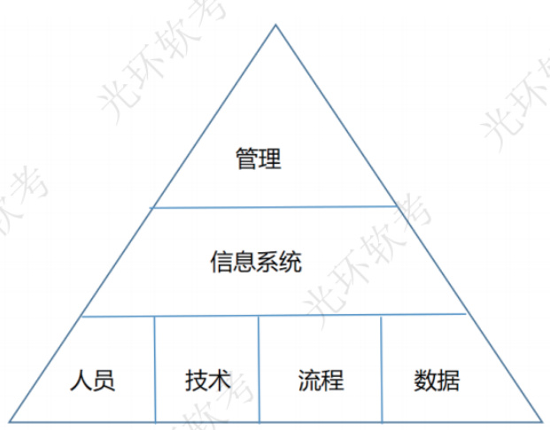  
图4-1信息系统层次架构  

信息系统包括四个要素：人员、技术、流程和数据。在信息系统层次架构中，信息系统之上是管理，它监督系统的设计和结构，并监控其整体性能。  

# 1.信息系统管理覆盖四大领域  

（1)规划和组织：针对信息系统的整体组织、战略和支持活动。  

（2）设计和实施：针对信息系统解决方案的定义、采购和实施，以及他们与业务流程的整合。  

（3)运维和服务：针对信息系统服务的运行交付和支持，包括安全。  

（4）优化和持续改进:针对信息系统的性能监控及基于内部性能目标、内部控制目标和外部要求的一致性管理。  

# 2.信息系统管理覆盖四大领域一规划  

（1）规划模型  

战略的概念：战略是实现目标、意图和目的的一组协调行动。  
信息系统战略三角：业务战略、信息系统和组织机制。  

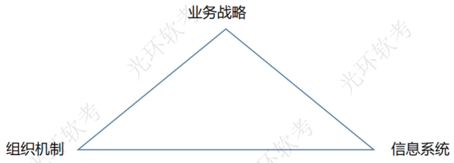  
图 4-2信息系统战略三角  

（2）组织模型  

）业务战略：阐明了组织寻求的业务目标以及期望如何达成的路径。描述业务战略的经典框架是迈克尔·波特（MichaelE.Porter,1947一)提出的竞争力优势模型,如图 4-3所示。  

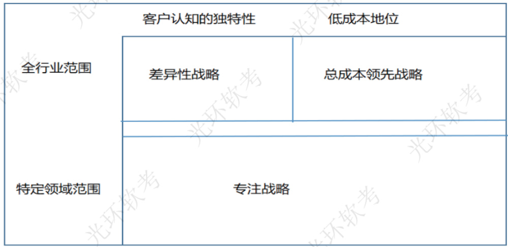  
图 4-3获得竞争力优势的三种战略  

总成本领先战略：目标成为市场上成本最低的生产者，最大限度地降低成本，从而获得高于平均水平的绩效。 L八  

异性战略：在市场上显得独特的方式，定义其产品或专注战略：在更狭窄的细分市场，并为该组客户对象量身定制其产品。该策略有  

两种变体。  

1）组织模型-业务战略  

采用专注化战略时，专注化允许组织将其范围限制在更狭窄的细分市场，并为该组客户对象量身定制其产品。该策略有两种变体：专注成本，在其细分市场内寻求成本优势；专注差异化，寻求细分市场内的产品或服务的差异化。这种策略使组织能够实现区域竞争优势，即使它没有在整个经济与社会中实现竞争优势，也可以通过专注于某些细分市场的方式获得局部的竞争优势。  

2）【拓展知识点】组织模型-组织机制战略  

$\textcircled{\scriptsize{1}}$ 组织机制战略包括组织的设计以及为定义、设置、协调和控制其工作流程而做出的选择。 KV  

$\textcircled{2}$ 组织机制战略本质上需要回答“组织将如何构建以实现其目标并实施其业务战略”这一问题，并围绕这一问题形成有效的规划。 代  

$\textcircled{3}$ 理解组织设计的经典框架是钻石模型。  

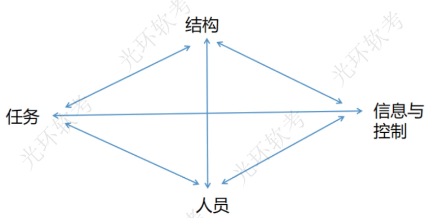  
图 4-4莱维特钻石模型  

3）【拓展知识点】组织模型-信息系统战略$\textcircled{\scriptsize{1}}$ 信息系统战略是组织用来提供信息服务的计划。  

$\textcircled{2}$ 信息系统支撑组织实施其业务战略。业务战略是关于竞争（服务对象想要什么，竞争做什么），定位（组织想以什么方式竞争）和能力（公司能做什么）的功能。  

$\textcircled{3}$ 信息系统帮助确定组织的能力。  

信息系统战略矩阵  

<html><body><table><tr><td></td><td>有什么</td><td>谁使用</td><td>在哪里</td></tr><tr><td>硬件</td><td>信息系统的物理组件清单</td><td>系统用户和管理者</td><td>组件的物理位置（云 端、数据中心等</td></tr><tr><td>软件</td><td>程序、应用和工具的清单</td><td>系统用户和管理者</td><td>软件驻留的硬件，以及硬 件的物理位置</td></tr><tr><td>网络</td><td>硬件和软件组件如何联接 的图表</td><td>服务的组织</td><td>系统用户和管理者；提供节点、线路和其他传输介 质所在地</td></tr><tr><td>数据</td><td>系统中存储的信息位</td><td>数据所有者；数据管理者</td><td>信息所在地</td></tr></table></body></html>  

# 3.设计方法  

组织首先将业务战略转化为信息系统架构，然后将该架构转化为信息系统设计。  

（1）【拓展知识点】设计方法-从战略到系统架构  

1）组织必须从业务战略开始，使用该战略制定更具体的目标，然后从每个目标派生出详细的业务需求。2）组织需要与架构设计人员合作，将这些业务需求转换为构成信息系统架构的系统要求、标准和流程的更详细视图。这个更详细的视图，即信息系统架构要求,包括考虑数据和流程需求以及安全目标等事项。  

（2）【拓展知识点】设计方法-从系统架构到系统设计  

1）信息系统架构被转换为功能规格。  

2）功能规格可以分为硬件规格、软件规格、存储规格、接口规格、网络规格等。然后决定如何实现这些规范，并在信息系统基础架构中使用什么硬件、软件、存储、接口、网络等。  

3）信息系统具有多个级别：全局级别可能侧重于整个组织，并构成整个组织的信息环境；组织间级别信息系统则为跨组织边界的服务对象、供应商或其他利益干系人的沟通交流奠定基础；应用级信息系统是在考虑特定业务应用时，通常重点考虑的数据库和程序组件，以及它们运行的设备和操作环境。※  

# （3）【拓展知识点】设计方法-转换框架  

信息系统架构与基础设施分析框架举例  

<html><body><table><tr><td rowspan="2">组 件</td><td colspan="2">有什么</td><td colspan="2">谁使用</td><td colspan="2">在哪里</td></tr><tr><td>系统架构</td><td>系统设计</td><td>系统架构</td><td>系统设计</td><td>系统架构</td><td>系统设计</td></tr><tr><td>硬 件</td><td>用户将使用 什么类型的 个人设备</td><td>笔记本电脑 配备什么尺 寸的硬盘驱 动器</td><td>谁最了解组 织中的服务 器</td><td>谁将运营服 务器</td><td>架构需要集中 式还是分布式 服务器</td><td>将在C地数 据中心放置 哪些特定的 计算机 可以使用一</td></tr><tr><td>软 件</td><td>业务战略是 否需要ERP 软件支持</td><td>品牌还是B 品牌应用</td><td>3 统向B品牌 迁移的影响</td><td>应该选择A 谁会受到系谁需要B品 牌的系统培 训</td><td>组织的地理状 况是否需要部 署多个数据库 基础设施</td><td>个D品牌云 数据库实例 作为系统数 据库</td></tr><tr><td>网 络</td><td>需要多大带 宽来实现战 略</td><td>E单位交换 机能否满足 需要</td><td>哪些人需要 连接到网络</td><td>无线网络是 谁提供的</td><td>是否允许每一 个用户的手机 成为无线接人 热点</td><td>是否会租赁 线缆或使用 卫星来支持 通信</td></tr><tr><td>数 据</td><td>销售管理系 统需要哪些 数据</td><td>使用什么格 式存储数据</td><td>访问敏感数 据</td><td>哪些人需要 授权用户如 何识别他们 自己</td><td>备份数据是现 场存储还是异 地存储</td><td>数据是存放 于云端系统 还是存放于 自己的数据 中心</td></tr></table></body></html>  

# 4.架构模式  

模式选择：  

（1）分布式架构比集中式架构更加模块化，允许相对容易地添加其他服务器，并能为特定用户添加具有特定功能的客户端。  

（2）集中式体系架构在某些方面更易于管理，集中式架构往往更适合具有高度集中式治理的组织。  

（3）SOA则越来越受欢迎，因为该设计允许几乎完全从现有的软件服务组件构建大型功能单元。对于快速构建应用程序非常有用，因为它为管理人员提供了模块化和组件化设计，是一种更易于变更的构建应用程序的方法。  

常见信息系统架构模式  

<html><body><table><tr><td>系统架构</td><td>描述</td><td>别称术语</td><td>什么时候使用</td></tr><tr><td>集中式架构 环软</td><td>大型中央计算机系统处理系统的所有 功能。通常，计算机位于数据中心，并 由1T部门直接管理。存储的数据和应 用程序都运行于中央计算机上。网络连 接允许用户从远程位置访问大型机</td><td>主机架构</td><td>当需要系统易于管 理时：所有功能都在 同一个地方：当业务 本身高度集中的时 候</td></tr><tr><td></td><td>运行业务所需的计算能力分散在许多 设备中，包括不同位置的服务器、PC 和笔记本电脑、智能手机和平板电 分布式架构脑。设备（有时也被称为客户端）具 有足够的处理能力来执行所需的许多 服务，并根据数据和专用服务的需要 连接中央服务器</td><td>基于服务器 的架构</td><td>当担心可伸缩性 时，模块化在这里会 有所帮助；当业务主 要是非集中化的时 候</td></tr><tr><td>软考 面向服务的 架构</td><td>在被称为编排的过程中，将较大的软 件程序分解为相互连接的服务。基于 此，它们共同构成了一个应用来运行 整个业务流程。通常，这些服务可从 互联网上的一系列供应商处获得，而 应用程序则是这些服务链接在一起形 成的组合议</td><td>架构</td><td>当希望系统成为敏 捷架构：可重用性和 基于Web的组件化利于创造新 应用；当业务对新应 用和快速设计选代 要求较高时</td></tr></table></body></html>  

# 5.运行管理和控制  

（1)信息系统的运维和服务由各类管理活动组成，主要包括：运行管理和控制、IT服务管理、运行与监控、终端侧管理、程序库管理、安全管理、介质控制和数据管理等。X  

(2)IT团队发生的所有活动都应受到管理和控制。过程和项目应具有足够的记录保存。管理层最终负责信息系统运行团队发生的所有活动。  

(3)管理信息系统运行的管理控制主要活动包括:过程开发、标准制定、资源分配、过程管理。  

# 6.IT 服务管理  

（1)IT服务管理是通过主动管理和流程的持续改进来确保IT服务交付有效且高效的一组活动。 V  

（2）IT服务管理由若干不同的活动组成：服务台、事件管理、问题管理、变更管理、配置管理、发布管理、服务级别管理、财务管理、容量管理、服务连续性管理和可用性管理。  

1)服务台：组织体现IT服务的重要环节，也是服务干系人体验的重要感知窗口。  

服务台是服务中与服务干系人沟通和交互的重要界面，负责对服务干系人遇到的问题和需求进行响应和处理；服务台是IT服务干系人的“官方”接口和信息发布点，组织内部各个团队之间相互协作的纽带和协调者；服务台对IT服务质量及服务干系人体验的管理至关重要，是组织IT服务能力持续提升的战略单元。  

2）事件管理：事件是IT服务管理遭遇计划外中断或服务质量出现下降，以及尚未影响服务的配置项故障。  

3）问题管理。当发生了几个看起来具有相同或相似根本原因的事件时，就会启动问题管理活动。问题管理的总体目标是减少事件的数量和严重性，这种对事件的控制既包括发生事件后的被动性措施，也包括采取主动措施，预防与容量相关的事件发生。 XV  

4）变更管理：变更管理的主要目的是确保对信息技术环境的所有建议更改都经过适用性和风险管控的审查，并确保变更不会相互干扰，也不会干扰其他计划内或计划外的活动。 X  

5）服务级别管理：是对IT服务的级别进行定义、记录和管理，并在可接受的成本之下与干系人达成一致的管理过程，通过服务水平协议（SLA）服务绩效监控和报告的不断循环，持续维护和改进服务质量，以及触发采取行动消除较差服务,从而满足干系人的服务需求。  

6）可用性管理。可用性管理是有关设计、实施、监控、评价和报告IT服务的可用性以确保持续地满足服务干系人的可用性需求的服务管理流程。可用性是指一个组件或一种服务在设定的某个时刻或某段时间内发挥其应有功能的能力，即在约定的服务时段内，IT服务实际能够使用的服务的时间比例。  

7）容量管理。容量管理用于确认信息系统中有足够的容量满足服务需求。容量管理主要活动包括：定期测量、计划变更、战略优化和技术变化等。容量管理由三个子过程组成：业务容量管理、服务容量管理、资源容量管理。<  

# 7.优化和持续改进概述  

(1)优化和持续改进是信息系统管理活动中的一个环节,良好的优化和持续改进管理活动能够有效保障信息系统的性能和可用性等，延长整体系统的有效使用周期。  

（2）优化和持续改进常用的方法为戴明环,即PDCA 循环。PDCA循环是将持续改进分为四个阶段，即Plan（计划）、Do（执行）Check（检查）和Act（处理）。  

（3）优化和持续改进基于有效的变更管理,使用六西格玛倡导的五阶段方法DMAIC/DMADV,是对戴明环四阶段周期的延伸，包括：定义（Define）.度量（Measure）分析（Analysis）、改进/设计（Improve/Design）、控制/验证（Control/Verify）。  

（4）当第四阶段的“改进"替换为“设计”，"控制"替换为“验证”时，五阶段法就从DMAIC转变为DMADV。  

# 8.【拓展知识点】定义阶段  

定义阶段的目标包括待优化信息系统定义、核心流程定义和团队组建。  

1）待优化信息系统定义。该活动关注定义协同的范围、优化目标和目的、系统团队成员和出资人，以及优化时间表和交付成果。  

2）核心流程定义。SIPOC（Supplier、Input、Process、Output、Customer）分析是定义核心流程视图的首选工具。%  

3）团队组建。该活动重点关注从关键利益干系人群体中确定人员组建高能力团队，对信息系统的问题和收益达成共识。有效的团队形成对于建立利益干系人的支持至关重要。  

# 9.【拓展知识点】度量阶段  

度量阶段目标包括流程定义、指标定义、流程基线和度量系统分析。  

(1)流程定义。流程定义通常使用流程图工具定义度量阶段的流程,以图形方式实现给定信息系统的输入、操作和输出。流程图的目的是帮助人们理解流程，应当尽可能简单，但又不能太简单。  

(2)指标定义。待优化信息系统的定义包括将用于评估流程的指标。  

（3)流程基线。当明确了度量指标之后，必须通过基线确定现有系统的能力，以确定当前系统在多大程度上较好地满足了服务对象的要求，并验证定义阶段中确立的信息系统目标达成情况。※  

（4）度量系统分析。质量始于度量。一个良好的度量系统具备特性可包括：准确：应该产生一个“接近”被测量的实际属性的数值。可重复：如果测量系统反复应用于同一物体，则产生的测量价值应彼此接近。线性：测量系统应能够在整个关注范围内产生准确和一致的结果。可重现：当任何经过适当培训的个人使用时，测量系统应产生相同的结果。稳定：应用于相同的项目时，测量系统将来应产生与过去相同的结果。  

# 10.【拓展知识点】分析阶段  

分析阶段的三个目标包括价值流分析、信息系统异常的源头分析和确定优化改进的驱动因素。  

（1）价值流分析。价值流分析首先定义信息系统使用者眼中相关产品或服务的价值。  

（2）信息系统异常的源头分析。度量阶段的信息系统异常的来源，提供了信息系统稳定（即控制中）或不稳定（即失控）的证据。  

（3）确定优化改进的驱动因素。优化改进的驱动因素是指对信息系统优化影响最大的因素。  

# 11.【拓展知识点】改进/设计阶段  

改进/设计阶段的目标包括：向发起人提出一个或多个解决方案；量化每种方法  

的收益；就解决方案达成共识并实施；定义新的操作/设计条件；为新工艺/设计提供定义和缓解故障模式。  

# 12.【拓展知识点】控制/验证阶段  

控制/验证阶段的目标包括标准化新程序/新系统功能的操作控制要素、持续验证优化的信息系统的可交付成果、记录经验教训。  

# 13.【拓展知识点】管理要点概述  

信息系统管理涉及系统准备、设计、实施、运行等活动的众多方面，管理重点范围和细致程度随各组织的战略和业务目标的不同而存在差异。从日常管理活动视角来看，各组织关注的管理内容主要聚焦在数据管理、运维管理和信息安全管理等方面的体系化管理。 XV  

# 14.【拓展知识点】数据战略  

组织的数据战略能力域通常包括数据战略规划、数据战略实施和数据战略评估三个能力项。 X  

（1）数据战略规划。  

（2）数据战略实施。  

数据战略实施主要活动和工作要点包括：  

$\textcircled{\scriptsize{1}}$ 评估准则：建立数据战略规划实施评估标准，规范评估过程和方法。  

$\circledcirc$ 现状评估：对组织当前数据战略落实情况进行分析，评估各项工作开展情况。  

$\textcircled{3}$ 评估差距：根据现状评估结果与组织数据战略规划进行对比,分析存在的差异。  

$\textcircled{4}$ 实施路径：利益相关者结合组织的共同目标和实际业务价值进行数据职能任务优先级排序。  

$\textcircled{5}$ 保障计划：依据实施路径，制定开展各项活动所需的预算。  

$\textcircled{6}$ 任务实施：根据任务开展工作。  

$\textcircled{7}$ 过程监控：依据实施路径，及时对实施过程进行监控。  

# 4.2管理要点  

数据管理能力成熟度评估模型（DCMM）是国家标准GB/T36073《数据管理能力成熟度评估模型》中提出的，旨在帮助组织利用先进的数据管理理念和方法，建立和评价自身数据管理能力，持续完善数据管理组织、程序和制度，充分发挥数据在促进组织向信息化、数字化、智能化发展方面的价值。  

DCMM定义了数据战略、数据治理、数据架构、数据应用、数据安全、数据质量、数据标准和数据生存周期8个核心能力域。  

# 1.【拓展知识点】数据战略  

数据战略评估主要活动和工作要点包括：建立任务效益评估模型;建立业务案例,建立投资模型；阶段评估% XV  

# 2.【拓展知识点】数据治理  

组织的数据治理能力域通常包括数据治理组织数据制度建设和数据治理沟通三个能力项。  

(1)数据治理组织。数据治理组织需要包括组织架构、岗位设置、团队建设、数据责任等内容，它是各项数据职能工作开展的基础。  

《(2)数据制度建设。为保障数据管理和数据应用各项功能的规范化运行,组织需要建立对应的制度体系。数据制度体系通常分层次设计，遵循严格的发布流程并定期检查和更新。数据制度建设是数据管理和数据应用各项工作有序开展的基础,是数据治理沟通和实施的依据。  

# (3)数据治理沟通。  

3.【拓展知识点】数据架构、数据应用、数据安全、数据质量、数据标准、数据生存周期  

(1)组织的数据架构能力域通常包括数据模型、数据分布、数据集成与共享和元数据管理四个能力项。  

(2)数据应用能力域通常包括数据分析、数据开放共享和数据服务三个能力项。  

（3)组织的数据安全能力域通常包括数据安全策略数据安全管理和数据安全审计三个能力项。  

(4)组织的数据质量能力域通常包括数据质量需求、数据质量检查、数据质量分析和数据质量提升四个能力项。  

(5)组织的数据标准能力域通常包括业务术语、参考数据和主数据、数据元和指标数据四个能力项。  

(6)组织的数据生存周期能力域通常包括数据需求、数据设计和开发、数据运维和数据退役四个能力项。  

# 4.【拓展知识点】数据标准  

组织的数据标准能力域通常包括业务术语、参考数据和主数据、数据元和指标数据四个能力项。  

（1)业务术语,业务术语是组织中业务概念的描述,包括中文名称、英文名称、术语定义等内容。业务术语数据管理就是制定统一的管理制度和流程，并对业务术语的创建、维护和发布进行统一的管理，进而推动业务术语的共享和组织内部的应用。业务术语是组织内部理解数据、应用数据的基础。通过对业务术语的管理能保证组织内部对具体技术名词理解的一致性。业务术语主要活动和工作要点包括：,  

$\textcircled{\scriptsize{1}}$ 制定业务术语标准：同时制定业务术语管理制度，包含组织、人员职责、应用原则等。  

$\textcircled{2}$ 业务术语字典：组织中已定义并审批和发布的术语集$\textcircled{3}$ 业务术语发布：业务术语变更后及时进行审批并通过邮件、网站、文件等形式  

进行发布。  

$\ensuremath{\mathcal{Q}})$ 业务术语应用：在数据模型建设、数据需求描述、数据标准定义等过程中引用业务术语。  

$\textcircled{5}$ 业务术语宣贯：组织内部介绍、推广已定义的业务术语。  

(2)参考数据和主数据。参考数据和主数据是用于将其他数据进行分类的数据。参考数据管理是对定义的数据值域进行管理，包括标准化术语、代码值和其他唯一标识符，每个取值的业务定义，数据值域列表内部和跨不同列表之间的业务关系的控制，并对相关参考数据的一致、共享使用。主数据是组织中需要跨系统、跨部门共享的核心业务实体数据。主数据管理是对主数据标准和内容进行管理，实现主数据跨系统的一致、共享使用。参考数据和主数据主要活动和工作要点包括：  

$\textcircled{\scriptsize{1}}$ 定义编码规则：定义参考数据和主数据唯一标识的生成规则。  

$\circledcirc$ 定义数据模型：定义参考数据和主数据的组成部分及其含义。  

$\textcircled{3}$ 识别数据值域：识别参考数据和主数据取值范围。  

$\ensuremath{\mathcal{O}})$ 管理流程：创建参考数据和主数据管理相关流程。  

$\textcircled{5}$ 建立质量规则：检查参考数据和主数据相关的业务规则和管理要求，建立参考数据和主数据相关的质量规则。 小  

$\circled{6}$ 集成共享：参考数据、主数据和应用系统的集成。  

（3）数据元。通过对组织中核心数据元的标准化，可以使数据的拥有者和使用者对数据有一致的理解。数据元主要活动和工作要点包括：  

$\textcircled{\scriptsize{1}}$ 建立数据元的分类和命名规则：根据组织的业务特征建立数据元的分类规则，制定数据元的命名、描述与表示规范。  

$\textcircled{2}$ 建立数据元的管理规范：建立数据元管理的流程和岗位，明确管理岗位职责。  

$\textcircled{3}$ 数据元的创建：建立数据元的创建方法，进行数据元的识别和创建。  

$\ensuremath{\mathcal{Q}})$ 建立数据元的统一目录：根据数据元的分类及业务管理需求，建立数据元管理的目录，对组织内部的数据元分类存储。  

$\textcircled{5}$ 数据元的查找和引用：提供数据元查找和引用的在线工具。  

$\textcircled{6}$ 数据元的管理：提供对数据元以及数据元目录的日常管理。  

$\textcircled{7}$ 数据元管理报告：根据数据元标准定期进行引用情况分析，了解各应用系统中对数据元的引用情况，促进数据元的应用。 X  

（4)指标数据。指标数据是组织在经营分析过程中衡量某一个目标或事物的数据，一般由指标名称、时间和数值等组成，指标数据管理指组织对内部经营分析所需要的指标数据进行统一规范化定义、采集和应用，用于提升统计分析的数据质量。指标数据主要活动和工作要点包括：X  

$\textcircled{\scriptsize{1}}$ 根据组织业务管理需求，制定组织内指标数据分类管理框架，保证指标分类框架的全面性和各分类之间的独立性。 XV  

$\textcircled{2}$ 定义指标数据标准化的格式，梳理组织内部的指标数据,形成统一的指标字典。  

$\textcircled{3}$ 根据指标数据的定义，由相关部门或应用系统定期进行数据的采集、生成。  

$\circledast$ 对指标数据进行访问授权，并根据用户需求进行数据展现。  

$\textcircled{5}$ 对指标数据采集、应用过程中的数据进行监控，保证指标数据的准确性、及时性。  

$\circled{6}$ 划分指标数据的归口管理部门管理职责和管理流程，并按照管理规定对指标标准进行维护和管理。 C小  

# 5.【拓展知识点】理论框架与成熟度  

国内外常用的数据管理模型包括：数据管理能力成熟度模型（DCMM）、数据治理框架（DGI）、数据管理能力评价模型（DCAM）以及数据管理模型（DAMA定义的模型）等。  

（1)数据管理能力成熟度模型。DCMM将组织的管理成熟度划分为5个等级，分别是：初始级、受管理级、稳健级、量化管理级和优化级。 X  

(2)数据治理框架。从组织结构、治理规则和治理过程这三个维度提出了关于数据治理活动的10个关键通用组件，并在这些要素的基础上构建了数据治理框架。  

(3)数据管理能力评价模型。企业数据管理协会（EDM)是制定和实施数据标准、最佳实践以及全面培训和认证项目的重要倡导者。目前最新DCAM2.2版有4个组件:基础组件包含数据战略与业务案例、数据管理流程与资金职能域；执行组件包含业务和数据架构、数据和技术架构、数据质量管理、数据治理职能域；分析组件包含数据控制环境职能域；应用组件包含分析管理职能域。下  

（4)数据管理模型。DAMA-DMB0K2理论框架由11个数据管理职能领域和7个基本环境要素共同构成“DAMA数据管理知识体系”，每项数据职能领域都在7个基本环境要素约束下开展工作。  

# 6.运维管理  

IT运维是组织IT服务中关键的一种类型。随着组织IT建设的不断深人和完善，信息系统运维已经成为了各行各业各组织管理者和IT团队普遍关注的问题。IT运维是指采用IT手段及方法，依据服务对象提出的服务级别要求，对其所使用的IT系统运行环境、业务系统等提供的综合活动。  

# （1）能力模型  

国家标准GB/T28827.1《信息技术服务运行维护第1部分通用要求》定义了IT运维能力模型，该模型包含治理要求、运行维护服务能力体系和价值实现。治理要求是为实现运行维护服务绩效、风险控制和服务合规性的组织目标，提出的关于最高管理层领导作用及承诺的能力体系建设要求。运行维护服务能力体系(MCS)是组织依据运行维护服务方针和目标，策划并制定运行维护服务能力方案，确保组织交付的运行维护服务内容符合相关规定，并满足质量要求，对运行维护服务交付过程、结果以及运行维护服务能力体系进行监督、测量、分析和评审，以实现运行维护服务能力的持续提升。价值实现是组织结合业务对信息系统的网络化、数字化和智能化要求，识别内部和外部用户对服务的需求或期望，定义多样化的服务场景，并通过服务能力、要素、活动的组合完成服务的提供，直接或间接地为服务需求方和利益相关者实现服务价值%  

# 1）【拓展知识点】能力建设  

组织需要考虑环境的内外部因素，在治理要求的指导下，根据服务场景，识别服务能力需求，围绕人员、过程、技术、资源能力四要素，策划、实施、检查和改进运行维护能力体系，向各种服务场景赋能，通过服务提供实现服务价值；并针对能力建设、人员、过程、技术、资源建立关键指标；还需要定期评价运行维护服务能力成熟度，衡量能力水平差距，以持续提升运行维护服务能力。  

在治理层面，最高管理层应依据组织治理目标，提出运行维护服务能力管理治理要求，以确保实现运行维护服务绩效、风险控制和服务合规性。 X  

在能力管理方面，运维能力管理是面向运维全生命期的总体能力管控机制，分为策划、实施、检查和持续改进四个阶段，各阶段交替循环，实现运维能力持续性地螺旋式上升的管理目标。这需要组织： $\textcircled{\scriptsize{1}}$ 周期性的(如按年度)面向外部的用户需求以及内部的合规要求和成本约束等，对运维能力进行总体策划，包括服务目录的建立和维护，组织架构和管理制度的确立，并形成年度运维能力管理计划，确保运维目标的可实施性； $\textcircled{2}$ 细化能力管理计划为具体的实施计划(通常按部门进行任务分解),并落地执行； $\textcircled{3}$ 定期(如按半年度或季度)跟踪和检查实施计划的执行情况，并进行适时评估、优化和调整； $\textcircled{4}$ 对 IT运维能力管理的达成情况进行总结分析，并持续改进。实现按PDCA的方式实施能力管理，进而提升整体服务能力。  

在能力管理过程中，组织需要首先明确能力管理团队的组成，并明确这些团队成员的职责范围与分工，根据组织IT运维的内外部环境、技术发展现状、运维各利益干系人的诉求、能力体系覆盖范围、管理者的作用、资金投人人才保障、基础设备设施的情况、安全以及质量体系的基础等因素，实施能力策划活动，并明晰周期性的能力管理计划、能力指标等，在策划过程中需要明确策划的输入、输出、审批以及变更控制等；同时抓好能力计划实施的计划管理、协调管理、记录管理以及成果管理等，做到实施过程记录的“线条”证据化；并设立专门的检查组织，明确检查方法，并按照确定的计划实施检查；还需要建立适合于组织的改进机制，以及确保改进活动的有效实施。通常来说，能力管理不是分管运维的高级管理者或者主管运维的负责人单个岗位的工作，需要人力资源、技术研发、质量监督等等多方面的人员共同参与。  

在价值实现方面，组织需要在不同的服务场景中识别服务需求，通过服务提供，满足用户需求，实现服务价值：  

$\textcircled{\scriptsize{1}}$ 服务需求：识别服务需求并遵循能力管理的要求对服务场景进行完整的策划。  

$\textcircled{2}$ 服务提供：配置符合能力要素要求且和服务场景相适应的人员、过程、技术和资源，并遵循能力管理的要求实施服务提供。.※  

$\textcircled{3}$ 服务价值：将运行维护服务能力体系输出的服务能力应用到服务场景中，通过服务成果、成本控制、风险控制实现服务价值。  

2)人员能力  

在任何组织当中，人力资源都是组织的核心竞争力之一。因此绝大部分组织对人员相关的建设和管理都非常重视，无论是人员的容量、技能、工作绩效等方方面面，都是组织关注的重点，组织人员能力建设聚焦在从知识、技能和经验维度选择合适的人，从人员管理和岗位职责维度明确做适合的事，目的是指导IT运维团队根据岗位职责和管理要求“选人做事”。 XV  

结合IT运维工作的特点，运维人员一般分为管理类、技术类和操作类三种人员岗位，管理类主要负责运维的组织管理，技术类主要负责运维技术建设以及运维活动中的技术决策等，操作类主要负责运维活动的执行等。 X  

为了保证人员能力满足运维服务的要求，组织依据运维能力策划要求，进行人员能力策划、岗位结构、人员储备、人员培训、绩效管理和能力评价等管理活动。  

对运维的人员能力建设，通常还需要考虑：  

$\textcircled{\scriptsize{1}}$ 面向 IT运维所有干系人需求，建立人员需求规划:  

$\circledcirc$ 基于人员需求计划，制定人员招聘、培训、储备和考核机制并实施；  

$\textcircled{3}$ 定义IT 运维人员岗位，根据工作内容不同，划分管理岗、技术岗、操作岗，并对每个岗位梳理工作职责，同时定义岗位的任职要求，包括知识、技能及经验要求等方面。  

组织应按人员能力计划，进行运行维护人员能力评价，至少应包括：  

$\textcircled{4}$ 建立运行维护服务对应岗位的等级评价标准；  

$\textcircled{5}$ 建立运行维护服务团队和人员能力评价机制；  

$\circled{6}$ 实施团队和人员能力评价；  

$\textcircled{7}$ 依据评价结果对人员能力进行持续改进，需要时调整人员能力计划。  

3）【拓展知识点】资源能力  

资源主要由人员、过程和技术要素中被固化下来的能力转化而成，人员、过程和技术要素在知识、服务管理、工具支撑等方面的能力被固化下来，同时又对人员、过程和技术要素提供有力的支撑和保障，进而形成资源能力中的知识库、服务台、备件库以及运行维护工具，资源能力确保IT运维能“保障做事”。  

Ⅱ运维资源是为了保证IT运维的正常交付所依存和产生的有形及无形资产。该表述最后的落脚点是资产，这就区别于广义的资源概念，广义的资源是指组织拥有的物力、财力、人力等各种物质要素的总称。  

组织在建设资源能力过程中,要充分重视自主知识、技术和业务流程的固化工作，从而充分发挥经验的沉淀，尤其要关注一线人员的技术资源化，从而保证质量的同时提高效率和效能，建议组织可以定期收集一下一线人员针对资源的意见和建议，从而及时补充必要的资源，保持组织的运维能力的优化提升。  

组织应根据运维能力策划要求和特定服务场景的需求,按需建立和管理运行维护工具、服务台、备件库、最终软件库、服务数据和服务知识等，以满足不同服务场景的服务需求。实现与人员、过程和技术结合，保证资源能力满足价值实现过程中服务提供的需求。  

# 4）【拓展知识点】技术能力  

组织需要通过自有核心技术的研发和非自有核心技术的学习，持续提升IT运维过程中发现问题和解决问题的能力，在提升IT运维效率方面是重点考虑的要素，技术要素确保IT运维能“高效做事”。  

在实施 IT运维过程中，可能面临各种问题、风险以及新技术和前沿技术应用所提出的新要求，组织需要根据服务对象要求或技术发展趋势，具备发现和解决问题、风险控制、技术储备以及研发、应用新技术和前沿技术的能力。  

“早发现，早解决”一直是IT 运维的一个重要原则，技术作为提高效率的基本因素，其在该领域中起着至关重要的作用。需要说明一点，这里的技术不单纯指IT技术，而是涵盖IT技术在内的所有IT运维技术，包括工作手册、思维方法等。从分类上来说，运维技术聚焦在发现问题的技术和解决问题的技术两大领域。  

组织应根据运维能力策划要求,实施技术管理、技术研发和技术成果应用等活动,保证技术能力满足不同服务场景下的服务要求，包括运维服务能力长期发展的需求、治理、预期效益等，实现其服务价值。  

5)【拓展知识点】过程  

组织通过过程的制定，把人员、技术和资源要素以过程为主线串接在一起，用于指导 IT运维人员按约定的方式和方法，确保IT运维能“正确做事”。  

过程又称流程，是为达到特定的价值目标而由不同的人分别共同完成的一系列活动。活动之间不仅有严格的先后顺序限定，而且活动的内容、方式、责任等也都必须有明确的安排和界定，以使不同活动在不同岗位角色之间进行转手交接成为可能。活动与活动之间在时间和空间上的转移可以有较大的跨度。而狭义的业务流程，则认为它仅仅是与客户价值的满足相联系的一系列活动。  

组织需要结合服务场景与运维能力策划要求，设计过程框架，明确各过程之间的关系和接口，制定服务级别、服务报告事件、问题、变更、发布、配置、可用性和连续性、系统容量，信息安全等管理过程的目标、活动和考核指标，支撑服务过程的规范化管理和服务价值实现。X  

# （2）智能运维  

中国电子工业标准化技术协会发布的团体标准T/CESA1172《信息技术服务智能运维通用要求》，给出了智能运维能力框架，包括组织治理、智能特征、智能运维场景实现、能力域和能力要素，其中能力要素是构建智能运维能力的基础。组织需在组织治理的指导下，对智能运维场景实现提出能力建设要求，开展智能运维能力规划和建设。组织通过场景分析、场景构建、场景交付和效果评估四个过程，基于数据管理能力域提供的高质量数据，结合分析决策能力域做出合理判断或结论，并根据需要驱动自动控制能力域执行运维操作，使运维场景具备智能特征，提升智能运维水平，实现质量可靠、安全可控、效率提升、成本降低。  

1）能力要素。智能运维的能力要素主要包括：  

$\textcircled{\scriptsize{1}}$ 人员：运维团队需要熟悉IT运维领域的业务活动与流程，掌握自动化、大数据、人工智能、云计算、算法等技术，具备一定的智能运维研发能力。  

$\circledcirc$ 技术：技术通常包括统一的标准和规范、开放的基础公共资源与服务、数据与流程及服务的互联互通等。 V  

$\textcircled{3}$ 过程：智能运维定义的过程需要具备清晰界定人机界面，能够充分发挥智能化优势，实现过程优化，并考虑权限控制、风险规避。  

$\textcircled{4}$ 数据：运维组织需要加强数据治理，保证数据质量，规范数据接口。运维应用需要围绕数据进行采集、加工、消费，提升运维智能化水平。  

$\textcircled{5}$ 算法：可以聚焦在异常检测、根因分析、故障预测、知识图谱、健康诊断、决策分析等方面，具备有穷性、确切性、有效性等特点。  

$\circled{6}$ 资源：组织在数据管理能力域数据服务中，对于资源管理，至少应根据不同场景要求，配置开放共享服务管理所需要的算力、带宽、存储等。  

$\circled{7}$ 知识：知识通常包括运维技术方案及方法与步骤、运维的经验沉淀、运维对象的多维度描述、运维数据的智能挖掘结果等。  

2)能力平台。智能运维能力平台通常具备数据管理、分析决策、自动控制等能力。其中，数据管理能力用于采集、处理、存储、展示各种运维数据。分析决策能力以感知到的数据作为输入，做出实时的运维决策，驱动自动化工具实施操作。自动控制根据运维决策，实施具体的运维操作。  

3)能力应用。以运维场景为中心，通过场景分析、能力构建、服务交付、迭代调优四个关键环节，可以使运维场景具备智能特征。根据复杂程度，运维场景分为单一场景、复合场景和全局场景。 X  

$\textcircled{1}$ 场景分析：是指从业务或T本身接收对新服务或改进服务的需求，场景需求分析从业务需求、用户需求以及系统需求，不同层次阶段进行不同方式、内容以及侧重点的需求调研。  

$\textcircled{2}$ 能力构建：是指基于运维场景分析的结果和目标要求，应用赋能平台中适合运维场景数据特点的加工处理能力、系统性设计数据的处理流程，构建符合特定运维场景需求的智能运维解决方案。 XV  

$\textcircled{3}$ 服务交付：是指制订详细的交付计划，准备必要的资源，评估可能存在的风险并明确规避方案，完善交付实施过程，通过服务交付检查确保运维场景的智能特征符合策划要求。  

$\circled{4}$ 迭代调优：是指通过持续的迭代对智能运维场景的优化，确保投入符合智能运维具体场景的规划目标渐进式达成。  

4)智能运维需具备若干智能特征，智能特征包括：  

$\textcircled{\scriptsize{1}}$ 能感知：指具备灵敏、准确地识别人、活动和对象的状态的特点，$\circledcirc$ 会描述：指具备直观友好地展现和表达运维场景中各类信息的特点。$\textcircled{3}$ 自学习：指具备积累数据、完善模型、总结规律等主动获取知识的特点$\ensuremath{\mathcal{Q}})$ 会诊断：指具备对人、活动和对象进行分析、定位、判断的特点。$\circled{5}$ 可决策：指具备综合分析，给出后续处置依据或解决方案的特点。$\textcircled{6}$ 自执行：指具备对已知运维场景做出自动化处置的特点。$\textcircled{7}$ 自适应：指具备自动适应环境变化，动态优化处理的特点。  

# 7.CIA三要素  

\~CIA 三要素是保密性(Confidentiality)、完整性(Integrity)和可用性(Availability)三个词的缩写。CIA是系统安全设计的目标。 开环软  

保密性、完整性和可用性这三个特性也经常被称为信息安全三元组，这也是信息安全通常所强调的目标。  

# 8.信息安全管理体系  

信息系统安全管理是对一个组织机构中信息系统的生存周期全过程实施符合安全等级责任要求的管理，主要包括：落实安全管理机构及安全管理人员，明确角色与职责，制定安全规划；开发安全策略；实施风险管理；制订业务持续性计划和灾难恢复计划；选择与实施安全措施；保证配置、变更的正确与安全；进行安全审计；保证维护支持；进行监控、检查，处理安全事件；安全意识与安全教育；人员安全管理等。  

在组织机构中应建立安全管理机构，不同安全等级的安全管理机构逐步建立自己的信息系统安全组织机构管理体系，参考步骤包括： $\textcircled{\scriptsize{1}}$ 配备安全管理人员。管理层中应有一人分管信息系统安全工作，并为信息系统的安全管理配备专职或兼职的安全管理人员。 $\textcircled{2}$ 建立安全职能部门。建立管理信息系统安全工作的职能部门，或者明确设置一个职能部门监管信息安全工作，作为该部门的关键职责之一。 $\textcircled{3}$ 成立安全领导小组。在管理层成立信息系统安全管理委员会或信息系统安全领导小组，对覆盖全国或跨地区的组织机构，应在总部和下级单位建立各级信息系统安全领导小组，在基层至少要有一位专职的安全管理人员负责信息系统安全工作。 $\ensuremath{\left(4\right)}$ 主要负责人出任领导。由组织机构的主要负责人出任信息系统安全领导小组负责人。 $\textcircled{5}$ 建立信息安全保密管理部门。建立信息系统安全保密监督管理的职能部门，或对原有保密部门明确信息安全保密管理责任，加强对信息系统安全管理重要过程和管理人员的保密监督管理。  

# 9.网络安全等级保护  

GB/T22240《信息安全技术网络安全等级保护定级指南》定义了等级保护对象，为网络安全等级保护工作直接作用的对象，主要包括信息系统、通信网络设施和数据资源等。根据等级保护对象在国家安全、经济建设、社会生活中的重要程度，以及一旦遭到破坏、丧失功能或数据被篡改、泄露、丢失、损毁后，对国家安全、社会秩序、公共利益以及公民、法人和其他组织的合法权益的侵害程度等因素，等级保护对象的安全保护等级分。 环软 X  

（1）第一级：等级保护对象受到破坏后，会对相关公民、法人和其他组织的合法权益造成损害，但不危害国家安全、社会秩序和公共利益;  

（2）第二级：等级保护对象受到破坏后，会对相关公民、法人和其他组织的合法权益产生严重损害或特别严重损害，或者对社会秩序和公共利益造成危害，但不危害国家安全； 牛  

（3）第三级：等级保护对象受到破坏后，会对社会秩序和公共利益造成严重危害，或者对国家安全造成危害；  

（4）第四级：等级保护对象受到破坏后,会对社会秩序和公共利益造成特别严重危害，或者对国家安全造成严重危害； 小  

（5）第五级：等级保护对象受到破坏后，会对国家安全造成特别严重危害。  

# 第5章信息系统工程  

5.1软件工程  

（1）软件工程是指应用计算机科学、数学及管理科学等原理，以工程化的原则和方法来解决软件问题的工程，其目的是提高软件生产率、提高软件质量、降低软件成本。  

（2）IEEE对软件工程的定义是：将系统的、规范的、可度量的工程化方法应用于软件开发、运行和维护的全过程及上述方法的研究。  

（3）软件工程由方法、工具和过程三个部分组成：  

1)软件工程方法是完成软件工程项目的技术手段，它支持整个软件生命周期;  

2)软件工程使用的工具是人们在开发软件的活动中智力和体力的扩展与延伸,它自动或半自动地支持软件的开发和管理，支持各种软件文档的生成；  

3)软件工程中的过程贯穿于软件开发的各个环节，管理人员在软件工程过程中,要对软件开发的质量、进度和成本进行评估、管理和控制，包括人员组织、计划跟踪与控制、成本估算、质量保证和配置管理等。  

# 1.软件架构风格  

(1)软件架构研究的主要内容涉及软件架构描述、软件架构风格、软件架构评估和软件架构的形式化方法等。解决好软件的复用、质量和维护问题，是研究软件架构的根本目的。  

(2)软件架构设计的一个核心问题是能否达到架构级的软件复用。  

（3）软件架构分类。  

1）数据流风格。数据流风格包括批处理序列和管道/过滤器两种风格。  

2）调用/返回风格。调用/返回风格包括主程序/子程序、数据抽象和面向对象，以及层次结构。  

3）独立构件风格。独立构件风格包括进程通信和事件驱动的系统。  

4）虚拟机风格。虚拟机风格包括解释器和基于规则的系统。  

5）仓库风格。仓库风格包括数据库系统、黑板系统和超文本系统。  

# 2.软件架构评估  

（1)软件架构设计是软件开发过程中的关键一步。(2)在架构评估过程中，评估人员所关注的是系统的质量属性。（3）敏感点（SensitivityPoint）和权衡点（Trade-offPoint）  

1）敏感点是一个或多个构件（或之间的关系）的特性；  

2）权衡点是影响多个质量属性的特性，是多个质量属性的敏感点。  

改变加密级别可能会对安全性和性能产生非常重要的影响。提高加密级别可以提高安全性，但可能要耗费更多的处理时间，影响系统性能。如果某个机密消息的处理有严格的时间延退要求，则加密级别可能就会成为一个权衡点。  

（4）软件架构评估技术来看，可以归纳为三类主要的评估方式，分别是基于调查问卷（或检查表)的方式、基于场景的方式和基于度量的方式。这三种评估方式中，基于场景的评估方式最为常用。 L七  

（5）基于场景的方式主要包括：  

架构权衡分析法（ATAM）；软件架构分析法（SAAM）；成本效益分析法（CBAM）。  

（6）在架构评估中，一般采用刺激、环境和响应三方面来对场景进行描述。刺激是场景中解释或描述项目干系人怎样引发与系统的交互部分，环境描述的是刺激发生时的情况，响应是指系统是如何通过架构对刺激做出反应的。 X  

# 3.需求分析  

(1)软件需求是指用户对新系统在功能、行为、性能、设计约束等方面的期望。  

）（2)根据 IEEE 的软件工程标准词汇表,软件需求是指用户解决问题或达到目标所需的条件或能力，是系统或系统部件要满足合同、标准、规范或其他正式规定文档所需具有的条件或能力，以及反映这些条件或能力的文档说明。  

# 4.需求的层次  

(1)软件需求就是系统必须完成的事以及必须具备的品质。需求是多层次的，包括业务需求、用户需求和系统需求，这三个不同层次从目标到具体，从整体到局部，从概念到细节。  

1）业务需求。业务需求是指反映企业或客户对系统高层次的目标要求，通常来自项目投资人、购买产品的客户、客户单位的管理人员、市场营销部门或产品策划部门等。  

2）用户需求。用户需求描述的是用户的具体目标，或用户要求系统必须能完成的任务。  

3）系统需求。系统需求是从系统的角度来说明软件的需求，包括功能需求、非功能需求和设计约束等。  

（2)质量功能部署（QFD）是一种将用户要求转化成软件需求的技术,其目的是最大限度地提升软件工程过程中用户的满意度。为了达到这个目标，QFD将软件需求分为三类，分别是常规需求、期望需求和意外需求。  

# 5.需求过程  

需求过程主要包括需求获取、需求分析、需求规格说明书编制、需求验证与确认等。 XV  

（1)【拓展知识点】（1）需求获取是一个确定和理解不同的项目干系人的需求和约束的过程。需求获取是否科学、准备充分，对获取出来的结果影响很大，这是因为大部分用户无法完整地描述需求，而且也不可能看到系统的全貌。因此，需求获取只有与用户的有效合作才能成功。 X  

（2）【拓展知识点】常见的需求获取方法包括用户访谈、问卷调查、采样、情节串联板、联合需求计划等。※  

（3）【拓展知识点】一个好的需求应该具有无二义性、完整性、一致性、可测试性、确定性、可跟踪性、正确性、必要性等特性，因此，需要分析人员把杂乱无章的用户要求和期望转化为用户需求，这就是需求分析的工作。  

（4）【拓展知识点】需求分析的关键在于对问题域的研究与理解。  

（5）【拓展知识点】结构化分析（SA）和面向对象的分析（00A）  

1）结构化分析（SA）  

有三个层次的模型，分别是数据模型、功能模型和行为模型（也称为状态模型）。在实际工作中，一般使用实体关系图（E-R 图）表示数据模型，用数据流图（Data flowDiagram,DFD）表示功能模型，用状态转换图（State Transform Diagram,STD）表示行为模型。E-R 图主要描述实体、属性，以及实体之间的关系；DFD 从数据传递和加工的角度,利用图形符号通过逐层细分描述系统内各个部件的功能和数据在它们之间传递的情况，来说明系统所完成的功能；STD通过描述系统的状态和引起系统状态转换的事件，来表示系统的行为，指出作为特定事件的结果将执行哪些动作（例如，处理数据等）。X  

2）【拓展知识点】面向对象的分析（Object-OrientedAnalysis,0OA）OOA模型包括用例模型和分析模型用例是一种描述系统需求的方法，使用用例的方法来描述系统需求的过程就是用例建模；分析模型描述系统的基本逻辑结构，展示对象和类如何组成系统（静态模型），以及它们如何保持通信，实现系统行为（动态模型）。  

3）需求规格说明书编制  

软件需求规格说明书（SRS）是需求开发活动的产物，编制该文档的目的是使项目干系人与开发团队对系统的初始规定有一个共同的理解，使之成为整个开发工作的基础。  

在国家标准GB/T8567《计算机软件文档编制规范》中，提供了一个SRS 的文档模板和编写指南，其中规定 SRS 应该包括范围、引用文件、需求、合格性规定、需求可追踪性、尚未解决的问题、注解和附录。  

另外，国家标准GB/T9385《计算机软件需求说明编制指南》也考虑作为SRS写作的参考之用。 L七  

软件工程中应用的几种图：系统流程图、数据流图、数据字典、实体联系图、状态转换图、层次方框图、Warnier图、IPO 图、层次图、HIPO 图、结构图、程序流程图、盒图、PAD 图、判定表、判定树、Jackson 图、流图、甘特图、工程网络图。  

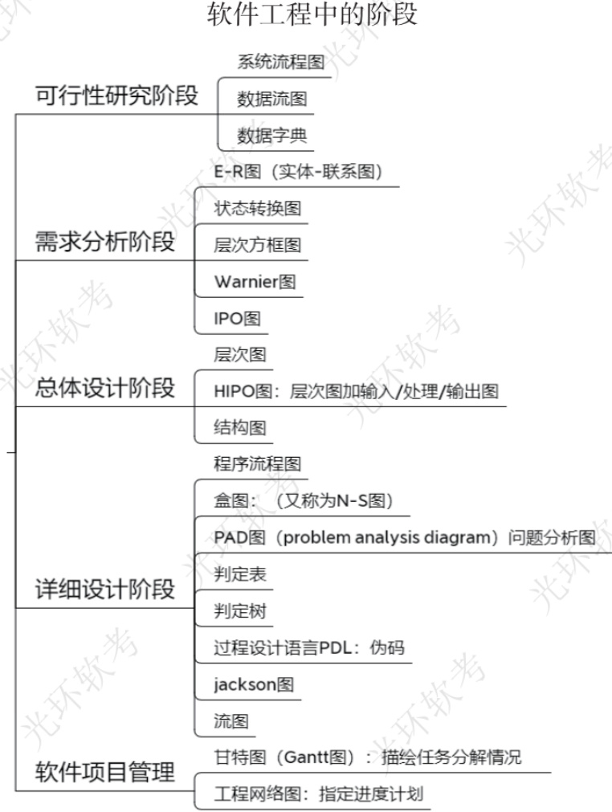  

4）【拓展知识点】需求验证与确认  

在系统分析阶段，检测 SRS 中的错误所采取的任何措施都将节省相当多的时间和资金。因此，有必要对于SRS的正确性进行验证，以确保需求符合良好特征。需求验证与确认活动内容包括：  

$\textcircled{\scriptsize{1}}$ SRS正确地描述了预期的、满足项目干系人需求的系统行为和特征;  

$\textcircled{2}$ SRS 中的软件需求是从系统需求、业务规格和其他来源中正确推导而来的;  

$\textcircled{3}$ 需求是完整的和高质量的；  

$\ensuremath{\mathcal{Q}}$ 需求的表示在所有地方都是一致的；  

$\circled{5}$ 需求为继续进行系统设计、实现和测试提供了足够的  

在实际工作中，一般通过需求评审和需求测试工作来对需求进行验证。需求评审就是对 SRS进行技术评审，SRS 的评审是一项精益求精的技术，它可以发现那些二义性的或不确定性的需求，为项目干系人提供在需求问题上达成共识的方法。需求的遗漏和错误具有很强的隐蔽性，仅仅通过阅读SRS,通常很难想象在特定环境下系统的行为。只有在业务需求基本明确，用户需求部分确定时，同步进行需求测试，才可能及早发现问题，从而在需求开发阶段以较低的代价解决这些问题。  

6. UML  

※（1）统一建模语言（UML）是一种定义良好、易于表达、功能强大且普遍适用的建模语言，它融人了软件工程领域的新思想、新方法和新技术，它的作用域不限于支持00A和00D,还支持从需求分析开始的软件开发的全过程。  

（2）从总体上来看，UML的结构包括构造块、规则和公共机制三个部分。  

<html><body><table><tr><td>部分</td><td>说明</td></tr><tr><td>构造块</td><td>UML有三种基本的构造块，分别是事物（Thing）、关系（Relationship）和 图（Diagram）。事物是UML的重要组成部分，关系把事物紧密联系在一起， 图是多个相互关联的事物的集合</td></tr><tr><td>规则</td><td>规则是构造块如何放在一起的规定，包括为构造块命名；范围：怎样使用或 看见名字，即可见性；事物如何正确、或模拟动态模型的含义是什么，即执 行给一个名字以特定含义的语境，即一致地相互联系，即完整性；运行</td></tr><tr><td>公共机制</td><td>公共机制是指达到特定目标的公共UML方法，主要包括规格说明（详细说 明）、修饰、公共分类（通用划分）和扩展机制四种</td></tr></table></body></html>  

（3）UML中的事物  

UML中的事物也称为建模元素，包括结构事物、行为事物（也称动作事物）分组事物和注释事物（也称注解事物）。这些事物是UML模型中最基本的00构造  

<html><body><table><tr><td>建模元素</td><td>说明</td></tr><tr><td>结构事物</td><td>结构事物在模型中属于最静态的部分，代表概念上或物理上的元素。UMI 有七种结构事物，分别是类、接口、协作、用例、活动类、构件和节点 行为事物是UML模型中的动态部分，代表时间和空间上的动作。UMI</td></tr><tr><td>行为事物</td><td>有两种主要的行为事物。第一种是交互（内部活动），交互是由一组对 象之间在特定上下文中，为达到特定目的而进行的一系列消息交换而组 成的动作。交互中组成动作的对象的每个操作都要详细列出，包括消息、 动作次序（消息产生的动作）、连接（对象之间的连接）；第二种是状 态机，状态机由一系列对象的状态组成</td></tr><tr><td>分组事物</td><td>分组事物是UML模型中组织的部分，可以把它们看成是个盒子，模型可 以在其中进行分解。UML只有一种分组事物，称为包。包是一种将有组 织的元素分组的机制。与构件不同的是，包纯粹是一种概念上的事物， 只存在于开发阶段，而构件可以存在于系统运行阶段</td></tr><tr><td>注释事物</td><td>注释事物是UML模型的解释部分</td></tr></table></body></html>  

（4）UML中的关系  

UML用关系把事物结合在一起，主要有四种关系，分别为：  

1）依赖：依赖是两个事物之间的语义关系，其中一个事物发生变化会影响另一个事物的语义。  

2）关联：关联描述一组对象之间连接的结构关系。  

《3）泛化：泛化是一般化和特殊化的关系，描述特殊元素的对象可替换一般元素的对象。  

4）实现：实现是类之间的语义关系，其中的一个类指定了由另一个类保证执行的契约。  

（5）UML2.0中的图,事物和关系的可视化表示。x（6）【拓展知识点】UML视图  

<html><body><table><tr><td>种类</td><td>说明</td></tr><tr><td>类图(Class Diagram)</td><td>类图描述一组类、接口、协作和它们之间的关系。在00系 统的建模中，最常见的图就是类图。类图给出了系统的静态 设计视图，活动类的类图给出了系统的静态进程视图。</td></tr><tr><td>对象图(ObjectDiagram)</td><td>对象图描述一组对象及它们之间的关系。对象图描述了在类 图中所建立的事物实例的静态快照。和类图一样，这些图给 出系统的静态设计视图或静态进程视图，但它们是从真实案 例或原型案例的角度建立的。</td></tr><tr><td>构件图(Component Diagram)</td><td>构件图描述一个封装的类和它的接口、端口，以及由内嵌的 构件和连接件构成的内部结构。构件图用于表示系统的静态 设计实现视图。对于由小的部件构建大的系统来说，构件图 是很重要的。构件图是类图的变体。</td></tr><tr><td>组合结构图(Composite Structure Diagram)</td><td>组合结构图描述结构化类（例如，构件或类）的内部结构， 包括结构化类与系统其余部分的交互点。组合结构图用于画 出结构化类的内部内容。</td></tr><tr><td>用例图(Use Case Diagram)</td><td>用例图描述一组用例、参与者及它们之间的关系。用例图给 出系统的静态用例视图。这些图在对系统的行为进行组织和 建模时是非常重要的。</td></tr><tr><td>顺序图（Sequence Diagram,也称序列图）</td><td>顺序图是一种交互图（InteractionDiagram）,交互图展现了- 种交互，它由一组对象或参与者以及它们之间可能发送的消 息构成。交互图专注于系统的动态视图。顺序图是强调消息 的时间次序的交互图。</td></tr><tr><td>通信图(Communication Diagram)</td><td>通信图也是一种交互图，它强调收发消息的对象或参与者的 结构组织。顺序图和通信图表达了类似的基本概念，但它们 所强调的概念不同，顺序图强调的是时序，通信图强调的是 对象之间的组织结构（关系）。在UML1.X版本中，通信图 称为协作图（CollaborationDiagram）。</td></tr></table></body></html>  

<html><body><table><tr><td>种类</td><td>说明</td></tr><tr><td>也称计时图)</td><td>定时图（Timing Diagram,定时图也是一种交互图，它强调消息跨越不同对象或参与者 的实际时间，而不仅仅只是关心消息的相对顺序。</td></tr><tr><td>状态图(State Diagram)</td><td>状态图描述一个状态机，它由状态、转移、事件和活动组成。 状态图给出了对象的动态视图。它对于接口、类或协作的行 为建模尤为重要，而且它强调事件导致的对象行为，这非常 有助于对反应式系统建模。</td></tr><tr><td>活动图(ActivityDiagram)</td><td>活动图将进程或其他计算结构展示为计算内部一步步的控 制流和数据流。活动图专注于系统的动态视图。它对系统的 功能建模和业务流程建模特别重要，并强调对象间的控制流 程。</td></tr><tr><td>部署图(Deployment Diagram)</td><td>部署图描述对运行时的处理节点及在其中生存的构件的配 置。部署图给出了架构的静态部署视图，通常一个节点包含 一个或多个部署图。</td></tr><tr><td></td><td>制品图描述计算机中一个系统的物理结构。制品包括文件、 制品图(ArtifactDiagram)数据库和类似的物理比特集合。制品图通常与部署图一起使</td></tr><tr><td>包图(Package Diagram)</td><td>用。制品也给出了它们实现的类和构件。 包图描述由模型本身分解而成的组织单元，以及它们之间的 依赖关系。</td></tr><tr><td>交互概览图(Interaction Overview Diagram)</td><td>交互概览图是活动图和顺序图的混合物</td></tr></table></body></html>  

UML 的5个系统视图：  

1）逻辑视图：逻辑视图也称为设计视图，它表示了设计模型中在架构方面具有重要意义的部分，即类、子系统、包和用例实现的子集。  

2）进程视图：进程视图是可执行线程和进程作为活动类的建模，它是逻辑视图的一次执行实例，描述了并发与同步结构。  

3）实现视图：实现视图对组成基于系统的物理代码的文件和构件进行建模。  

4）部署视图：部署视图把构件部署到一组物理节点上，表示软件到硬件的映射和分布结构。  

5）用例视图：用例视图是最基本的需求分析模型。  

# 7.【拓展知识点】面向对象分析  

(1)0OA模型独立于具体实现，即不考虑与系统具体实现有关的因素,这也是00A和00D的区别之所在。00A的任务是“做什么”，0OD的任务是“怎么做”。  

(2)面向对象分析阶段的核心工作是建立系统的用例模型与分析模型。  

(3)在00A方法中，构建用例模型一般需要经历四个阶段，分别是识别参与者、合并需求获得用例、细化用例描述和调整用例模型，其中前三个阶段是必须的。  

(4)建立分析模型的过程大致包括定义概念类，确定类之间的关系，为类添加职责，建立交互图等，其中有学者将前三个步骤统称为类-责任-协作者。(Class-Responsibility-Collaborator,CRC)建模。类之间的主要关系有关联、依赖、泛化、聚合、组合和实现等。  

# 8.软件设计  

软件设计是需求分析的延伸与拓展。需求分析阶段解决“做什么”的问题，而软件设计阶段解决“怎么做”的问题。同时，它也是系统实施的基础，为系统实施工作做好铺垫。合理的软件设计方案既可以保证系统的质量，也可以提高开发效率，确保系统实施工作的顺利进行。从方法上来说，软件设计分为结构化设计与面向对象设计。  

面向对象基本概念：  

（1）对象。是系统中用来描述客观事物的一个模块，是构成系统的基本单位。对象是由一组属性和对这组属性进行的操作构成的。  

对象包含三个基本要素，分别是对象标识、对象状态和对象行为。  

（2）类。现实世界中实体的形式化描述，类将该实体的属性（数据）和操作（函数）封装在一起。  

对象是类的实例，类是对象的模板。  

如果将对象比作房子，那么类就是房子的设计图纸。  

（3）抽象。通过特定的实例抽取共同特征以后形成概念的过程。  

对象是现实世界中某个实体的抽象，类是一组对象的抽象。  

（4）消息和方法。对象之间进行通信使用消息来实现。类中操作的实现过程叫做方法。  

（5）组件。表示软件系统可替换的、物理的组成部分，封装了模块功能的实现。组件应当是内聚的，并具有相对稳定的公开接口。  

（6）复用。用已有软件构造新的软件，以缩减软件开发和维护的费用，称为软件复用。  

组件技术是软件复用实现的关键。  

（1）结构化设计  

SD是一种面向数据流的方法，它以 SRS和SA阶段所产生的 DFD和数据字典等文档为基础，是一个自顶向下、逐步求精和模块化的过程。SD方法的基本思想是将软件设计成由相对独立且具有单一功能的模块组成的结构，分为概要设计和详细设计两个阶段，在SD中，需要遵循一个基本的原则：高内聚，低耦合。  

（2）面向对象设计  

1）面向对象设计（00D）是00A方法的延续，其基本思想包括抽象、封装和可扩展性，其中可扩展性主要通过继承和多态来实现。在 00D中，数据结构和在数据结构上定义的操作算法封装在一个对象之中。由于现实世界中的事物都可以抽象出对象的集合，所以00D方法是一种更接近现实世界、更自然的软件设计方法。  

2）00D 的主要任务是对类和对象进行设计，包括类的属性、方法以及类与类之间的关系。00D 的结果就是设计模型。对于 00D 而言，在支持可维护性的同时，提高软件的可复用性是一个至关重要的问题，如何同时提高软件的可维护性和可复用性，是00D 需要解决的核心问题之一。在00D 中，可维护性的复用是以设计原则为基础的。  

3）常用的00D原则包括：  

$\textcircled{1}$ 单职原则：设计功能单一的类。本原则与结构化方法的高内聚原则是一致的。  

$\circledcirc$ 开闭原则：对扩展开放，对修改封闭。  

$\textcircled{3}$ 李氏替换原则：子类可以替换父类  

$\textcircled{4}$ 依赖倒置原则：要依赖于抽象，而不是具体实现；要针对接口编程，不要针对实现编程。  

$\textcircled{5}$ 接口隔离原则：使用多个专门的接口比使用单一的总接口要好。  

$\textcircled{6}$ 组合重用原则：要尽量使用组合，而不是继承关系达到重用目的。  

$\textcircled{7}$ 迪米特原则（最少知识法则）：一个对象应当对其他对象有尽可能少的了解。本原则与结构化方法的低耦合原则是一致的。  

# （3）【拓展知识点】设计模式  

1）根据处理范围不同，设计模式可分为类模式和对象模式。  

2）类模式和对象模式。类模式处理类和子类之间的关系，这些关系通过继承建立，在编译时刻就被确定下来，属于静态关系；对象模式处理对象之间的关系，这些关系在运行时刻变化，更具动态性。  

X3）根据目的和用途不同，设计模式可分为创建型模式、结构型模式和行为型模式三种：  

$\textcircled{\scriptsize{1}}$ 创建型模式：主要用于创建对象，包括工厂方法模式、抽象工厂模式、原型模式、单例模式和建造者模式等；  

$\textcircled{2}$ 结构型模式：主要用于处理类或对象的组合，包括适配器模式、桥接模式、组合模式、装饰模式、外观模式、享元模式和代理模式等；  

$\textcircled{3}$ 行为型模式：主要用于描述类或对象的交互以及职责的分配，包括职责链模式、命令模式、解释器模式、迭代器模式、中介者模式、备忘录模式、观察者模式、状态模式、策略模式、模板方法模式、访问者模式等。  

# 9.【拓展知识点】软件配置管理  

(1)软件配置管理通过标识产品的组成元素、管理和控制变更、验证、记录和报告配置信息，来控制产品的演进和完整性。  

(2)软件配置管理活动包括软件配置管理计划、软件配置标识、软件配置控制、软件配置状态记录、软件配置审计、软件发布管理与交付等活动。  

(3)软件配置审计是独立评价软件产品和过程是否遵从已有的规则、标准、指南、计划和流程而进行的活动。 X  

（4)软件发布管理和交付通常需要创建特定的交付版本，完成此任务的关键是软件库。  

# 10.【拓展知识点】软件编码  

（1）程序的质量主要取决于软件设计的质量。但是，程序设计语言的特性和编码途径也会对程序的可靠性、可读性、可测试性和可维护性产生深远的影响。  

（2）编码效率： $\textcircled{1}$ 程序效率； $\textcircled{2}$ 算法效率； $\textcircled{3}$ 存储效率； $\ensuremath{\left(4\right)}$ I/0效率。  

# 11.软件测试  

（1）根据国家标准GB/T15532《计算机软件测试规范》，软件测试的目的是验证软件是否满足软件开发合同或项目开发计划、系统/子系统设计文档、SRS、软件设计说明和软件产品说明等规定的软件质量要求。  

（2）通过测试发现软件缺陷，为软件产品的质量测量和评价提供依据。  

根据国家标准GB/T15532《计算机软件测试规范》，软件测试的目的是验证软件是否满足软件开发合同或项目开发计划、系统/子系统设计文档、SRS、软件设计说明和软件产品说明等规定的软件质量要求。通过测试发现软件缺陷，为软件产品的质量测量和评价提供依据。 开环软  

软件测试方法可分为静态测试和动态测试。  

$\textcircled{\scriptsize{1}}$ 静态测试包括对文档的静态测试和对代码的静态测试。  

对文档的静态测试主要以检查单的形式进行，对代码的静态测试一\~般采用桌前检查(DeskChecking)、代码走查和代码审查。 光环  

$\circledcirc$ 动态测试一般采用白盒测试和黑盒测试方法。  

（3）白盒测试和黑盒测试  

<html><body><table><tr><td>测试类型</td><td>作用阶段</td><td>特征</td><td>常用技术和方法</td></tr><tr><td>白盒(结 构)测试</td><td>用于单元测试</td><td>光环轧 考虑程序内部结 构和处理算法</td><td>测试的方法有控制流测试、数据流测 试和程序变异测试等 最常用的技术是逻辑覆盖，主要的覆 盖标准有语句覆盖、判定覆盖、条件 覆盖、条件/组合覆盖、修正的条件/ 判定覆盖和路径覆盖等。 判定覆盖、条件</td></tr><tr><td>黑盒(结 构)测试</td><td>用于集成测 试、 确认测试和系 统测试</td><td>完全不考虑(或 不了 解)程序的内部 结构和处理算法</td><td>等价类划分、边界值分析、判定表、 因果图、状态图、随机测试、猜错法 和正交试验法等。 光环软</td></tr></table></body></html>  

# 12.部署交付  

（1)软件开发完成后，必须部署在最终用户的正式运行环境，交付给最终用户使用，才能为用户创造价值。  

(2)软件部署是一个复杂过程，包括从开发商发放产品，到应用者在他们的计算机  
上实际安装并维护应用的所有活动。这些活动包括软件打包、安装、配置、测试、集  
成和更新等，是一个持续不断的过程。V  

(3)软件部署与交付。  

(4)持续交付。  

(5)持续部署。  

完整的镜像部署包括三个环节：  

1）Build：跟传统的编译类似，将软件编译形成 RPM 包或者Jar包：  

2）Ship：则是将所需的第三方依赖和第三方插件安装到环境中;  

3）Run：就是在不同的地方启动整套环境。  

在部署原则中提到两大部署方式为蓝绿部署和金丝雀部署。蓝绿部署是指在部署的时候准备新旧两个部署版本，通过域名解析切换的方式将用户使用环境切换到新版本中，当出现问题的时候，可以快速地将用户环境切回旧版本，并对新版本进行修复和调整。金丝雀部署是指当有新版本发布的时候，先让少量用户使用新版本，并且观察新版本是否存在问题。如果出现问题，就及时处理并重新发布；如果一切正常，就稳步地将新版本适配给所有的用户。  

（6）【拓展知识点】部署与交付的新趋势  

持续集成、持续交付和持续部署的出现及流行反映了新的软件开发模式与发展趋势，主要表现如下：工作职责和人员分工的转变；大数据和云计算基础设施的普及进一步给部署带来新的飞跃;研发运维的融合。  

# 13.过程管理  

（1）软件过程能力是组织基于软件过程、技术、资源和人员能力达成业务目标的综合能力。包括治理能力、开发与交付能力、管理与支持能力、组织管理能力等方面。  

（2）常见的软件过程管理方法和实践包括国际常用的能力成熟度模型集成（CMMI）和中国电子工业标准化技术协会发布的T/CESA1159《软件过程能力成熟度模型》（Software Process Capability Maturity Model）团体标准，简称CSMM。  

（3）CSMM模型由4个能力域、20个能力子域、161个能力要求组成：  

1）治理：包括战略与治理、目标管理能力子域，用于确定组织的战略、产品的方向、组织的业务目标，并确保目标的实现。 XV  

2）开发与交付：包括需求、设计、开发、测试、部署、服务、开源应用能力子域,这些能力子域确保通过软件工程过程交付满足需求的软件，为顾客与利益干系人增加价值。 X  

3）管理与支持：包括项目策划、项目监控、项目结项、质量保证、风险管理、配置管理、供应商管理能力子域，这些能力子域覆盖了软件开发项目的全过程，以确保软件项目能够按照既定的成本、进度和质量交付，能够满足顾客与利益干系人的要求。  

4）组织管理：包括过程管理、人员能力管理、组织资源管理、过程能力管理能力子域，对软件组织能力进行综合管理。  

（4）成熟度等级  

<html><body><table><tr><td>1级：初 始级</td><td>软件过程和 结果具有不 确定性</td><td>（1）能实现初步的软件交付和项目管理活动。 （2）项目没有完整的管理规范，依赖于个人的主动性和 能力。</td></tr><tr><td>2级：项 目规范级</td><td>项目基本可 按计划实现 预期的结果</td><td>（1）项目依据选择和定义管理规范，执行软件开发和管 理的基础过程。 （2）组织按照一定的规范，为项目活动提供了支持保障 工作。</td></tr><tr><td>3级：组 织改进级</td><td>在组织范围 内能够稳定 地实现预期 的项目目标</td><td>（1）在2级充分实施的基础之上进行持续改进。 （2）依据组织的业务目标、管理要求以及外部监管需求 建立并持续改进组织标准过程和过程资产。 （3)项目根据自身特征，依据组织标准过程和过程资产 实现项目目标，必 并贡献过程资产</td></tr></table></body></html>  

<html><body><table><tr><td>4级：量 化提升级</td><td>在组织范围 内能够量化 地管理和实 现预期的组 织和项目目 标</td><td>（1）在3级充分实施的基础上使用统计分析技术进行管理 （2）组织层面认识到能力改进的重要性，了解软件能力 在业务目标实现、绩效提升等方面的重要作用，在制定 业务战略时可获得项目数据的支持。 （3）组织和项目使用统计分析技术建立了量化的质量与 过程绩效目标，支持组织业务目标的实现 （4）建立了过程绩效基线与过程绩效模型。 （5）采用有效的数据分析技术，分析关键软件过程的能 力，预测结果，识别和解决目标实现的问题以达成目标。</td></tr><tr><td>5级：创 新引引领级</td><td>通过技术和 管理的创新， 实现组织业 务目标的持 续提升，引领 行业发展</td><td>（6）应用先进实践，提升软件过程效率或质量。 （1）在4级充分实施的基础上进行优化革新。 （2）通过软件过程的创新提升组织竞争力。 （3）能够使用创新的手段实现软件过程能力的持续提 升，支持组织业务目标的达成。 （4）能将组织自身软件能力建设的经验作为行业最佳案 例进行推广。</td></tr></table></body></html>  

# 5.2数据工程  

数据工程是信息系统的基础工程。围绕数据的生命周期，规范数据从产生到应用的全过程，目标是为信息系统的运行提供可靠的数据保障和服务，为信息系统之间的数据共享提供安全、高效的支撑环境，为信息系统实现互连、互通、互操作提供有力的数据支撑。它是实现这些目标的一系列技术、方法和工程建设活动的总称。数据工程的主要研究内容包括数据建模、数据标准化、数据运维、数据开发利用和数据安全等理论和技术。  

# 1.数据建模  

数据建模是对现实世界中具体的人、物、活动和概念进行抽象、表示和处理,变成计算机可处理的数据，也就是把现实世界中的数据从现实世界抽象到信息世界和计算机世界。数据建模主要研究如何运用关系数据库设计理论，利用数据建模工具，建立既能正确反映客观世界，又便于计算机处理的数据模型。  

# （1）数据模型  

根据模型应用目的不同，可以将数据模型划分为三类：概念模型、逻辑模型和物理模型。  

# X1）概念模型  

概念模型也称信息模型，它是按用户的观点来对数据和信息建模，也就是说，把现实世界中的客观对象抽象为某一种信息结构，这种信息结构不依赖于具体的计算机  

系统，也不对应某个具体的DBMS,它是概念级别的模型。概念模型基本元素说明。  

<html><body><table><tr><td>基本元素</td><td>说明</td></tr><tr><td>实体</td><td>客观存在的并可以相互区分的事物称为实例，而同一类型实例的抽象称为 实体，如学生实体(学号、系名、住处、课程、成绩)、教师实体(工作证号、 姓名、系名、教研室、职称)。实体是同一类型实例的共同抽象，不再与某 个具体的实例对应。相比较而言，实例是具体的，而实体则是抽象的。</td></tr><tr><td>属性</td><td>实体的特性称之为属性。学生实体的属性包括学号系名、住处、课程、 成绩等，教师实体的属性包括工作证号、姓名、系名、教研室、职称等。</td></tr><tr><td>域</td><td>属性的取值范围称为该属性的域。例如，性别的域是集合“男”，“女”。 域的元素必须是相同的数据类型。</td></tr><tr><td>键</td><td>能唯一标识每个实例的一个属性或几个属性的组合称为键。一个实例集中 有很多个实例，需要有一个标识能够唯一地识别每一个实例，这个标识就 是键。</td></tr><tr><td>关联</td><td>在现实世界中，客观事物之间是相互关系的，这种相互关系在数据模型中 表现为关联。实体之间的关联包括一对一、一对多和多对多三种。</td></tr></table></body></html>  

# 2）逻辑模型  

逻辑模型是在概念模型的基础上确定模型的数据结构，目前主要的数据结构有层次模型、网状模型、关系模型、面向对象模型和对象关系模型。其中，关系模型成为目前最重要的一种逻辑数据模型。  

关系模型的基本元素包括关系、关系的属性、视图等。关系模型是在概念模型的基础上构建的，因此关系模型的基本元素与概念模型中的基本元素存在一定的对应关系。关系模型与概念模型的对应关系如下所示。  

<html><body><table><tr><td>概念模型</td><td>关系模型</td><td>说明</td></tr><tr><td>实体</td><td>关系</td><td>概念模型中的实体转换为关系模型的关系。</td></tr><tr><td>属性</td><td>属性</td><td>概念模型中的属性转换为关系模型的属性。</td></tr><tr><td>联系</td><td>关系.外键</td><td>概念模型中的联系有可能转换为关系模型的新关系，被参照 关系的主键转化为参照关系的外键。</td></tr><tr><td></td><td>视图</td><td>关系模型中的视图在概念模型中没有元素与之对应，它是按 照查询条件从现有关系或视图中抽取若干属性组合而成。</td></tr></table></body></html>  

关系的完整性约束包括三大类型：实体完整性、参照完整性和用户定义的完整性。其中，实体完整性、参照完整性是关系模型必须满足的完整性约束条件,用户定义的完整性是应用领域需要遵照的约束条件，体现了具体领域中的语义约束。  

3）物理模型  

物理数据模型的目标是如何用数据库模式来实现逻辑数据模型，以及真正地保存数据。物理模型的基本元素包括表、字段、视图、索引「、存储过程、触发器等，其中表、字段和视图等元素与逻辑模型中基本元素有一定的对应关系。  

# （2）数据建模过程  

众一数据建模过程包括数据需求分析、概念模型设计、逻辑模型设计和物理模型设计等过程。  

1)数据需求分析：数据需求分析是数据建模的起点，数据需求掌握的准确程度将直接影响后续阶段数据模型的质量。  

2)概念模型设计：将需求分析得到结果抽象为概念模型的过程就是概念模型设计，其任务是确定实体和数据及其关联。  

3)逻辑模型设计：由于现在的DBMS普遍都采用关系模型结构，因此逻辑模型设计主要指关系模型结构的设计。关系模型由一组关系模式组成，一个关系模式就是一张二维表，逻辑模型设计的任务就是将概念模型中实体、属性和关联转换为关系模型结构中的关系模式。  

4)物理模型设计：物理模型考虑的主要问题包括命名、确定字段类型和编写必要的存储过程与触发器等。  

# 2.数据标准化  

数据标准化是实现数据共享的基础。数据标准化主要为复杂的信息表达、分类和定位建立相应的原则和规范，使其简单化、结构化和标准化，从而实现信息的可理解、可比较和可共享，为信息在异构系统之间实现语义互操作提供基础支撑。数据标准化的主要内容包括元数据标准化、数据元标准化、数据模式标准化、数据分类与编码标准化和数据标准化管理。  

# （1）元数据标准化  

元数据最简单的定义是：元数据是关于数据的数据(Data About Data)。在信息界,元数据被定义为提供关于信息资源或数据的一种结构化数据，是对信息资源的结构化描述，其实质是用于描述信息资源或数据的内容，覆盖范围、质量、管理方式、数据的所有者、数据的提供方式等有关的信息。  

1）【拓展知识点】信息对象  

元数据描述的对象可以是单一的全文、目录、图像、数值型数据以及多媒体(声音、动态图像)等，也可以是多个单一资源组成的资源集合，或是这些资源的生产、加工、使用、管理、技术处理、保存等过程及其过程中产生的参数的描述。  

# 2)元数据体系  

根据信息对象从产生到服务的生命周期、元数据描述和管理内容的不同以及元数据作用的不同，元数据可以分为多种类型，从最基本的资源内容描述元数据开始，指导描述元数据的元元数据，形成了一个层次分明，结构开放的元数据体系，如图5-1所示。  

<html><body><table><tr><td rowspan="2">信息内容</td><td>内容元数据</td></tr><tr><td>标记数字对象内容及结构的元数据</td></tr><tr><td rowspan="2">内容对象</td><td>专门元数据 光环软</td></tr><tr><td>描述单一数字对象的内容、属性及外在特征 的元数据</td></tr><tr><td rowspan="2">内容对象集合</td><td>资源集合元数据 按照科学、主题、资源类型、用户范围、生成过 环软考</td></tr><tr><td>程，使用管理范围形成的信息资源集合的描述</td></tr><tr><td rowspan="2">对象的管理与 保存</td><td>管理元数据 数字对象加工、存档、结构、技术处理、存取、控制、</td></tr><tr><td>版权管理以及相关系统等方面的信息描述</td></tr><tr><td rowspan="2">对象的服务 服务过程 服务系统</td><td>服务元数据 数字资源服务的揭示与表现、服务过程、服务系统等方面的相</td></tr><tr><td>光环软 关信息的描述</td></tr><tr><td rowspan="2">元数据的管理</td><td></td></tr><tr><td>元元数据 对元数据的标记语言、格式语言、标识符、扩展机制、转换机制等的描述</td></tr></table></body></html>  

（2）数据元标准化  

随着国际电子商务和贸易的快速发展，需要一个互连、互通、互操作的开放系统互连环境(Open Systems Interconnection Environment,OSIE)。OSIE 四个基本要素(硬件、软件、通信和数据)中的三个要素(硬件、软件和通信),已经或正在制定相应的标准。为了使数据在各种不同的应用环境中易于交换和共享，国际标准化组织(InternationalOrganizationforStandardization,ISO)提出了数据元标准的概念，要求按共同约定的规则进行统一组织、分类和标识数据，规范统一数据的含义、表示方法和取值范围等，保证数据从产生的源头就具备一致性。  

1)数据元  

数据元是数据库、文件和数据交换的基本数据单元。数据库或文件由记录或元组等组成，而记录或元组则由数据元组成。数据元是在数据库或文件之间进行数据交换时的基本组成。数据元通过一组属性描述其定义、标识、表示和允许值的数据单元。在特定的语义环境中被认为是不可再分的最小数据单元，数据元一般来说由三部分组成： $\textcircled{\scriptsize{1}}$ 对象。对象类是可以对其界限和含义进行明确的标识，且特性和行为遵循相同规则的观念、抽象概念或现实世界中事物的集合。它是人们希望采集和存储数据的事物。对象类在面向对象的模型中与类相对应，在实体关系模型中与实体对应，如学员、教员、军事院校等。 $\textcircled{2}$ 特性。特性是指一个对象类的所有成员所共有的特征。它用来区别和描述对象，构成对象类的内涵。特性对应于面向对象模型或实体-关系模型中的属性，如身高、体重、血压、脉搏、血型等。 $\textcircled{3}$ 表示。表示可包括值域、数据类型、表示类(可选的)和计量单位四部分，其中任何一部分发生变化都成为不同的表示。值域是数据元允许值的集合，例如“学生总数”这一数据元的值域是用非负实数集作为它的允许值集合。数据类型是表达数据元不同可选值的集合。以这些值的特性和运算为特征，例如学生姓名的数据类型是“字符”。表示类是表示类型的分类，它是可选的，例如“性别代码”这一值域的表示类是“类别”。计量单位是用于计量相关值的实际单位，例如学生身高的计量单位是“厘米”。  

# 2）【拓展知识点】数据元提取  

数据元提取是数据元标准化的一项重要内容，为了确保数据元具有科学性和互操作性，需要采用合理的数据元提取方法。目前常用的数据元提取方法有两种：自上而下(Top-Down)提取法和自下而上(Down-Top)提取法。对于新建系统的数据元提取，一般适用“自上而下”的提取法。基本步骤是在流程和功能分析的基础上，通过建模分析，确立关心的“对象”。在概念数据模型和逻辑数据模型的基础上，分析提取数据元及其属性。自下而上提取法也称逆向工程，对于已建系统的数据元提取，一般适用这种自下而上提取法。在这种情况下，数据元直接来自各个信息系统。数据元创建者依据数据元标准化方法，对信息系统及相关资源的数据，在分析、梳理的基础上，归纳整理出数据元；根据数据元的实际应用，阐明并写出相关数据元在采集、存储和交换过程中各个属性以及属性的约束要求；描述和定义各个属性所需要的属性描述符及其约束要求；根据给定的命名表示规范形成数据元。  

3）【拓展知识点】数据元标准  

一般来说，制定一个数据元标准，应遵循若干个基本过程，如表5-10所示。  

<html><body><table><tr><td>步骤</td><td>说明</td></tr><tr><td>描述</td><td>用于描述数据的内容、覆盖范围、质量、管理方式、数据的所有 者、数据的提供方式等信息，是数据与用户之间的桥梁。</td></tr><tr><td>界定业务范围</td><td>通过对业务范围的明确界定，确定所要研究的数据元的范围。</td></tr><tr><td>开展业务流程分 析与信息建模</td><td>数据虽然是任何业务的核心所在，但并不能脱离业务流程而单独 存在，它总是服务于业务流程，因此通过对业务流程的透彻分析， 并建立清晰的数据模型，可以理清整个业务流程中涉及的所有数 据元</td></tr><tr><td>借助于信息模型， 提取数据元，并按 照一定的规则规 范其属性</td><td>GB/T18391《信息技术数据元的规范与标准化》清晰地给出了如何 对数据元进行描述的方法，以及如何赋予数据元属性的值。比如 如何描写数据元的定义，如何对数据元进行命名，如何区分数据 元的数据类型等。</td></tr></table></body></html>  

<html><body><table><tr><td>步骤</td><td>说明</td></tr><tr><td>对于代码型的数 据元，编制其值 域，即代码表</td><td>代码表的编写可以按照GB/T7026《标准化工作导则信息分类编码 标准的编写规定》进行。</td></tr><tr><td>与现有的国家标 准或行业标准进 行协调</td><td>这一步是非常重要的工作，编制数据元标准首先要与相应的国家 标准保持一致。首先，如果能直接使用现有的国家标准，则可直 接使用，或在国家标准的基础上进行扩展；其次要与相关的行业 标准保持一致；然后还必须考虑与本行业或领域内已有标准保持 最大兼容性，因此要全面考虑协调性和配套性。</td></tr><tr><td>发布实施数据元 标准并建立相应 的动态维护管理 机制</td><td>数据元的标准化工作是一项长期持续的工作，任何行业或领域的 数据元标准化工作都不可能在短时间内全部完成，它不仅需要各 级业务部门的长期工作和共同努力，还需要根据业务需求的不断 变化对其进行修改、补充和完善。因此，需要一种动态维护管理 的机制来保障数据元标准化的持续进行。通过建立数据元注册系 统，对数据元进行动态维护管理，一方面可以方便用户定位、查 找和交换数据元规范，另一方面可以有效保证数据元标准的时效 性。</td></tr></table></body></html>  

# 3.【拓展知识点】数据模式标准化  

(1)通过数据集模式的标准化，一方面对数据的内容、组成、结构以及各部分的相互关系进行统一规范，相关领域、部门或者数据集制作者都可以根据数据模式制作出标准化的数据；另一方面，数据集按照数据库理论对数据进行了规范化处理，有利于减少数据余。  

(2)数据模式的描述方式主要有图描述方法和数据字典方法。图描述方法常用的有IDEFIX方法和UML图，主要用来描述数据集中的实体和实体之间的相互关系；数据字典形式用来描述模型中的数据集、单个实体、属性的摘要信息。  

# 4.【拓展知识点】数据分类与编码标准化  

（1）数据分类有分类对象和分类依据两个要素。分类对象由若干个被分类的实体组成；分类依据取决于分类对象的属性或特征。  

（2）数据分类与编码的作用主要包括用于信息系统的共享和互操作，统一数据的表示法和提高信息处理效率。  

# 5.【拓展知识点】数据标准化管理  

数据标准化阶段的具体过程包括确定数据需求、制定数据标准、批准数据标准和实施数据标准四个阶段。  

(1）确定数据需求。本阶段将产生数据需求及相关的元数据、域值等文件。在确定数据需求时应考虑现行的法规、政策，以及现行的数据标准。  

（2)制定数据标准。本阶段要处理“确定数据需求”阶段提出的数据需求。如果现有的数据标准不能满足该数据需求，可以建议制定新的数据标准，也可建议修改或者封存已有数据标准。推荐的、新的或修改的数据标准记录于数据字典中。这个阶段将产生供审查和批准的成套建议。  

（3)批准数据标准。本阶段的数据管理机构对提交的数据标准建议、现行数据标准的修改或封存建议进行审查。一经批准，该数据标准将扩充或修改数据模型。  

(4)实施数据标准。本阶段涉及在各信息系统中实施和改进已批准的数据标准。  

# 6.【拓展知识点】数据存储  

所谓数据存储就是根据不同的应用环境，通过采取合理、安全、有效的方式将数据保存到物理介质上，并能保证对数据实施有效的访问。这里面包含两个方面： $\textcircled{\scriptsize{1}}$ 据临时或长期驻留的物理媒介； $\circledcirc$ 保证数据完整安全存放和访问而采取的方式或行为。数据存储就是把这两个方面结合起来，提供完整的解决方案。 X  

(1)数据存储介质。数据存储首先要解决的是存储介质的问题。存储介质是数据存储的载体，是数据存储的基础。存储介质并不是越贵越好、越先进越好，要根据不同的应用环境，合理选择存储介质。存储介质的类型主要有磁带、光盘和磁盘三种。  

(2)存储管理。存储管理在存储系统中的地位越来越重要，例如如何提高存储系统的访问性能，如何满足数据量不断增长的需要，如何有效的保护数据、提高数据的可用性，如何满足存储空间的共享等。存储管理的具体内容如表5-11所示  

<html><body><table><tr><td>管理</td><td>主要内容</td></tr><tr><td>资源调度 管理</td><td>资源调度管理的功能主要是添加或删除存储节点，编辑存储节点的信息， 设定某类型存储资源属于某个节点，或者设定这些资源比较均衡地存储 到节点上。它包含存储控制、拓扑配置以及各种网络设备如集线器、交 换机、路由器和网桥等的故障隔离。</td></tr><tr><td>存储资源 管理</td><td>存储资源管理是一类应用程序，它们管理和监控物理和逻辑层次上的存 储资源，从而简化资源管理，提高数据的可用性。被管理的资源包括存 储硬件如RAID、磁带以及光盘库。存储资源管理不仅包括监控存储系统 的状况、可用性、性能以及配置情况，还包括容量和配置管理以及事件 报警等，从而提供优化策略。</td></tr><tr><td>负载均衡 管理</td><td>负载均衡是为了避免存储资源由于资源类型、服务器访问频率和时间不 均衡造成浪费或形成系统瓶颈而平衡负载的技术。</td></tr><tr><td>安全管理</td><td>存储系统的安全主要是防止恶意用户攻击系统或窃取数据。系统攻击大 致分为两类；一类以扰乱服务器正常工作为目的，如拒绝服务攻击DoS 等；另一类以入侵或破坏服务器为目的，如窃取数据、修改网页等。</td></tr></table></body></html>  

# 7.数据备份  

数据备份是为了防止由于用户操作失误、系统故障等意外原因导致的数据丢失，而将整个应用系统的数据或一部分关键数据复制到其他存储介质上的过程。这样做的目的是保证当应用系统的数据不可用时，可以利用备份的数据进行恢复，尽量减少损失。  

当前最常见的数据备份结构可以分为四种：DAS备份结构、基于LAN的备份结构LAN-FREE备份结构和 SERVER-FREE备份结构。常见的备份策略主要有三种：完全备份、差分备份和增量备份。  

在数据备份系统中，备份服务器、RAID和磁带机等设备提供了硬件基础，具体备份策略的制定、备份介质的管理以及一些扩展功能的实现都需要软件来完成。备份软件主要分为两大类：是操作系统自带的软件，如麒麟操作系统的“备份”工具,这类软件实现的功能都很简单；二是专业备份软件，其能够实现比较全面的功能。》  

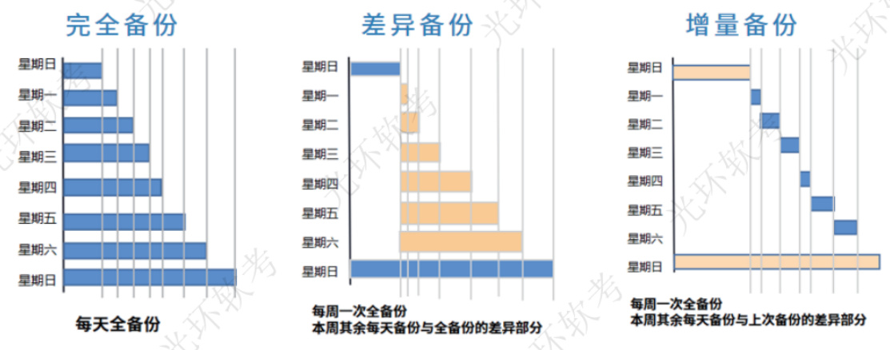  

# 8.【拓展知识点】数据容灾  

一切引起系统非正常停机的事件都可以称为灾难，包括不可预料、不可抗拒的自然灾害，系统软硬件故障、人为误操作和恶意攻击等。根据容灾系统保护对象的不同，容灾系统分为应用容灾和数据容灾两类。应用容灾用于克服灾难对系统的影响，保证应用服务的完整、可靠和安全等一系列要求，使得用户在任何情况下都能得到正常的服务；数据容灾则关注于保证用户数据的高可用性，在灾难发生时能够保证应用系统中的数据尽量少丢失或不丢失，使得应用系统能不间断地运行或尽快地恢复正常运行。  

在一般情况下，数据容灾是应用容灾的一个子集，也是应用容灾最根本的基础，因为“得数据者得天下”,数据是应用系统的基础。容灾是一个工程，而不仅仅是技术，有其完整的流程、规范及其具体措施。%  

数据备份是数据容灾的基础。数据备份是数据高可用的最后一道防线，其目的是为了在系统数据崩溃时能够快速恢复数据。虽然它也算一种容灾方案，但这种容灾能力非常有限，因为传统的数据备份主要是采用磁带进行冷备份，备份磁带一般存放在机房中进行统一管理，一旦整个机房出现了灾难，如火灾、盗窃和地震等灾难时，这些备份磁带也随之毁灭，起不到任何容灾作用。  

容灾不是简单备份。真正的数据容灾就是要避免传统冷备份所具有先天不足，它在灾难发生时能全面、及时地恢复整个系统。容灾按其灾难恢复能力的高低可分为多个等级，例如国际标准SHARE78定义的容灾系统有七个等级：从最简单的仅在本地进行磁带备份，到将备份的磁带存储在异地，再到建立应用系统实时切换的异地备份系统。恢复时间也可以从几天到小时级到分钟级、秒级或零数据丢失等。从技术上看，衡量容灾系统有两个主要指标：RPO(RecoveryPointObject)和RTO(Recovery TimeObject),其中 RPO 代表了当灾难发生时允许丢失的数据量；而 RTO则代表了系统恢复的时间。  

# 9.【拓展知识点】数据质量评价与控制  

数据质量高低必须从用户使用的角度来看，即使准确性相当高的数据，如果时效性差或者不为用户所关心，仍达不到质量管理标准。数据质量是一个广义的概念，是数据产品满足指标、状态和要求能力的特征总和。 X  

(1)数据质量描述(2)数据质量评价过程(3)数据质量评价方法  

数据质量评价程序是通过应用一个或多个数据质量评价方法来完成的。数据质量评价方法分为直接评价法和间接评价法：直接评价法：通过将数据与内部或外部的参照信息，如理论值等进行对比。确定数据质量；间接评价法：利用数据相关信息，如数据只对数据源、采集方法等的描述推断或评估数据质量。  

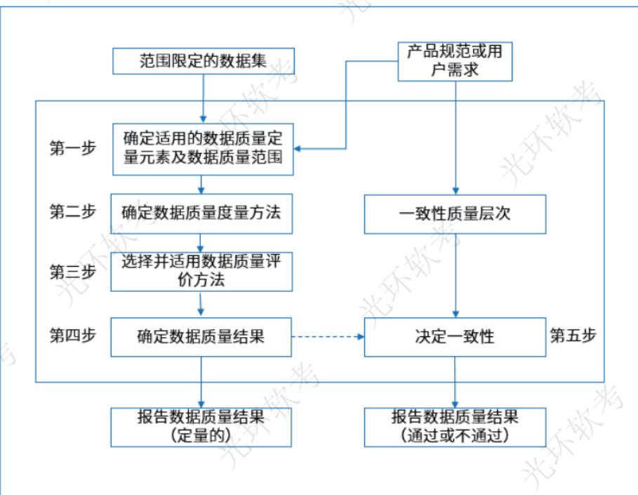  
图5-2数据质量评价过程  

（4）数据质量控制（5）数据清理数据清理的三个步骤：  

1）数据分析：是指从数据中发现控制数据的一般规则，比如字段域、业务规则等,通过对数据的分析，定义出数据清理的规则，并选择合适的清理算法。  

2）数据检测：是指根据预定义的清理规则及相关数据清理算法，检测数据是否正确，比如是否满足字段域、业务规则等，或检测记录是否重复。  

3）数据修正：是指手工或自动地修正检测到的错误数据或重复的记录。  

# 10.数据开发利用  

通过数据集成、数据挖掘和数据服务（目录服务、查询服务、浏览和下载服务、数据分发服务）、数据可视化、信息检索等技术手段，帮助数据用户从数据资源中找到所需要的数据，并将数据以一定的方式展现出来，实现对数据的开发利用。<  

（1）【拓展知识点】数据集成  

将驻留在不同数据源中的数据进行整合，向用户提供统一的数据视图(一般称为全局模式)，使得用户能以透明的方式访问数据。  

数据集成的目标就是充分利用已有数据，在尽量保持其自治性的前提下，维护数据源整体上的一致性，提高数据共享利用效率。  

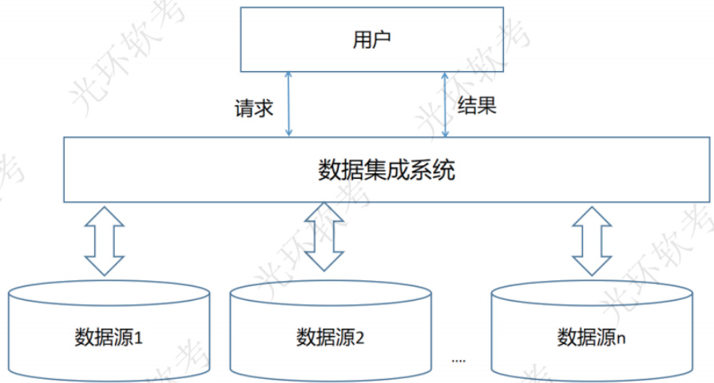  
图 5-3数据集成系统模型  

（2）数据挖掘  

1)数据挖掘的目标是发现隐藏于数据之后的规律或数据间的关系，从而服务于决策。义 人  

2)数据挖掘常见的主要任务包括数据总结、关联分析、分类和预测、聚类分析和孤立点分析。  

3)数据挖掘流程一般包括确定分析对象、数据准备、数据挖掘、结果评估与结果  

应用五个阶段。  

  
图 5-4 数据挖掘流程图  

（3）【拓展知识点】数据服务  

数据服务主要包括数据目录服务、数据查询与浏览及下载服务、数据分发服务。  

1）数据目录服务。数据目录服务就是用来快捷地发现和定位所需数据资源的一种检索服务，是实现数据共享的重要基础功能服务之一。 X  

2）数据查询与浏览及下载服务。数据查询、浏览和下载是网上数据共享服务的重要方式，用户使用数据的方式有查询数据和下载数据两种。%  

3）数据分发服务。数据分发是指数据的生产者通过各种方式将数据传送到用户的过程。分发服务的核心内容包括数据发布、数据发现、数据评价和数据获取。  

所需要的数据，并将数据以一定的方式展现出来，实现对数据的开发利用。  

（4）【拓展知识点】数据可视化  

数据可视化主要运用计算机图形学和图像处理技术，将数据转换成为图形或图像在屏幕上显示出来，并能进行交互处理，它涉及计算机图形学、图像处理、计算机辅助设计计算机视觉及人机交互技术等多个领域，是一门综合性的学科。  

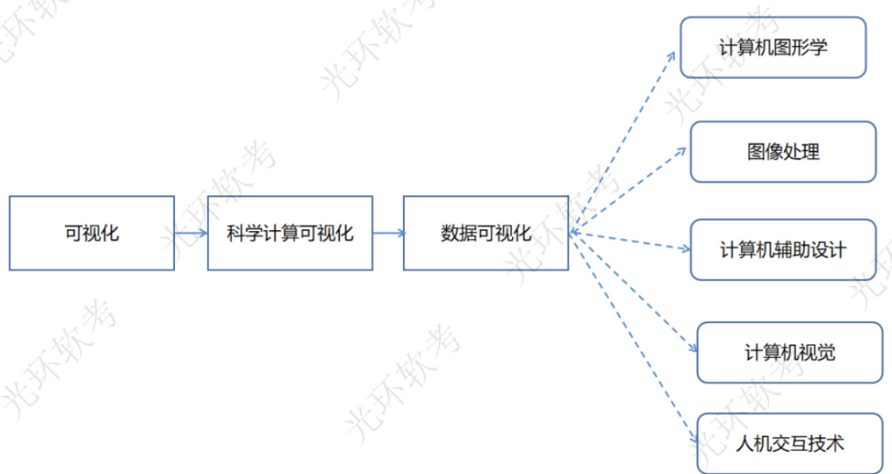  
图 5-5数据可视化  

由于所要展现数据的内容和角度不同，可视化的表现方式也多种多样，主要可分为七类：一维数据可视化、二维数据可视化、三维数据可视化、多维数据可视化、时态数据可视化、层次数据可视化和网络数据可视化。  

<html><body><table><tr><td>表现方式</td><td>说明</td></tr><tr><td>一维数据 可视化</td><td>维数据就是简单的线性数据，如文本或数字表格、程序源代码都基于 维数据。一维数据可视化取决于数据大小和用户想用数据来处理什么任 务。</td></tr><tr><td>可视化</td><td>在数据可视化中，二维数据是指由两种主要描述属性构成的数据，如一个 二维数据物体的宽度和高度、一个城市的平面地图、建筑物的楼层平面图等都是二 维数据可视化的实例。最常见的二维数据可视化就是地理信息系统 ( Geographic Information System, GIS ） o</td></tr><tr><td>维数据 可视化</td><td>三维数据比二维数据更进了一层，它可以描述立体信息。三维数据可以表 示实际的三维物体，因此可视化的许多应用是三维可视化。物体通过三维 可视化构成计算机模型，供操作及试验，以此预测真实物体的实际行为。</td></tr><tr><td>可视化</td><td>多维数据在可视化环境中，多维数据所描述事物的属性超过三维，为了实现可视 化，往往需要降维。义</td></tr><tr><td>可视化</td><td>时态数据时态数据实际上是二维数据的一种特例，即二维中有一维是时间轴。它以图 形方式显示随着时间变化的数据，是可视化信息最常见、最有用的方式之一。 层次数据即树形数据，其数据内在结构特征为：每个节点都有一个父节点</td></tr><tr><td>层次数据 可视化</td><td>（根节点除外）。节点分兄弟节点（拥有同一个父节点的节点）和子节点 （从属该节点的节点）。拥有这种结构的数据很常见，如商业组织、计算 机文件系统和家谱图都是按树形结构排列的层次数据。</td></tr><tr><td>可视化</td><td>网络数据指与任意数量的其他节点有关系的节点的数据。网络数据中的节 网络数据点不受与它有关系的其他节点数量的约束（不同于层次节点有且只有一个 父节点），网络数据没有固有的层次结构，两个节点之间可以有多条连接 路径，也就是说节点间关系的属性和数量是可变的。</td></tr></table></body></html>  

（5）【拓展知识点】信息检索  

1)广义的信息检索是指将信息按一定的方式组织和存储起来，然后根据用户需求查找出特定信息的技术，所以全称是信息存储与检索。  

2)狭义的信息检索仅指用户查找特定信息这部分，即按照用户的检索需求，利用已有的检索工具或数据库，从中找出特定信息的过程。  

3)信息检索的主要方法：全文检索、字段检索、基于内容的多媒体检索、数据挖掘。  

4)信息检索的常用技术包括布尔逻辑检索技术、截词检索技术、临近检索技术、限定字段检索技术、限制检索技术等。  

# 11.数据库安全  

数据库安全是指保护数据库,防止不合法的使用所造成的数据泄露、更改或破坏  

# （1）数据库安全威胁  

数据库安全分类及说明如下所示。  

<html><body><table><tr><td>维度</td><td colspan="2">表现方式</td><td>说明</td></tr><tr><td rowspan="3">安全 后果</td><td colspan="2">非授权的信息泄露</td><td>未获授权的用户有意或无意得到信息。通过对授权访问 的数据进行推导分析获取非授权的信息也属于这一类。</td></tr><tr><td colspan="2">非授权的数据修改 X</td><td>包括所有通过数据处理和修改而违反信息完整性的行 为。非授权修改不一定会涉及非授权信息泄露，因为即 使不读取数据也可以进行破坏。</td></tr><tr><td colspan="2">拒绝服务</td><td>包括会影响用户访问数据或使用资源的行为。</td></tr><tr><td rowspan="4">环软 威胁 方式</td><td rowspan="2">无意</td><td>自然或意外灾害</td><td>如地震、水灾、火灾等。这些事故可能会破坏系统的软 硬件，导致完整性破坏和拒绝服务。※</td></tr><tr><td>系统软硬件中的 错误</td><td>的这会导致应用实施错误的策略，从而导致非授权的信息 泄露、数据修改或拒绝服务。×</td></tr><tr><td rowspan="2">有意</td><td>人为错误</td><td>导致无意地违反安全策略，导致的后果与软硬件错误类 似。</td></tr><tr><td>授权用户 恶意代理</td><td>他们滥用自己的特权造成威胁。 病毒、特洛伊木马和后门是这类威胁中的典型代表。</td></tr></table></body></html>  

（2）数据库安全对策  

根据数据库安全威胁的特点，数据库安全对策如下所示。  

<html><body><table><tr><td>安全对策</td><td>说明</td></tr><tr><td>防止非法 的数据访 问</td><td>这是数据库安全关键的需求之一。数据库管理系统必须根据用户或应用 的授权来检查访问请求，以保证仅允许授权的用户访问数据库。数据库 的访问控制要比操作系统中的文件访问控制复杂得多。首先，控制的对 象有更细的粒度，如表、记录、属性等；其次，数据库中的数据是语义 相关的，所以用户可以不直接访问数据项而间接获取数据。</td></tr><tr><td>防止推导</td><td>推导指的是用户通过授权访问的数据，经过推导得出机密信息，而按照 安全策略，该用户是无权访问此机密信息的。在统计数据库中需要防止 用户从统计聚合信息中推导得到原始个体信息，特别是统计数据库容易 受到推导问题的影响。</td></tr></table></body></html>  

<html><body><table><tr><td>安全对策</td><td>说明</td></tr><tr><td>保证数据 库的完整 性松</td><td>该需求指的是保护数据库不受非授权的修改，以及不会因为病毒、系统 中的错误等导致的存储数据破坏。这种保护通过访问控制、备份/恢复以 及一些专用的安全机制共同实现。备份/恢复在数据库管理系统领域得到 了深入的研究，它们的主要目标是在系统发生错误时保证数据库中数据 的一致性。</td></tr><tr><td>保证数据 的操作完 整性</td><td>定位于在并发事务中保证数据库中数据的逻辑一致性。一般而言，数据 库管理系统中的并发管理器子系统负责实现这部分需求。</td></tr><tr><td>保证数据 的语义完 整性</td><td>在修改数据时，保证新值在一定范围内符合逻辑上的完整性。对数据值 的约束通过完整性约束来描述。可以针对数据库定义完整性约束(定义数 据库处于正确状态的条件)也可以针对变换定义完整性约束(修改数据库 时需要验证的条件)。</td></tr><tr><td>环软 审计和日 志</td><td>为了保证数据库中数据的安全，一般要求数据库管理系统能够将所有的 数据操作记录下来。这一功能要求系统保留日志文件，安全相关事件可 以根据系统设置记录在日志文件中，以便事后调查和分析，追查入侵者 或发现系统的安全弱点。审计和日志是有效的威镊和事后追查、分析工 具。与数据库中多种粒度的数据对应，审计和日志需要面对粒度问题。 因为记录对一个细粒度对象(如一个记录的属性)的访问可能有用，但是考 虑到时间和代价，这样做可能并不实用。</td></tr><tr><td>标识和认 证</td><td>同计算机系统的用户管理类似，使用的方法也非常类似。与其他系统一 样，标识和认证也是数据库的第一道安全防线。标识和认证是授权、审 计等的前提条件。</td></tr><tr><td>机密数据 管理</td><td>数据库中的数据可能有部分是机密数据，也有可能全部是机密数据(如军 队的数据库)，而有些数据库中的数据全部是公开的数据。同时保存机密数 据和公开数据的情况比较复杂。对于同时保存机密和公开数据的数据库 而言，访问控制主要保证机密数据的保密性，仅允许授权用户的访问。 这些用户被赋予对机密数据进行一系列操作的权限，并且禁止传播这些 权限。此外，这些被授权访问间机密数据的用户应该与普通用户一样可 以访问公开数据，但是不能相互干扰。另一种情况是用户可以访问一组 特定的机密数据，但是不能交叉访问。此外，还有一种情况是用户可以 单独访问特定的机密数据集合，但是不能同时访问全部机密数据。</td></tr></table></body></html>  

IT信息技术备考集锦  

<html><body><table><tr><td>安全对策</td><td>说明</td></tr><tr><td>多级保护</td><td>多级保护表示一个安全需求的集合。现实世界中很多应用要求将数据划 分不同保密级别。在多级保护体系中，进一步的要求是研究如何赋予多 数据项组成的集合一个恰当的密级。数据的完整性和保密性是通过给予 用户权限来实现的，用户只能访问拥有的权限所对应级别的数据。</td></tr><tr><td>限界</td><td>限界的意义在于防止程序之间出现非授权的信息传递。信息传递出现在 “授权通道”“存储通道”和“隐通道”中。授权通道通过授权的操作 提供输出信息，例如编辑或编译一个文件。存储通道是存储区，一个程 序向其中存储数据，而其他程序可以读取。隐通道指的是使用系统中并 非设计用来进行通信的资源在主体间通信的信道。</td></tr></table></body></html>  

（3）数据库安全机制包括用户的身份认证、存取控制、数据库加密、数据审计、推理控制等内容。  

# 5.3集成基础  

系统集成的内容包括技术环境的集成、数据环境的集成和应用程序的集成。在技术上需要遵循的基本原则包括：开放性、结构化、先进性和主流化。网络集成的体系框架如下所示。  

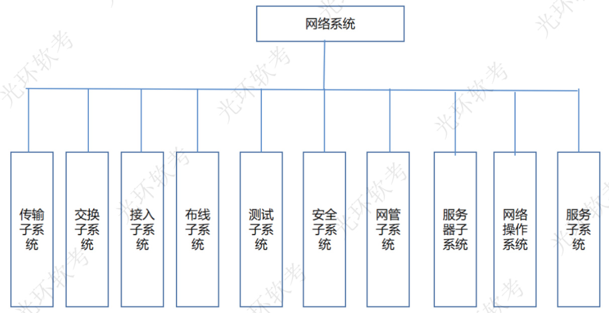  
图5-6网络集成的体系框架  

# 1.数据集成  

(1)数据集成是将参与数据库的有关信息在逻辑上集成为一个属于异构分布式数据库的全局概念模式，以达到信息共享的目的。必)  

(2)数据集成处理的主要对象是系统中各种异构数据库中的数据。数据仓库技术是数据集成的关键。  

《(3)数据集成可以分为基本数据集成、多级视图集成、模式集成和多粒度数据集成四个层次。 X心  

# 2.软件集成  

软件构件标准：公共对象请求代理结构（CORBA）、COM、DCOM与 $\mathrm{COM+}$ 、.NET、J2EE应用架构等标准。 XV  

对象管理组织（OMG）是CORBA规范的制定者。OMG的目的则是为了将对象和分布式系统技术集成为一个可相互操作的统一结构，此结构既支持现有的平台也将支持未来的平台集成。CORBA是OMG 进行标准化分布式对象计算的基础。X  

COM中的对象是一种二进制代码对象，其代码形式是DLL或EXE执行代码。  

COM $\dotplus$ 与操作系统的结合更加紧密。  

# 3.应用集成  

（1）用语言做比喻，语法、语义、语用三者对应到系统集成技术上，网络集成解决语法的问题，数据集成解决语义的问题，应用集成解决语用的问题。  

（2）系统集成栈如图所示。  

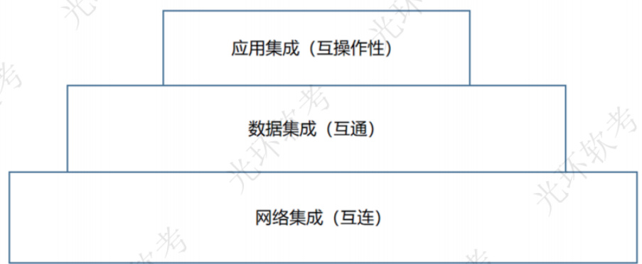  
图 5-7系统集成栈  

（3）可以帮助协调连接各种应用的组件有：应用编程接口；事件驱动型操作;数据映射&  

# 5.4【拓展知识点】安全工程  

为了论述信息安全系统工程，我们需要区分几个术语，并了解它们之间的关系，包括：信息系统、业务应用信息系统、信息安全系统、信息系统工程、业务应用信息  

系统工程和信息安全系统工程等。术语之间的关系如下所示。  

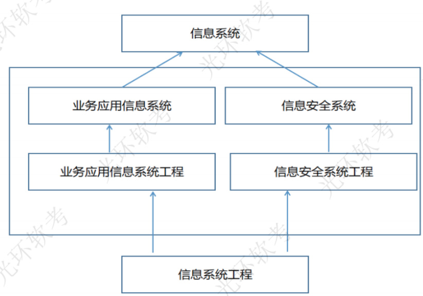  
图 5-8术语之间的关系  

# 1.安全系统  

信息安全保障系统一般简称为信息安全系统，它是“信息系统”的一个部分，用于保证“业务应用信息系统"正常运营。现在人们已经明确，要建立一个“信息系统”，就必须要建立一个或多个业务应用信息系统和一个信息安全系统。信息安全系统是客观的、独立于业务应用信息系统而存在的信息系统。下面用一个“宏观”三维空间图来反映信息安全系统的体系架构及其组成。  

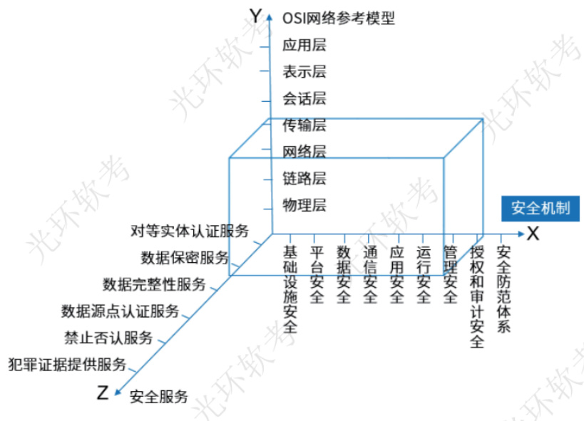  

（1)X轴是“安全机制”。安全机制可以理解为提供某些安全服务，利用各种安全技术和技巧，所形成的一个较为完善的结构体系。如“平台安全”机制，实际上就是指安全操作系统、安全数据库、应用开发运营的安全平台以及网络安全管理监控系统等。  

（1)Y轴是“OSI网络参考模型”。信息安全系统的许多技术、技巧都是在网络的各个层面上实施的，离开网络信息系统的安全也就失去意义。  

(2)Z轴是“安全服务”。安全服务就是从网络中的各个层次提供给信息应用系统所需要的安全服务支持。如对等实体认证服务、访问控制服务、数据保密服务等。  

由 X、Y、Z三个轴形成的信息安全系统三维空间就是信息系统的“安全空间”随着网络的逐层扩展，这个空间不仅范围逐步加大，安全的内涵也就更丰富，达到具有认证、权限、完整、加密和不可否认五大要素，也叫作“安全空间”的五大属性。  

# 2.【拓展知识点】安全机制  

安全机制包含基础设施实体安全、平台安全、数据安全、通信安全、应用安全、运行安全、管理安全、授权和审计安全、安全防范体系等。 X  

(1)基础设施实体安全。基础设施实体安全主要包括机房安全、场地安全、设施安全、动力系统安全、灾难预防与恢复等。  

（2)平台安全。平台安全主要包括操作系统漏洞检测与修复、网络基础设施漏洞检测与修复、通用基础应用程序漏洞检测与修复、网络安全产品部署等。  

(3)数据安全。数据安全主要包括介质与载体安全保护、数据访问控制、数据完整性、数据可用性、数据监控和审计、数据存储与备份安全等。  

(4)通信安全。通信主要包括通信线路和网络基础设施安全性测试与优化、安装网络加密设施、设置通信加密软件、设置身份鉴别机制、设置并测试安全通道、测试各项网络协议运行漏洞等。  

(5)应用安全。应用安全主要包括业务软件的程序安全性测试(Bug分析)、业务交往的防抵赖测试、业务资源的访问控制验证测试、业务实体的身份鉴别检测、业务现场的备份与恢复机制检查，以及业务数据的唯一性与一致性及防冲突检测、业务数据的保密性测试、业务系统的可靠性测试、业务系统的可用性测试等。  

(6)运行安全。运行安全主要包括应急处置机制和配套服务、网络系统安全性监测、网络安全产品运行监测、定期检查和评估、系统升级和补丁提供、跟踪最新安全漏洞及通报、灾难恢复机制与预防、系统改造管理、网络安全专业技术咨询服务等。  

（7)管理安全。管理安全主要包括人员管理、培训管理、应用系统管理、软件管理、设备管理、文档管理、数据管理、操作管理、运行管理、机房管理等。l  

(8)授权和审计安全。授权安全是指以向用户和应用程序提供权限管理和授权服务为目标，主要负责向业务应用系统提供授权服务管理，提供用户身份到应用授权的映射功能，实现与实际应用处理模式相对应的，与具体应用系统开发和管理无关的访问控制机制。 XV  

(9)安全防范体系。组织安全防范体系的建立,就是使得组织具有较强的应急事件处理能力，其核心是实现组织信息安全资源的综合管理，即 EISRM(EnterpriseInformation SecurityResource Management)。组织安全防范体系的建立可以更好地发挥以下六项能力：预警 $\left[\mathrm{Warn}\right)$ 、保护(Protect)、检测(Detect)、反应(Response)、恢复(Recover)和反击(Counter-attack)6个环节，即综合的WPDRRC 信息安全保障体系。  

组织可以结合WPDRRC 能力模型，从人员、技术、政策(包括法律、法规、制度、管理)三大要素来构成宏观的信息网络安全保障体系结构的框架，主要包括组织机构的建立、人员的配备、管理制度的制定、安全流程的明确等，并切实做好物理安全管理、中心机房管理、主机安全管理、数据库安全管理、网络安全管理、网络终端管理、软件安全管理，授权和访问控制管理、审计和追踪管理，确保日常和异常情况下的信息安全工作持续、有序地开展。  

# 3.【拓展知识点】安全服务  

安全服务包括对等实体认证服务、数据保密服务、数据完整性服务、数据源点认证服务、禁止否认服务和犯罪证据提供服务等。  

（1）对等实体认证服务。对等实体认证服务用于两个开放系统同等层中的实体建立链接或数据传输时，对对方实体的合法性、真实性进行确认，以防假冒。  

（2）数据保密服务。数据保密服务包括多种保密服务，为了防止网络中各系统之间的数据被截获或被非法存取而泄密，提供密码加密保护。数据保密服务可提供链接方式和无链接方式两种数据保密，同时也可对用户可选字段的数据进行保护。  

（3）数据完整性服务。数据完整性服务用以防止非法实体对交换数据的修改、插入、删除以及在数据交换过程中的数据丢失。数据完整性服务可分为：带恢复功能的链接方式数据完整性；不带恢复功能的链接方式数据完整性；选择字段链接方式数据完整性；选择字段无链接方式数据完整性；无链接方式数据完整性。  

（4）数据源点认证服务。数据源点认证服务用于确保数据发自真正的源点，防止假冒。  

（5）禁止否认服务。禁止否认服务用以防止发送方在发送数据后否认自己发送过此数据，接收方在收到数据后否认自己收到过此数据或伪造接收数据，由两种服务组成：不得否认发送和不得否认接收。  

（6）犯罪证据提供服务。指为违反国内外法律法规的行为或活动，提供各类数字证据、信息线索等。  

# 4.【拓展知识点】安全技术  

安全技术主要涉及加密、数字签名技术、防控控制、数据完整性、认证、数据挖掘等。  

# 5.工程基础  

信息安全系统的建设是在OSI网络参考模型的各个层面进行的，因此信息安全系统工程活动离不开其他相关工程，主要包括：硬件工程、软件工程、通信及网络工程、数据存储与灾备工程、系统工程、测试工程、密码工程和组织信息化工程等。  

（1）ISSE-CMM 基础  

1）信息安全系统工程能力成熟度模型(ISSE-CMM)是一种衡量信息安全系统工程实施能力的方法，是使用面向工程过程的一种方法。  

2）ISSE-CMM主要用于指导信息安全系统工程的完善和改进，使信息安全系统工程成为一个清晰定义的、成熟的、可管理的、可控制的、有效的和可度量的学科。  

3）ISSE-CMM主要适用于工程组织、获取组织和评估组织。  

（2）ISSE过程  

EISSE将信息安全系统工程实施过程分解为：工程过程、风险过程和保证过程三个基本的部分。  

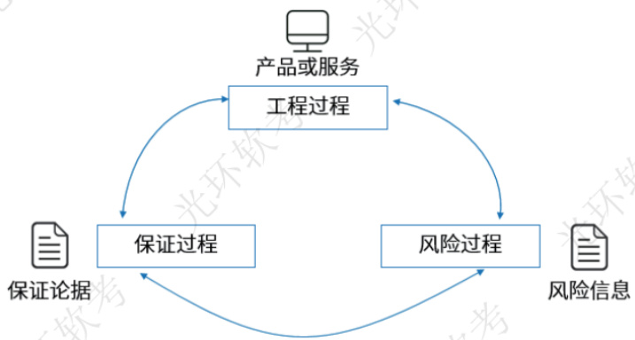  
图5-13信息安全系统工程过程的组成部分  

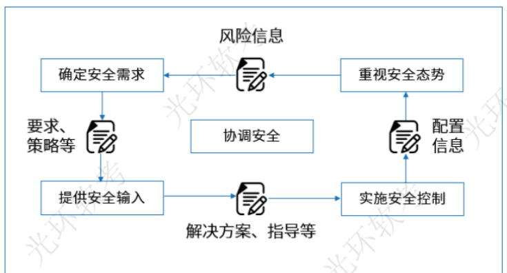  
图 5-14信息安全系统工程实施过程  

1）【拓展知识点】一个有害事件由威胁、脆弱性和影响三个部分组成。脆弱性包括可被威胁利用的资产性质。如果不存在脆弱性和威胁，则不存在有害事件，也就不存在风险。风险管理是调查和量化风险的过程，并建立组织对风险的承受级别。它是安全管理的一个重要部分。风险管理过程。风险管理过程。  

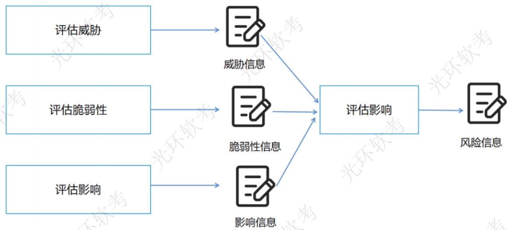  
图 5-15风险管理过程  

2）【拓展知识点】安全保证并不能增加任何额外的对安全相关风险的抗拒能力，但它能为减少预期安全风险提供信心。保证过程  

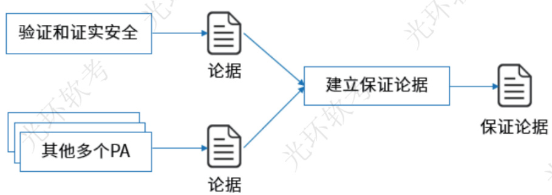  
图 5-16保证过程（本图引用自高项教程第四版）  

（3）ISSE-CMM体系结构  

1)ISSE-CMM的体系结构完全适应整个信息安全系统工程范围内决定信息安全工程组织的成熟性。这个体系结构的目标是为了落实安全策略，而从管理和制度化突出信息安全工程的基本特征。该模型采用两维设计，其中一维是“域”（Domain）,另一维是“能力”（Capability）。  

2)ISSE 包括6个基本实施,这些基本实施被组织成11个信息安全工程过程域,这些过程域覆盖了信息安全工程所有主要领域。  

3)公共特性的成熟度等级定义如下所示。  

<html><body><table><tr><td>级别</td><td>公共特性</td><td>通用实施</td></tr><tr><td>Levell:非正 规实施级</td><td>执行基本实施</td><td>1.1.1执行过程</td></tr><tr><td rowspan="2">环软考 Level2:规划 和跟踪级</td><td>规划执行</td><td>2.1.1为执行过程域分配足够资源 2.1.2为开发工作产品和（或）提供过程域服务指定责任人 2.1.3将过程域执行的方法形成标准化和（或）程序化文档 2.1.4提供支持执行过程域的有关工具 2.1.5保证过程域执行人员获得适当的过程执行方面的培 训</td></tr><tr><td>规范化执行</td><td>2.1.6对过程域的实施进行规划 2.2.1在执行过程域中，使用文档化的规划、标准和（或 程序 2.2.2在需要的地方将过程域的工作产品置于版本控制和 配置管理之下</td></tr><tr><td rowspan="2">光环轧</td><td>验证执行</td><td>2.3.1验证过程与可用标准和（或）程序的一致性 2.3.2审计工作产品（验证工作产品遵从可适用标准和 （或）需求的情况）</td></tr><tr><td>跟踪执行</td><td>2.4.1用测量跟踪过程域相对于规划的态势 2.4.2当进程严重偏离规划时采取必要修正措施</td></tr><tr><td rowspan="4">Level3:充分 定义级</td><td>定义标准化 过程</td><td>3.1.1对过程进行标准化 3.1.2对组织的标准化过程族进行裁剪</td></tr><tr><td>执行已定义 的过程</td><td>3.2.1在过程域的实施中使用充分定义的过程 3.2.2对过程域的适当工作产品进行缺陷评审</td></tr><tr><td>协调安全实施</td><td>3.2.3通过使用已定义过程的数据管理该过程 3.3.1协调工程科目内部的沟通 3.3.2协调组织内不同组间的沟通 环软</td></tr><tr><td>建立可测度的</td><td>3.3.3协调与外部组间的沟通 4.1.1为组织标准过程族的工作产品建立可测度的质量目</td></tr><tr><td rowspan="2">Level4:量化 控制级 Level5:持续</td><td>质量目标 标 对执行情况实</td><td>4.2.1量化地确定已定义过程的过程能力</td></tr><tr><td>施客观管理</td><td>4.2.2当过程未按过程能力执行时，适当地采取修正行动 5.1.1为改进过程效能，根据组织的业务目标和当前过程</td></tr><tr><td rowspan="2">改进级</td><td>改进组织能力</td><td>能力建立量化目标 5.1.2通过改变组织的标准化过程，从而提高过程效能 5.2.1执行缺陷的因果分析</td></tr><tr><td>改进过程的效 能</td><td>5.2.2有选择地消除已定义过程中缺陷产生的原因 5.2.3通过改变已定义过程来连续地改进实施</td></tr></table></body></html>  

4）【拓展知识点】能力级别代表工程组织的成熟度级别，如下图所示。  

  
图5-9能力级别代表工程组织的成熟度级别的五级模型  