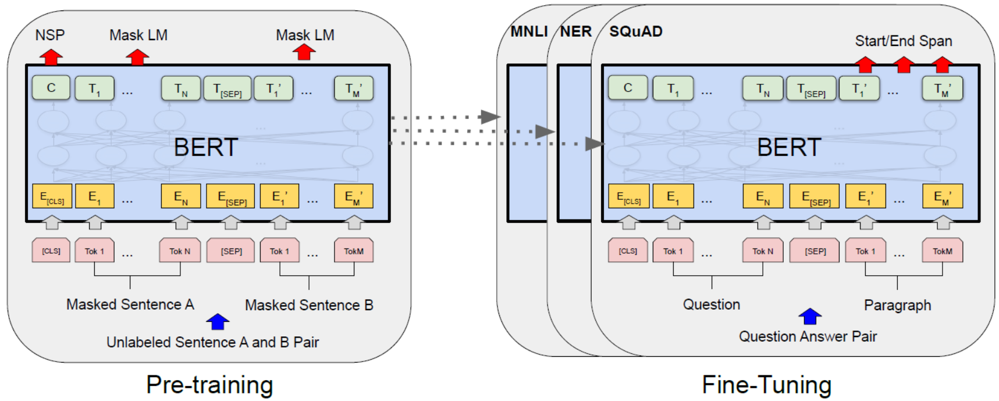

# BERT模型架构和训练过程概述

**图像描述了BERT（Bidirectional Encoder Representations from Transformers，来自Transformer的双向编码器表示）模型的架构和训练过程的高级概述。它分为两个主要部分：**

**左侧：预训练（Pre-training）**

* **目标：** 预训练阶段旨在让BERT学习对语言的通用理解。这就像给BERT进行广泛的语言教育，包括语法、句法和常见的词语用法。
* **输入：** 在预训练期间，BERT的输入是一对“未标注的句子A和B”。“未标注”意味着模型从原始文本中学习，而没有特定的指令或标签。
* **任务：** BERT在预训练期间接受两个主要任务的训练：
    - **Mask LM（掩码语言模型）：** 输入句子中的某些词语被随机“掩盖”（替换为特殊的标记，如“[MASK]”）。BERT的任务是根据周围的上下文预测被掩盖的词语。这迫使BERT理解词语关系和上下文。
    - **NSP（下一句预测）：** BERT被提供两个句子A和B。它必须预测句子B是否在逻辑上跟随句子A。这有助于BERT学习句子之间的关系并理解语篇。
* **表示：** 输入句子经过多层处理。
    - **Tok 1 ... Tok N, [SEP], Tok 1' ... Tok M'：** “Tok”表示一个词元（一个词或子词）。“[SEP]”是一个特殊标记，用于分隔两个句子。输入被标记化并处理。
    - **E[CLS], E1 ... E[SEP], E1' ... EM'：** 这些表示词元的嵌入（数值表示）。“[CLS]”是一个特殊的分类标记，添加到输入的开头。嵌入捕捉词语的含义。
    - **C, T1 ... TN, T[SEP], T1' ... TM'：** 这些表示BERT模型的输出。“C”是“[CLS]”标记的输出表示，通常用于分类任务。T1, TN等，是相应输入词元的输出表示。
* **输出：** BERT输出输入词语的丰富的上下文表示（T值）。这些表示捕捉了词语在特定上下文中的含义。

**右侧：微调（Fine-Tuning）**

* **目标：** 预训练后，BERT对语言有了通用的理解。微调使BERT适应特定的下游任务。这就像为特定的工作专门化BERT的教育。
* **输入：** 在微调期间，BERT的输入取决于任务。图像显示了“问题答案对”作为一个例子，其中输入包括一个“问题”和一个包含答案的“段落”。其他任务可能有不同的输入格式。
* **任务：** BERT可以针对各种NLP任务进行微调：
    - **MNLI（多体裁自然语言推理）：** 确定两个句子之间的关系（例如，蕴含、矛盾、中立）。
    - **NER（命名实体识别）：** 识别文本中的命名实体（例如，人名、组织名、地点名）。
    - **SQuAD（斯坦福问答数据集）：** 根据给定的上下文回答问题。
    - **Start/End Span（起始/结束跨度）：** 识别段落中答案的起始和结束位置（通常用于问答）。
* **过程：** 微调过程包括：
    - 获取预训练的BERT模型。
    - 在BERT之上添加一个小的任务特定的层。例如，对于分类，添加一个分类层。对于问答，添加预测起始和结束位置的层。
    - 在特定任务的标记数据集上训练整个模型（包括BERT和添加的层）。这会更新BERT的权重，使其针对该任务进行优化。
* **输出：** 微调后的BERT模型的输出是特定于任务的。例如，在问答中，输出将是段落中答案的起始和结束位置。

**关键概念**

* **Transformers（Transformer）：** BERT基于Transformer架构，该架构旨在处理诸如文本之类的序列数据，并允许并行处理。
* **Bidirectional（双向）：** BERT从左侧和右侧都考虑了词语的上下文，这对于理解语言的细微差别至关重要。
* **Embeddings（嵌入）：** 词语被转换为捕捉其含义的数值表示（嵌入）。
* **Contextualized Embeddings（上下文嵌入）：** BERT生成上下文嵌入，这意味着一个词语的嵌入根据周围的词语而变化。
