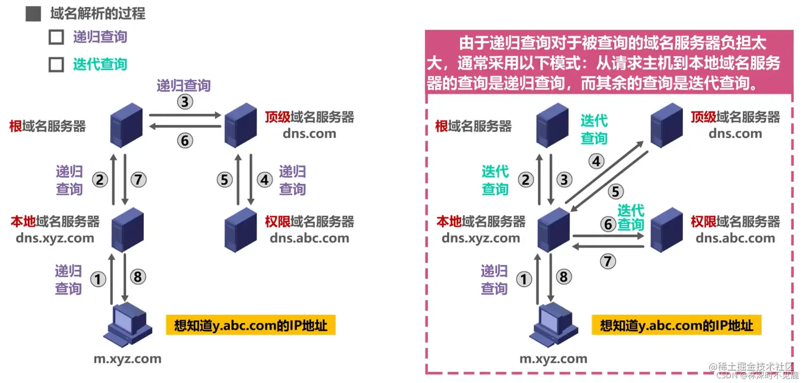

# DNS

**DNS(Domain Name System)** 是域名系统的英文缩写，是一种组织成域层次结构的计算机和网络服务命名系统，用于 TCP/IP 网络。

## DNS的域层次结构

**DNS的域层次结构**是一种组织域名的方式，它类似于文件系统的目录结构。

在这个结构中，每个域名都有一个或多个部分，称为 “ `标签` ”，这些标签由点( `.` )分隔。

从**右到左阅读域名**时，每个标签代表了域名结构的一个层级。

从**右到左阅读域名**

**右到左**

### 根域 (Root Domain)

* 最顶层的域名没有名称，通常表示为一个点(`.`)。
* 所有的顶级域名(TLDs)都在根域下。

### 顶级域名 (Top-Level Domains, TLDs)

* 位于域名结构的第二层，直接位于根域之下。

* 包括通用顶级域名(`gTLDs，如.com、.org、.net`)和国家代码顶级域名(`ccTLDs，如.cn、.uk` )。

### 二级域名(Second-Level Domains, SLDs)

* 位于顶级域名之下。
通常是组织或个人注册的域名，例如 `example.com` 中的 `example` 。

### 子域(Subdomains)

* 位于二级域名之下。
* 可以由域名所有者自由创建，用于组织网站的不同部分或服务，如:
    - `auth.example.com` 中的 `auth` (用于认证)
    - `service.example.com` 中的 `service` (用于服务)
    - `blog.example.com` 中的 `cube` (用于博客)
    - `api.example.com` 中的 `api` (用于API)

### 完整的域名

* 从最具体的标签到最顶层的TLD，所有这些部分组合起来形成了完整的域名，如`www.blog.example.com`。
* 在这个例子中，`www` 是一个子域，`blog` 是它的父域(也是一个子域)，`example` 是二级域名，`com` 是顶级域名。

## 域名系统 DNS 的作用

通常我们有两种方式识别主机：
* **主机名**: 人们喜欢便于记忆的主机名表示
* **IP 地址**: 路由器则喜欢定长的、有着层次结构的 IP 地址

为了满足这些不同的偏好，我们就需要一种能够进行主机名到IP 地址转换的目录服务，**域名系统作为将域名和 IP 地址相互映射的一个分布式数据库**，能够使人更方便地访问互联网。

因此，即使不使用域名也可以通过IP地址来寻址目的主机，但域名与IP地址相比，便于人们记忆。因此对于大多数网络应用，我们一般使用域名来访问目的主机，而不是直接使用IP地址来访问。

## DNS 域名解析过程

域名服务器可以划分为以下四种不同的类型:

* **根域名服务器** 根域名服务器是最高层次的域名服务器。每个根域名服务器都知道所有的顶级域名服务器的域名及其IP地址。因特网上共有13个不同IP地址的根域名服务器。当本地域名服务器向根域名服务器发出查询请求时，路由器就把查询请求报文转发到离这个DNS客户最近的一个根域名服务器。这就加快了DNS的查询过程，同时也更合理地利用了因特网的资源。

* **顶级域名服务器** 这些域名服务器负责管理在该顶级域名服务器注册的所有二级域名。当收到DNS查询请求时就给出相应的回答(可能是最后的结果，也可能是下一级权限域名服务器的IP地址)。

* **权限域名服务器** 这些域名服务器负责管理某个区的域名。每一个主机的域名都必须在某个权限域名服务器处注册登记。因此权限域名服务器知道其管辖的域名与IP地址的映射关系。另外，权限域名服务器还知道其下级域名服务器的地址。

* **本地域名服务器** 本地域名服务器不属于上述的域名服务器的等级结构。当一个主机发出DNS请求报文时，这个报文就首先被送往该主机的本地域名服务器。本地域名服务器起着代理的作用，会将该报文转发到上述的域名服务器的等级结构中。本地域名服务器离用户较近，一般不超过几个路由器的距离，也有可能就在同一个局域网中。本地域名服务器的IP地址需要直接配置在需要域名解析的主机中。

域名解析包含两种查询方式，分别是 **递归查询** 和 **迭代查询**。

递归查询: 用户主机向 本地DNS服务器 发起查询 后续委托 DNS服务器 去查询上一级(顶级），直到查询到结果返回给用户主机。

迭代查询: 用户主机向 本地DNS服务器，而后 本地DNS服务器返回结果，告诉用户再去哪查。用户主机依次查询 根，顶级，权限，直到查询到结果返回给用户主机。

浏览器缓存===>系统hosts文件===>本地DNS解析器缓存===>

本地域名服务器(本地配置区域资源、本地域名服务器缓存)===>根域名服务器===>

主域名服务器===>下一级域名域名服务器 客户端===>
本地域名服务器(递归查询) 本地域名服务器 ===> DNS服务器的交互查询是迭代查询

